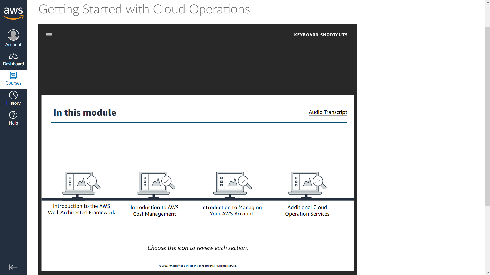

#   Getting Started with Cloud Operations
### This is the beginning of cloud practitioner journey.
We begin our journey from AWS educate course. Click [Getting Started with Cloud Operations](https://awseducate.instructure.com/courses/889) to start learning.

## Objectives
By the end of this course you will be able to do the following:

+      Describe cloud operation fundamental concepts.

+      Explain the Amazon Well-Architected Framework.

+      Describe AWS cost and free tier structures.

+      Describe the AWS cost management tools that are available.

+      Identify support plans and explain the differences between them.

+      Discuss AWS cloud operations services that are available to you, including AWS Trusted Advisor, AWS Health  Dashboard, Amazon CloudWatch, AWS CloudTrail, AWS Organizations, AWS Systems Manager, and AWS Config.

## Getting Started learning pathway
This is a course that’s a part of a series of courses designed to give you foundational knowledge about cloud computing.  
Each of the courses are focused on a specific domain of cloud computing.

Although you can take any of the courses at any time, we suggest that you take the courses in the following order:

1. Getting Started with Storage
2. Getting Started with Compute
3. Getting Started with Networking 
4. Getting Started with Databases 
5. Getting Started with Cloud Operations 
6. Getting Started with Security 
7. Getting Started with Serverless   

## Learning

## Getting Started with Cloud Operations Lab  
This hands-on lab guides you through the steps to estimate Amazon Web Services (AWS) costs for a sample workload. The workload that you evaluate is for a three-tier web application that consists of :  
+       An Application Load Balancer  
+       An Amazon Elastic Compute Cloud (Amazon EC2) instance  
+       An Amazon Relational Database Service (Amazon RDS) instance 

The skills will help you to use AWS Pricing Calculator to estimate costs for your workloads.

###     Introduction to the Well-Architected Framework
<b>Cloud Environment</b>

+   Security
+   Operation
+   Performance
+   Scalability
+   Cost

### What is cloud operations?
+   Innovation
+   Cost
+   Compliance
+   Security
