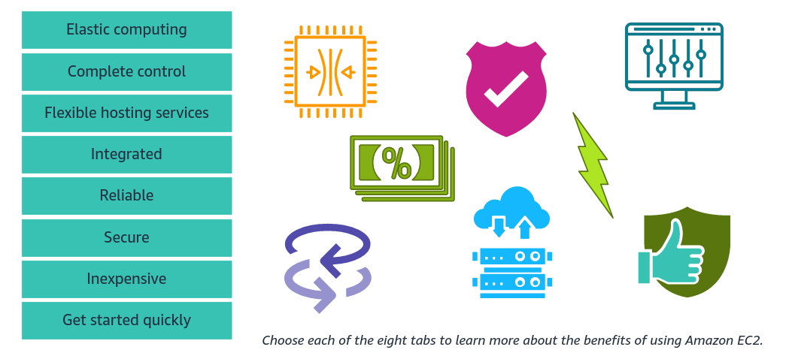
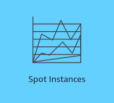

#   [Getting Started with Compute](https://awseducate.instructure.com/courses/817)

##	Overview
When we consider running our workloads on Amazon Web Services (AWS), we will want to consider our compute options. AWS provides the services that we need to build the compute solution that’s right for our workload and our business. We will review the primary compute types and the differences between them. We will also learn how computing balances different amounts of compute, memory, storage, and networking to optimize for our use case.

We will then focus on Amazon Elastic Compute Cloud (Amazon EC2), a secure and resizable compute service that offers reliable, scalable infrastructure on demand. Customers of all sizes and industries can use the broad range of instance choices from Amazon EC2 to match their workloads’ needs. We will learn about the types of instances to meet our use case. These instance types include general purpose, compute optimized, memory optimized, storage optimized, and accelerated computing. 

In this course, we acquire the knowledge that we need to start using Amazon EC2. We will learn about the key concepts and features of Amazon EC2. We will learn how to launch and configure an instance to meet our workload’s needs. We will choose storage for our compute instance and configure security to keep our data secure.  

##	Objectives
By the end of this course, we will be able to do the following:

+   Discuss different types of compute solutions and their features and benefits.
+   Discuss the basic features and concepts of Amazon EC2.
+   Describe EC2 instance types and how to choose an instance type.
+   Describe how to use Amazon EC2 to launch and configure an instance.
+   Describe how to manage EC2 instances.
+   Use Amazon EC2 to launch and manage and instance.

Click <a href="https://awseducate.instructure.com/courses/817">Getting Started with Compute</a>

<small>**_Getting Started with Compute_**</small>

+   In this module we learn about the compute domain and the Amazon Elastic Compute Cloud (Amazon EC2) service. It is broken into four sections.

    ####  [1.  Introduction to Compute]()
    ####  [2.  Amazon Elastic Compute Cloud (Amazon EC2)]()
    ####  [3.  Using Amazon EC2]()
    ####  [4.  Managing Amazon EC2]()

<small>**_Four Sections_**</small>

### Introduction to Compute
+   ####    Introduction to Compute

    Computing is the brain behind IT applications. Organizations all around the world run diverse workloads on different compute platforms. Depending on our workload, we might need a different architectural method for how we set up our computing resources. 

    
    

    <small><b><i>Introduction to Compute</i></b></small>
    

    

    In this section of the module, we will be introduced to the basics of compute, compute architectural methods, and some compute services that AWS offers.

+	####	What is computing?

    Computers have been around for a long time. Through the years, they have changed a lot. We rely on them for many things, including  things that we might not ordinarily associate with computers.

    
    

    <small><b><i>Computer Development</i></b></small>
    

	For example, we rely on computing for communication, travel, medical equipment, scientific research, financial security, sales transactions, everyday business tasks, entertainment, and much more.

    
    

    <small><b><i>Examples of Computing</i></b></small>
    

    At  its most base level, computing is the brain that makes IT applications work. It collects any necessary data, and it can then analyze that data, process that data, and, finally distribute that data.

    The main components of computing are CPU, memory, hard drive and network performance.

    
    

    <small><b><i>Components of Computing</i></b></small>
    

	+	#####	CPU
		CPU is the central processing unit. It is responsible for running and processing instructions that it is given.
		
	+	#####	RAM
		Our Computer's memory, or RAM, stores data that the computer needs to carry out processing tasks. For example, when we run an application, the required data to run the application is temporarily stored on the RAM.
		
	+	#####	Hard drive
		The hard drive is long-term storage where all of our files are stored and kept.
		
		
	+	#####	Network Performance
		The computer's network performance is the speed at  which a message can be sent or received. It is measured in two ways: bandwidth and latency.
		
		+	######	Bandwidth
			Bandwidth is the amount of data  that can be sent  over  a specified time.
		+	######	Latency 
			Latency is how long it takes the data to travel.

    

	Every computer has an operating system. The operating system is the software package that manages the computer's hardware and software.
    
	Some of the most familiar operating systems are Microsoft Windows, Linux, and Apple's MacOS. The operating system, combined with our computer's hardware and additional software, determines the capabilities of our computer.

    
    

    <small><b><i>Examples of OS</i></b></small>
    

	With the expansion of virtualization technologies, computing has moved into what is called the **cloud**.
	
	Cloud Computing is the on-demand delivery of IT resources over the internet with pay-as-you-go pricing. It alleviates the need to buy, own, and maintain physical data centers and servers. Instead, we can access  technology services, such as computing power, storage, and database, on as-needed basis from a cloud provider like AWS.
    
    
    

    <small><b><i>Cloud Computing</i></b></small>
    

    +	####	Benefits of Cloud computing
		Cloud computing has several benefits compared to on-premises computing.
		<!-- +	#####	Save on costs
		+	#####	Scalable
		+	#####	Reliable -->
		
        
        

        <small><b><i>Benefits of Cloud computing</i></b></small>
        

+	####	Computing Methods
    When deciding which computing method would work best for our architecture, we might consider instances, containers, serverless, or a hybrid of cloud and on-premises computing.

	
    

	<small><b><i>Computing Methods</i></b></small>
	

    +	#####	Instances

		An **instance**, or virtual machine, is a computing resource in the cloud. It works like a traditional on-premises server. it can support workloads such as web hosting, applications, databases, authentication services, and anything else a server can do. We choose the operating system (OS), CPU, memory, storage, and other components, and in a few minutes, our instance is ready to use. As soon as we're done, we can stop or terminate the instances. We're not locked in or stuck with servers that we don't need or want. We can treat instances as temporary and disposable computing resources, free from the inflexibility and constraints of a fixed and finite IT infrastructure.
		
		**Instance use cases** include the following:
		+	Hosting environment
		+	Development and testing environments
		+	Backup and disaster recovery

	+	#####	Containers

		**Containers** are a method of operating system virtualization that we can use to run an application and its dependencies in resource-isolated processes. By using containers, we can package an application's code, configurations, and dependencies into simple building blocks that deliver environmental consistency, operational efficiency, developer productivity, and version control.
		Containers are smaller than virtual machines and do not contain an entire operating system. Instead, containers share a virtualized operating system and run as resource-isolated processes, which ensure quick, reliable, and consistent deployments. Containers hold everything that the software needs to run, such as libraries, system tools, code, and the runtime.
		
		**Containers use case** include the following:
		+	Building microservices architecture
		+	Video rendering services
		+	Quick development and deployment

	+	#####	Serverless
		**Serverless computing** gives us the ability to run code without provisioning or managing servers. Serverless computing features automatic scaling, built-in high availability, and a pay-for-use billing model to increase agility and optimize costs. Serverless computing also eliminates infrastructure management tasks like capacity provisioning and patching, so we can focus on writing code that serves our customers.
		
		**Serverless use cases** include the following:
		+	File processing 
		+	Web applications 
		+	Mobile backends
		+	Cron jobs (scheduled computing tasks)

	+	#####	Hybrid

		In a **hybrid** deployment, cloud-based resources are connected to on-premises infrastructure. We might want to use this approach in a number of situations. For example, we have legacy applications that are better maintained on premises, or government regulations require our business to keep certain records on premises.
		
		For example, suppose that a company wants to use cloud services that can automate batch data processing and analytics. However, the company has several legacy applications that are more suitable on premises and will not be migrated to the cloud. With a hybrid deployment, the company could keep the legacy applications on premises while benefiting from the data and analytics services that run in the cloud.

		**Hybrid use cases** include the following:
		+	Legacy applications
		+	Company regulatory requirements
		+	Government regulatory requirements

+	####	AWS Computing Services
	+	#####	Amazon EC2
		Amazon Elastic Compute Cloud (Amazon EC2) is a web service that provides secure and resizable compute capacity in the cloud. We can use it to provision virtual servers that are called Amazon EC2 instances, which can handle almost any computing need.
		With Amazon EC2 we can do the following:
		+	Provision and launch one or more EC2 instances in minutes.
		+	Stop or shut down EC2 instances when we finish running a workload. 
		+	Pay for only the compute time that we use when running an instance.

	+	#####	AWS Lambda

		AWS Lambda is a serverless compute service that helps us run code without provisioning or managing servers. We pay for only the compute time we consume, and we incur no charges when our code is not running.
		With Lambda, we can run code for virtually any type of application or backend service, all with zero administration. We need only to upload our code, and Lambda manages everything required to run and scale our code with high availability. We can set up our code to automatically launch from other AWS services or call it directly from any web or mobile app.

	+	#####	Amazon ECS

		Amazon Elastic Container Service (Amazon ECS) is a highly scalable and high-performance container management system. It helps customers spin up new containers and manage them across EC2 instances. Amazon ECS supports Docker containers. Docker is a software platform that packages software (such as applications) into containers.
		To manage our containers, we must install an open-source Amazon ECS container agent on our EC2 instances. This agent is referred to as a container instance. We can run this agent on both Linux and Windows Amazon Machine Images (AMIs). Amazon ECS uses API calls to control Docker-enabled applications.

	+	#####	Amazon EKS

		Amazon Elastic Kubernetes Service (Amazon EKS) provides the flexibility to start, run, and scale Kubernetes applications in the AWS Cloud or on premises. Kubernetes is an open-source platform for managing containerized applications. It is portable and extensible.
		With Amazon EKS, we will be able to provide highly available and secure clusters. It automates patching, node provisioning, and updates.

	+	#####	AWS Fargate

		AWS Fargate is a serverless compute engine for containers. It supports both Amazon ECS and Amazon EKS architectures. Fargate allocates the right amount of compute, which reduces the need to manage EC2 instances, cluster capacity, and scaling.

	+	#####	AWS Elastic Beanstalk

        AWS Elastic Beanstalk is an easy-to-use service for deploying and scaling web applications. We can upload our code, and Elastic Beanstalk automatically handles the deployment, from capacity provisioning, load balancing, auto-scaling to application health monitoring. At the same time, we retain full control over the AWS resources powering our application and can access the underlying resources at any time.

        There is no additional charge for Elastic Beanstalk; we pay for only the AWS resources needed to store and run our applications.

###	Introduction to Amazon EC2
In this section, we will be introduced to Amazon EC2, a cloud computing service. Amazon EC2 is a web service that provides resizable compute capacity in the cloud at affordable costs all around the world.

+	####	What is Amazon  EC2?

	Amazon EC2, is a compute service that _provides resizable compute capacity in the cloud_. It's designed to make web-scale computing easier for developers. It eliminates the need to invest in hardware up front, so we can focus on developing and deploying applications faster. We can use Amazon EC2 to launch as many _virtual server_, also known as **compute instances**, as we need.

	+	#####	EC2 instance types

		Amazon EC2 offers a wide selection of instance types optimized to fit different use cases. Instance types are composed of
		
		+	CPU
		+	Memory
		+	Storage
		+	Networking Capacity
		
		Amazon EC2 instances are **_reliable, scalable, highly available, and cost effective_**. 
	
	+	#####	Amazon EC2 purchasing options

		+	On-Demand Instances
		+	Savings Plans
		+	Dedicated Hosts
		+	Spot instances

+	####	What problems does Amazon EC2 solve?

	Running servers on-premises is a big challenge for building our IT architecture.
	Data centers are expensive to build, staff, and maintain. We need to think ahead for computing capacity needs.
	For example, it can be difficult to predict traffic spikes and peak workloads. And this issue must be balanced with making sure that we don't have unused and idle servers running. Unused resources can be wasteful and cost us a lot of money.
	
	With Amazon EC2, we do not need to guess our computing capacity. As traffic spikes or workloads increase, we can launch more instances to meet the computing needs. When workloads die down, we can stop the instance or terminate it so that we don't have idle instances that are costing us money. With Amazon EC2, we pay for only what we use, which helps us save on costs.

+	####	Amazon EC2 Overview

	Amazon EC2 provides virtual machines in the cloud and gives us full administrative control over the operating system that runs on the instance. Amazon EC2 supports most server operating systems, including Windows and Linux.
	With Amazon EC2, we can launch any number of instances of any size into any Availability Zone anywhere in the world in a matter of minutes. We can also control traffic to and from instances by using security groups and Elastic Load Balancing (ELB). Amazon EC2 can host the same kinds of applications that we might run on a traditional on-premises server.

	
    

    <small><b><i>Amazon EC2 Overview</i></b></small>
    

+	####	Amazon EC2 benefits

	
    

    <small><b><i>Amazon EC2 benefits</i></b></small>
    

<b>Click to learn more about Amazon EC2 benefits</b>
	

<table>
<tr>
<th>
	 
	Elastic computing
</th>
<td>
We can use Amazon EC2 to increase or decrease capacity within minutes, not hours or days. We can commission one, hundreds, or even thousands of server instances simultaneously. We can also use Amazon EC2 Auto Scaling to maintain availability of our Amazon EC2 fleet and automatically scale our fleet up and down depending on our needs to maximize performance and minimize cost. To scale multiple services, we can use AWS Auto Scaling.
</td>
<tr>

<tr>
<th>
	 
	Complete control
</th>
<td>
We have complete control of our instances, including root access, and the ability to interact with them as we would any machine. We can stop any instance while retaining the data on the boot partition and then subsequently restart the same instance by using web service APIs. Instances can be rebooted remotely by using web service APIs, and we also have access to their console output.
</td>
<tr>

<tr>
<th>
	 
	Flexible hosting services
</th>
<td>
We have the choice of multiple instance types, operating systems, and software packages. With Amazon EC2, we can select a configuration of memory, CPU, instance storage, and boot partition size that's optimal for our choice of operating system and application. For example, choice of operating systems includes numerous Linux distributions and Microsoft Windows Server.
</td>
<tr>

<tr>
<th>
	 
	Integrated
</th>
<td>
Amazon EC2 is integrated with most AWS services. For example, these services could include Amazon Simple Storage Service (Amazon S3), Amazon Relational Database Service (Amazon RDS), and Amazon Virtual Private Cloud (Amazon VPC). This integration provides a complete, secure solution for computing, query processing, and cloud storage across a wide range of applications.
</td>
<tr>

<tr>
<th>
	 
	Reliable
</th>
<td>
Amazon EC2 offers a highly reliable environment where replacement instances can be rapidly and predictably commissioned. The service runs within the proven network infrastructure and data centers of Amazon.
</td>
<tr>

<tr>
<th>
	 
	Secure
</th>
<td>
Security is our highest priority. As an AWS customer, we will benefit from a data center and network architecture that's built to meet the requirements of the most security-sensitive organizations. Amazon EC2 works in conjunction with Amazon VPC to provide security and robust networking functionality for our compute resources.
</td>
<tr>

<tr>
<th>
	 
	Inexpensive
</th>
<td>
Using Amazon EC2, we can take advantage of Amazon's scale-you can pay a very low rate for the compute capacity that we actually consume.
For more information about Amazon EC2 pricing, see the <a href="https://aws.amazon.com/ec2/pricing/?trk=36c6da98-7b20-48fa-8225-4784bced9843&sc_channel=ps&sc_campaign=acquisition&sc_medium=ACQ-P|PS-GO|Brand|Desktop|SU|Compute|EC2|US|EN|Text&s_kwcid=AL!4422!3!488982705483!p!!g!!amazon%20ec2&ef_id=CjwKCAjw7vuUBhBUEiwAEdu2pFivmVo-FtkL4LGDqt2DTC4ADQ5jtqayYy9VLodSssQxZvZ-ptsVXBoCJ9YQAvD_BwE:G:s&s_kwcid=AL!4422!3!488982705483!p!!g!!amazon%20ec2"> Amazon EC2 Pricing </a>page.
</td>
<tr>

<tr>
<th>
	 
	Get started quickly
</th>
<td>
We can get started quickly with Amazon EC2. Whether we launch an instance programmatically or through the AWS Management Console, our instances will be ready to use in minutes. When we no longer need the instances, we can stop or terminate them as quickly as we started them.
</td>
<tr>

</table>

+	####	Amazon EC2 architecture

	We'll be deciding which Region, Virtual Private Cloud (VPC) on AWS, subnet, and security group to place it in. First, we must choose the the Region. AWS has Regions all over the globe.

    

	
	

    

    <small><b><i>Amazon EC2 Environment</i></b></small>
    

	
	The Region is the outer portion of our architecture. Next, we choose the VPC on AWS that we want to place our EC2 instance in. Within each VPC, we can then specify the subnet to place the EC2 instance in. Each EC2 instance will be placed behind a security group, with the security configurations that we have set up, when we launch the instance. For high availability, it is a best practice to place our instances in multiple subnets in different Availability Zones. Then, have an Elastic Load Balancer attached to route traffic based on our application needs.
   
    

	
	

    

    <small><b><i>Amazon EC2 Architecture</i></b></small>
    

+	####	Amazon EC2 architectural components

	+	#####	Regions
		
		

		<small><b><i>Regions</i></b></small>
		

		When we launch an EC2 instance, we must choose the Region that we want to provision the instance in. A Region is a physical location around the world where AWS clusters data centers.
		Each Region is designed to be isolated from the other Regions. This separation achieves the greatest possible fault tolerance and stability. Ideally, when we launch an instance, we want to choose the Region that is closest to our users to help cut down on latency.

	+	#####	VPC

		EC2 instances are launched in the VPC that we choose. Amazon VPC is a service that lets us launch AWS resources in a logically isolated virtual network that we define. When we set up an AWS account, we are given a default VPC. However, we can create multiple VPCs in a single Region or place them in different Regions.
		Each VPC can have a dedicated purpose to support different environments, such as production, development, and testing. If we do not specify the VPC to launch our instance in, then it will be launched in our default VPC.

		

		
		

		

		<small><b><i>VPC</i></b></small>
		

	+	#####	Subnets

		Within each VPC, we can specify the subnet to place the EC2 instance in. A subnet is a range of IP addresses in our VPC. Use a public subnet for resources that must be connected to the internet and a private subnet for resources that won't be connected to the internet.
		Subnets are associated with only one Availability Zone. We will learn more about the architecture of a VPC and subnets in the Getting Started with Networking course. This high-level overview is to help we understand the architectural environment that our EC2 instance will be launched in.

		

		
		

		

		<small><b><i>Subnets</i></b></small>
		

	+	#####	Security groups

		When we launch our EC2 instance, it will be protected by a security group that we select while configuring the instance. A security group acts as a virtual firewall for our EC2 instances to control incoming and outgoing traffic. We want to build our application to be highly available and fault tolerant. To do so, a best practice is to launch instances in multiple Availability Zones and attach an Elastic Load Balancer. An Elastic Load Balancer automatically distributes incoming application traffic across multiple targets and virtual instances in one or more Availability Zones.

		

		
		

		

		<small><b><i>Security groups</i></b></small>
		

+	####	Amazon EC2 use cases

	Amazon EC2 has many use cases to help customers manage their applications.

	+	**_Run cloud-native and enterprise applications_**
		Amazon EC2 delivers secure, reliable, high-performance, and cost-effective compute infrastructure to meet demanding business needs.

	+	**_Scale for high performance computing (HPC) applications_**
		Access the on-demand infrastructure and capacity that you need to run HPC applications faster and more cost effectively.

	+	**_Develop for Apple platforms_**
		Build, test, and sign on-demand macOS workloads. Access environments in minutes, dynamically scale capacity as needed, and benefit from AWS pay-as-you-go pricing.

	+	**_Train and deploy machine learning (ML) applications_**
		Amazon EC2 delivers the broadcast choice of compute, networking (up to 400 Gbps), and storage services, purpose-built to optimize price performance for ML projects.

+	####	Instance costs

	Five main aspects of our instance will determine the cost. They are the Instance purchasing options, the tenancy, the Amazon Machine Image (AMI), the EC2 instance type, and the storage type and size that you choose. For now, we are going to focus on the purchasing options and tenancy. We will learn more about the AMI, instance types, and storage in the next section.

	
	

	

	<small><b><i>Instance Costs</i></b></small>
	

+	####	Instance purchasing options

	Amazon EC2 provides purchasing options so that we can optimize our costs based on our needs. When we choose an instance purchasing option, we should consider the following:
	+	The instance use case
	+	The purchasing option's costs structure

	
	
	Based on our needs Amazon EC2 provides four main purchasing options:
	<b>1.	On-Demand Instances</b>
	<b>2.	Reserved Instances</b>
	<b>3.	Savings Plans Instances</b>, and 
	<b>4.	Spot Instances</b>

+	####	On-Demand  Instances

	

	+	Pay for compute capacity per second (Amazon Linux and Ubuntu) or by the hour (all other operating systems)
	+	No long-term commitments
	+	No upfront payments
	+	Increase or decrease our compute capacity depending on the demands of our application

	<table>
	<thead>
	<tr>
	<th style="background:#fb9b04">Use case</th>
	<th style="background:#fb9b04">Problem solved</th>
	</tr>
	</thead>
	<tbody style="background:#fff5e6">
	<tr>
	<td>Short-term, spiky, or unpredictable workloads</td>
	<td rowspan="2">Application development or testing</td>
	</tr>
	<tr>
	<td>Solve the need for immediate compute capacity</td>
	</tr>
	</tbody>
	</table>

+	####	Reserved Instances (RI)

	Reserved Instances can provide a significant discount for your architectures.
	

	
	

	+	Up to 72 percent discount compared to On-Demand Instances
	+	Prepay for capacity (1-year or 3-year buying options)
	+	The upfront payment methods:
		+	Standard RIs
		+	Convertible RIs
		+	Scheduled RIs

	<table>
	<thead>
	<tr style="background:#bbb3db">
	<th>Use case</th>
	<th>Problem solved</th>
	</tr>
	</thead>
	<tbody style="background:#f1f0f8">
	<tr>
	<td>Predictable usage workloads that do not require flexibility in compute power</td>
	<td rowspan="3">Provides the ability to reserve capacity ahead of time reducing cost</td>
	</tr>
	<tr>
	<td>Workloads that  last longer than 1 year</td>
	</tr>
	<tr>
	<td>Users are able to make upfront payments to reduce total  computing costs even further</td>
	</tr>
	</tbody>
	</table>

+	####	Savings Plans Instances

	AWS offers two types of savings plans:

	

	+	**Compute Savings Plans** provide the most flexibility and help to reduce our costs by up to 66 percent.

		+	These plans automatically apply to EC2 instance usage regardless of instance family, size, Availability Zone, Region, Operating System, or tenancy. They also apply to AWS Fargate and AWS Lambda usage.
		
	+	**EC2 Instance Savings Plans** apply to a specific instance family within a specific Region and provide the largest discount (up to 72 percent, like Standard RIs)

	<table>
	<thead>
	<tr style="background:#abe324">
	<th>Use case</th>
	<th>Problem solved</th>
	</tr>
	</thead>
	<tbody style="background:#f7fce9">
	<tr>
	<td>Long time workloads</td>
	<td rowspan="2">Don't have to coordinate our RI purchases</td>
	</tr>
	<tr>
	<td>Computing needs that might need flexibility over location or by instance power</td>
	</tr>
	</tbody>
	</table>

+	####	Spot Instances

	

	+	Purchase unused Amazon EC2 capacity
	+	Up to 90 percent off compared to on-demanding pricing
	+	Prices controlled by AWS based on supply and demand
	+	Termination notice provided 2 minutes prior to termination
	+	Spot blocks: Launch Spot Instances with a duration lasting 1-6 hours

	<table>
	<thead>
	<tr style="background:#63d3fb">
		<th>Use case</th>
		<th>Problem solved</th>
	</tr>
	</thead>
	<tbody style="background:#effbff">
	<tr>
		<td>Applications with flexible start and end time</td>
		<td rowspan="3">Low budgeted workloads can be completed with low cost instances, provided that interruptions can be tolerated.</td>
	</tr>
	<tr>
		<td>Applications only feasible at very low compute prices</td>
	</tr>
	<tr>
		<td>Users with  urgent computing needs for large amounts of additional capacity</td>
	</tr>
	</tbody>
	</table>

+	####	Amazon EC2 purchasing options thinking activity (instructions)

	**
What is your solution?
**

	_**Instructions:** Read the scenario that describes the business problem. Then think about which Amazon EC2 purchasing option you would recommend. The key to selecting the right answer is based on use case and keeping the costs as low as possible. Don't guess; reason it out and see whether you can explain your choice. Then choose the question mark icon to see whether you were correct._

	> **
Solution
**
	> See if your answer corresponds with the solution. If it doesn't, go back and review the differences between the Amazon EC2 purchasing options in this section.

+	####	Amazon EC2 purchasing options scenario 1

	**
What is your solution?
**

	_Your manager has told you that you must set up some computing resources by using Amazon EC2. You are told that the project lasts at least 1 year, maybe longer. The resources should be located in Ireland, but they might need to move to the United States within 6 months. Also, some people have discussed the possibility of moving the application to Lambda later in the year. Which Amazon EC2 purchasing option would you recommend?_

	> **
Solution
**
	> The best instance purchasing option would be the Compute Savings Plans. It provides the flexibility needed and helps to reduce your costs by up to 66 percent. With these instance types, you can make changes to instances regardless of instance family, size, Availability Zone, Region, operating system, or tenancy. Therefore, if the project is relocated from the Ireland Region to the United States Region, your Savings Plans instances let you make that change. Also, if the workload is moved from Amazon EC2 to Lambda, with Saving Plans instances, you can switch to Lambda at the Savings Plans costs.

+	####	Amazon EC2 purchasing options scenario 2

	**
What is your solution?
**
	
	_You need an inexpensive computing resource to handle a batch processing task. No immediate timeline currently exists for when the work should be done, and it can be interrupted and resumed later if needed. Which EC2 instance purchasing option would you choose?_

	> **
Solution
**
	> The best solution for this scenario would be Spot Instances. Spot Instances offer discounts up to 90 percent off of what On-Demand Instances offer. Spot Instances are ideal for workloads that have a small budget and when the work can be interrupted and finished later.

+	####	Amazon EC2 purchasing options scenario 3

	**
What is your solution?
**

	_You need a computing solution for a project that will go on for over a year. The computing resources will be steady throughout the year. However, workloads might spike for a month or two, and you will temporarily need additional computing resources._

	> **
Solution
**
	> In this scenario, you would use two purchasing options. To handle the steady workload, you can use either Reserved Instances or EC2 Compute Savings Plans. Both offer a savings of up to 72 percent; however, EC2 Compute Savings Plans offer more flexibility for the same price. So, choosing EC2 Compute Savings Plans instead of Reserved Instances would make a better choice.
	> To handle the spike in workload, On-Demand Instances should be used. On-Demand Instances are purpose-built to handle an increase in workloads and then terminate the instances when the spike in the workload decreases.

+	####	Tenancy	

	Tenancy defines how EC2 instances are distributed across the physical host hardware.
	Amazon EC2 offers three tenancy options for hosting our instances. They are shared tenancy, dedicated instances,and dedicated hosts. The tenancy that we choose will affect pricing.

	

	
	

+	####	Comparing tenancies

	**
Tenancy use cases
**
	
	<table>
	<thead>
	<tr>
	<th>Dedicated Host</th>
	<th>Dedicated Instance</th>
	<th>Shared Tenancy</th>
	</tr>
	</thead>
	<tbody>
	<tr>
	<td>Regulatory compliance that requires <i><b>hosts cannot be shared</b></i> between AWS accounts.</td>
	<td>Regulatory compliance that requires <i><b>hosts cannot be shared</b></i> between AWS accounts.</td>
	<td>Regulatory compliance <i><b>is not</b></i> required</td>
	</tr>
	
	<tr>
	<td>Managing the host hardware <i><b>is</b><i> required.</td>
	<td>Managing the host hardware <i><b>is not</b></i> required.</td>
	<td>Development and testing accounts.</td>
	</tr>
	
	<tr>
	<td>When you <i><b>will need enough</b></i> or close to enough dedicated instances to fill a host.</td>
	<td>When you <i><b>do  not need</b></i>enough dedicated instances to fill a host.</td>
	<td></td>
	</tr>
	
	
	<tr>
	<td>Using <i><b>existing</b></i> per-socket, per-core, or per-VM software licenses that are <i><b>bound</b></i> to VMs, sockets, or physical cores, subject to our license terms.</td>
	<td></td>
	<td></td>
	</tr>
	
	</tbody>
	</table>
	
	> _**Note:** A host contains approximately 22 instances._

+	####	Introduction to Amazon EC2 Summary

	

	
	

	

	<b><i>Introduction to Amazon EC2 Summary
	</i></b>

###	Using Amazon EC2

+	####	Using Amazon EC2

In this section, we will learn about the seven steps to launch an EC2 instance. We will also learn about configuration for each step. Finally, we will learn that understanding how the instance will be used help to guide us in making good  configuration choices.

<b><i>Using Amazon EC2</i></b>

+	####	Steps to launching an instance

	his section walks through **seven key decisions** to make when you use the AWS Management Console **Launch Instance Wizard** to create an EC2 instance.
	+	Along the way, we will explore essential Amazon EC2 concepts. In this section of the module, we will  be introduced to the configuration choices that we can make when we launch an instance. These choice include making decisions on _instance names and tags, AMIs, Instance types, key pairs, network settings, storage configurations, and advanced details_.

+	####	Step 1. Using tags

	The first step in creating an instance is assigning it a name and tags. This steps is optional but recommended. The name of an instance is default tag for the instance name and works like every other tag. Tag work as metadata  to identify and define the AWS resources that they are attached to. Each tag is a label that consists of a customer-defined key and an optional value that can simplify managing, searching for, and filtering resources. Although there are no inherent types of tags, customer can use them to categorize resources by purpose, owner, environment, or other criteria.

+	####	Tag features

	After we have created our instances, we can manage our tags and use them to filter and search for resources by tag.

	+	#####	Manage
		
		+	Add, remove or edit tags.
		+	The tag limit per Amazon EC2 resources is 50 tags.
		+	Naming and tagging resources is optional
	
	+	#####	Search and filter

		+	Search for resources by key or by value.
		+	Filter and search for resources by a combination of tag keys and values.
		
+	####	Benefits of using tags

	+	#####	Resource organization