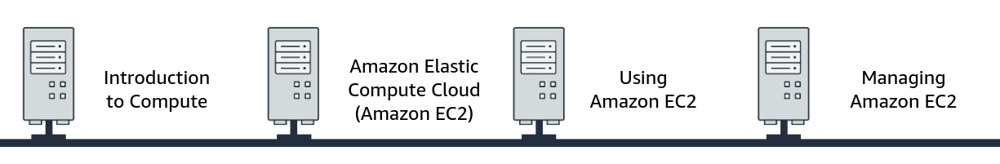

#   [Getting Started with Compute](https://awseducate.instructure.com/courses/817)

##	Overview
When we consider running our workloads on Amazon Web Services (AWS), we will want to consider our compute options. AWS provides the services that we need to build the compute solution that’s right for our workload and our business. We will review the primary compute types and the differences between them. We will also learn how computing balances different amounts of compute, memory, storage, and networking to optimize for our use case.

We will then focus on Amazon Elastic Compute Cloud (Amazon EC2), a secure and resizable compute service that offers reliable, scalable infrastructure on demand. Customers of all sizes and industries can use the broad range of instance choices from Amazon EC2 to match their workloads’ needs. We will learn about the types of instances to meet our use case. These instance types include general purpose, compute optimized, memory optimized, storage optimized, and accelerated computing. 

In this course, we acquire the knowledge that we need to start using Amazon EC2. We will learn about the key concepts and features of Amazon EC2. We will learn how to launch and configure an instance to meet our workload’s needs. We will choose storage for our compute instance and configure security to keep our data secure.  

##	Objectives
By the end of this course, we will be able to do the following:

+   Discuss different types of compute solutions and their features and benefits.
+   Discuss the basic features and concepts of Amazon EC2.
+   Describe EC2 instance types and how to choose an instance type.
+   Describe how to use Amazon EC2 to launch and configure an instance.
+   Describe how to manage EC2 instances.
+   Use Amazon EC2 to launch and manage and instance.

Click <a href="https://awseducate.instructure.com/courses/817">Getting Started with Compute</a>

<small>**_Getting Started with Compute_**</small>

+   In this module we learn about the compute domain and the Amazon Elastic Compute Cloud (Amazon EC2) service. It is broken into four sections.

    ####  [1.  Introduction to Compute]()
    ####  [2.  Amazon Elastic Compute Cloud (Amazon EC2)]()
    ####  [3.  Using Amazon EC2]()
    ####  [4.  Managing Amazon EC2]()

<small>**_Four Sections_**</small>

### Introduction to Compute
+   ####    Introduction to Compute

    Computing is the brain behind IT applications. Organizations all around the world run diverse workloads on different compute platforms. Dependin on our workload, we might need a different architectural method for how we set up our computing resources. 

    
    

    <small><b><i>Introduction to Compute</i></b></small>
    

    

    In this section of the module, we will be introduced to the basics of compute, compute architectural methods, and some compute services that AWS offers.

+	####	What is computing?

    Computers have been around for a long time. Through the years, they have changed a lot. We rely on them for many things, including  things that we might not ordinarily associate with computers.

    
    

    <small><b><i>Computer Development</i></b></small>
    

	For example, we rely on computing for communication, travel, medical equipment, scientific research, financial security, sales transactions, everyday business tasks, entertainment, and much more.

    
    

    <small><b><i>Examples of Computing</i></b></small>
    

    At  its most base level, computing is the brain that makes IT applications work. It collects any necessary data, and it can then analyze that data, process that data, and, finally distribute that data.

    The main components of computing are CPU, memory, hard drive and network performance.

    
    

    <small><b><i>Components of Computing</i></b></small>
    

	+	#####	CPU
		CPU is the central processing unit. It is responsible for running and processing instructions that it is given.
		
	+	#####	RAM
		Our Computer's memory, or RAM, stores data that the computer needs to carry out processing tasks. For example, when you run an application, the required data to run the application is temporarily stored on the RAM.
		
	+	#####	Hard drive
		The hard drive is long-term storage where all of our files are stored and kept.
		
		
	+	#####	Network Performance
		The computer's network performance is the speed at  which a message can be sent or received. It is measured in two ways: bandwidth and latency.
		
		+	######	Bandwidth
			Bandwidth is the amount of data  that can be sent  over  a specified time.
		+	######	Latency 
			Latency is how long it takes the data to travel.

    

	Every computer has an operating system. The operating system is the software package that manages the computer's hardware and software.
    
	Some of the most familiar operating systems are Microsoft Windows, Linux, and Apple's MacOS. The operating system, combined with our computer's hardware and additional software, determines the capabilities of our computer.

    
    

    <small><b><i>Examples of OS</i></b></small>
    

	With the expansion of virtualization technologies, computing has moved into what is called the **cloud**.
	
	Cloud Computing is the on-demand delivery of IT resources over the internet with pay-as-you-go pricing. It alleviates the need to buy, own, and maintain physical data centers and servers. Instead, you can access  technology services, such as computing power, storage, and database, on as-needed basis from a cloud provider like AWS.
    
    
    

    <small><b><i>Cloud Computing</i></b></small>
    

    +	####	Benefits of Cloud computing
		Cloud computing has several benefits compared to on-permises computing.
		<!-- +	#####	Save on costs
		+	#####	Scalable
		+	#####	Reliable -->
		
        
        

        <small><b><i>Benefits of Cloud computing</i></b></small>
        

+	####	Computing Methods
    When deciding which computing method would work best for our architecture, we might consider instances, containers, serverless, or a hybrid of cloud and on-premises computing.

    +	#####	Instances

		An **instance**, or virtual machine, is a computing resource in the cloud. It works like a traditional on-premises server. it can support workloads such as web hosting, applications, databases, authentication services, and anything else a serveer can do. We choose the operating system (OS), CPU, memory, storage, and other components, and in a few minutes, our instance is ready to use. As soon as we're done, we can stop or terminate the instances. We're not locked in or stuck with servers that we don't need or want. We can treat instances as temproary and disposable computing resources, free from the inflexibility and constraints of a fixed and finite IT infrastructure.
		
		**Instance use cases** include the following:
		+	Hosting environment
		+	Development and testing environments
		+	Backup and disaster recovery

	+	#####	Containers

		**Containers** are a method of operating system virtualization that we can use to run an application and its dependencies in resource-isolated processes. By using containers, we can package an application's code, configurations, and dependencies into simple building blocks that deliver environmental consistency, operational efficiency, developer productivity, and version control.
		Containers are smaller than virtual machines and do not contain an entire operating system. Instead, containers share a virtualized operating system and run as resource-isolated processes, which ensure quick, reliable, and consistent deployments. Containers hold everything that the software needs to run, such as libraries, system tools, code, and the runtime.
		
		**Containers use case** include the folllowing:
		+	Building microservices architecture
		+	Video rendering services
		+	Quick development and deployment

	+	#####	Serverless
		**Serverless computing** gives you the ability to run code without provisioning or managing servers. Serverless computing features automatic scaling, built-in high availability, and a pay-for-use billing model to increase agility and optimize costs. Serverless computing also eliminates infrastructure management tasks like capacity provisioning and patching, so we can focus on writing code that serves our customers.
		
		**Serverless use cases** include the following:
		+	File processing 
		+	Web applications 
		+	Mobile backends
		+	Cron jobs (scheduled computing tasks)

	+	#####	Hybrid

		In a **hybrid** deployment, cloud-based resources are connected to on-premises infrastructure. We might want to use this approach in a number of situations. For example, we have legacy applications that are better maintained on premises, or government regulations require our business to keep certain records on premises.
		
		For example, suppose that a company wants to use cloud services that can automate batch data processing and analytics. However, the company has several legacy applications that are more suitable on premises and will not be migrated to the cloud. With a hybrid deployment, the company could keep the legacy applications on premises while benefiting from the data and analytics services that run in the cloud.

		**Hybrid use cases** include the following:
		+	Legacy applications
		+	Company regulatory requirements
		+	Government regulatory requirements

+	####	AWS Computing Services
	+	#####	Amazon EC2
		Amazon Elastic Compute Cloud (Amazon EC2) is a web service that provides secure and resizable compute capacity in the cloud. You can use it to provision virtual servers that are called Amazon EC2 instances, which can handle almost any computing need.
		With Amazon EC2 you can do the following:
		+	Provision and launch one or more EC2 instances in minutes.
		+	Stop or shut down EC2 instances when you finish running a workload. 
		+	Pay for only the compute time that you use when running an instance.

	+	#####	AWS Lambda

		AWS Lambda is a serverless compute service that helps you run code without provisioning or managing servers. You pay for only the computetime you consume, and you incur no charges when your code is not running.
		With Lambda, you can run code for virtually any type of application or backend service, all with zero administration. You need only to upload your code, and Lambda manages everything required to run and scale your code with high availability. You can set up your code to automatically launch from other AWS services or call it directly from any web or mobile app.

	+	#####	Amazon ECS

		Amazon Elastic Container Service (Amazon ECS) is a highly scalable and high-performance container management system. It helps customers spin up new containers and manage them across EC2 instances. Amazon ECS supports Docker containers. Docker is a software platform that packages software (such as applications) into containers.
		To manage your containers, you must install an open-source Amazon ECS container agent on your EC2 instances. This agent is referred to as a container instance. You can run this agent on both Linux and Windows Amazon Machine Images (AMIs). Amazon ECS uses API calls to control Docker-enabled applications.

	+	#####	Amazon EKS

		Amazon Elastic Kubernetes Service (Amazon EKS) provides the flexibility to start, run, and scale Kubernetes applications in the AWS Cloud or on premises. Kubernetes is an open-source platform for managing containerized applications. It is portable and extensible.
		With Amazon EKS, you will be able to provide highly available and secure clusters. It automates patching, node provisioning, and updates.

	+	#####	AWS Fargate

		AWS Fargate is a serverless compute engine for containers. It supports both Amazon ECS and Amazon EKS architectures. Fargate allocates the right amount of compute, which reduces the need to manage EC2 instances, cluster capacity, and scaling.

	+	#####	AWS Elastic Beanstalk