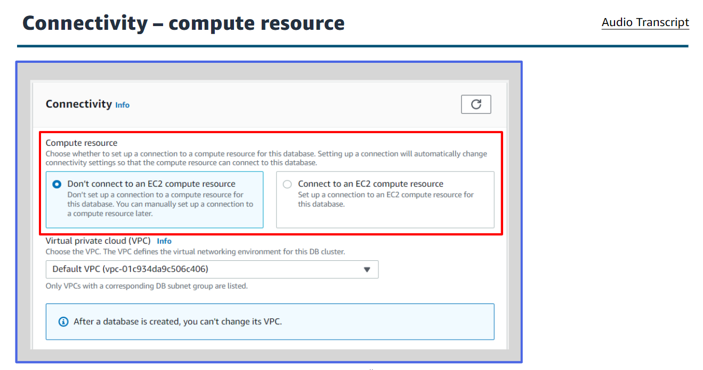

#   [Getting Started with Databases](https://awseducate.instructure.com/courses/912)

## Overview

The business world is constantly changing and evolving. By accurately recording, updating, and tracking data efficiently and on a regular basis, companies can use the immense potential from the insights that they obtain from their data. Database management systems are the crucial link for managing this data. Like other cloud services, cloud databases offer significant cost advantages over traditional database strategies.

In this module, you learn about database fundamentals and Amazon Relational Database Service (Amazon RDS). Amazon RDS is a managed web service that helps customers create and manage highly scalable and secure relational databases in the AWS Cloud. Customers aren’t responsible for hardware provisioning, database setup, software patching, and backups. AWS manages common database administrative tasks.

Amazon RDS supports most relational database engines, including commercial (such as Oracle and Microsoft SQL Server [MSSQL]), open source (MySQL, PostgreSQL, and MariaDB), and Amazon Aurora. With Amazon RDS, you store and transmit data securely.

In this course, you acquire the knowledge that you need to start using Amazon RDS. You learn about the key elements of Amazon RDS and explore how to configure them. You also learn the basic elements of high availability, backups, and security to set up a database that suits the needs of your workload. 

##  Course Level 

This is a foundational level course that is written for learners beginning with cloud computing and AWS services. When you start this course, you don’t need to have a deep understanding of cloud computing. If you already have a deeper understanding of cloud computing, you might still find this course helpful in refreshing your knowledge and practicing your skills. 

It’s helpful if you already have a basic understanding of cloud computing concepts and the AWS Management Console. AWS Educate supports this background knowledge with the following courses:

+   Introduction to the AWS Management Console
+   Introduction to Cloud 101

##  Objectives
By the end of this course I will be able to do the following:

+   Describe key database concepts.
+   Compare and contrast relational and nonrelational databases.
+   Identify the AWS database services.
+   Discuss the features and concepts of Amazon RDS.
+   Describe the benefits and use cases of Amazon RDS.
+   Describe how to set up an RDS instance using the console.
+   Identify how to connect to the database instance.
+   Discuss how to use SQL commands to read and write to the database.

Click <a href="https://awseducate.instructure.com/courses/912">Getting Started with Databases</a>

---

####    Why databases?
A computer need to store the information, before that the information can be reference or changed . A computer also need to find the right information at the right time A database is logically organized collection of information designed in such a way the information with them can be accessed for later used by a computer program.
    

####    Data models and structure   
Data model is the logical structure of the database and determine the rules for how information can be organized an used. The data model you choose is influenced by the structure of your data. Data structure in three different ways:
1.      Structured data:
    It is stored as a series of data values in related tables. This data is highly structured. This means it is formatted so that it owner can be made accessible for most effective processing and analysis. The data is also able to be used for highly complex queries.

2.      Unstructured database  
    +   Stored as files
    +   Lacks predefined structured
    +   Special tools to catalog and query

3.      Semi structured data
    +   Highly flexible
    +   Changed as needed
    +   Analyzed    

   

####    Database terms and concepts
1.      Schema
    A database schema is the blueprint of the database. The schema outlines the relationships within the database and the constraints of the database.
    There are two main types of schemas: schema-less and semi-structured or fixed schema.
    +   A schema-less database manages information without the need for a blueprint.
    +   Semi-structured data does not follow the format of a tabular data model or relational databases because it does not have fixed schema.

2.      Read/Write
    Reading and writing to a database is just what it sounds like.
    +   When you complete actions that read from the database you are accessing the data for a particular purpose.
    +   When complete actions that write to the database you are putting new data into the database or changing data that is already existing.
    knowing if you workload will have more read operations or write operations will help you to design a database that is optimized for speed and efficiency.  

3.      Input/output operations per second
    IOPS is the measure of performance of reads and writes to a storage location like a database.
    Databases are IOPS intensive because they are continuously reading from the database and modifying the pages. Given this aspect of database, it is important to consider the impact of your performance when selecting IOPS.
    To improve latency and rea/write throughput, provision more IOPS when configuring the database. Limiting the IOPS may cause the database to hit the threshold and reduce performance. Over provisioning of IOPS will result in higher costs for the instance.

4.      ACID and BASE compliance
 

 

 

5.      OLTP/OLAP
     

6.      Indexes
     

7.      SQL query language
     

####    Types of database
1.  Relational database
+   Structured data

2.  Nonrelational database
+   Unstructured and semi structured data

  

####    Relational database tables
  

####    Relational databases benefits
+   Ease of use for structure data
+   Data integrity controls and accuracy
+   Common shared query language
+   Reducing redundancy and overall data storage.

 

####    Use case of Relational database
 

####    Nonrelational database
 

####    Non relational database benefits
+   flexibility
+   Scalability
+   High performance
+   Highly functional APIs

####    Non relational database use case
 

####    Why AWS database
+       purpose built
    AWS database service are purpose-built to support what your application is designed to do. Choose database service that best matches your workload.

+       performance at scale
    AWS offers databases hat are three to five times faster than popular alternatives, or non-relational databases that give you microsecond to sub-millisecond latency.

+       fully managed
    AWS manages database tasks such as server provisioning, patching, configuration, and backups so you can focus on developing your application.

+       secure and highly available
    AWS database are built for business-critical, enterprise workloads. They offer high availability, reliability, and security with multi-region and end-to-end encryption support.

####    Database deployments and management
+   On-premises database
 

+   Hosted on Amazon EC2
 

+   AWS managed    
 

####    AWS databases
 

+   Relational
 

+   key-value
 

+   Document
 

+   Timestream

+   In-memory

+   Graph

+   Ledger

+   Key spaces

####    Introduction to Amazon Relational Database Service(Amazon RDS)
+   Cost-efficient
+   Automating administration tasks
+   Resizable capacity

####    Amazon RDS engines

####    Amazon RDS
    It is fully managed relational database service that supports the major relational database engines.

<b>Why move to a fully managed services?</b>

1.  Pass on the burden of repetitive tasks.
such as:

+   Backups and restores
+   Software installations and patching
+   Managing hardware

2.  Pass on the responsibility and engineering efforts.
+   scaling servers
+   highly available environments
+   maintenance free migration

####    Amazon RDS benefits
+   Easy to administer
+   Available and durable
+   Highly scalable
+   Fast
+   Secure
+   Inexpensive

####    High availability: Multi-AZ deployments

####    High availability: Multi-AZ deployments benefits
+       Enhanced durability
    +   Multi-AZ deployments for the MySQL, MariaDB, Oracle, and PostgreSQL engines utilize synchronous physical replication to keep data on the standby up to date with the primary.
    +   Multi-AZ deployments for the SQL Server engine use synchronous logical replication o achieve the same result, employing SQL Server-native mirroring technology.
    +   If the storage volume on the primary instance falls, Amazon RDS automatically initiates a failover to the standby.

+       Increased availability
    +   If there is an Availability Zone or primary database failure, your availability impact is limited to the time automatic failover takes to complete-typically under two minutes.
    +   This availability benefit extends to planned maintenance and backups as well.
    +   Upgrades and patches are installed on the standby instance first.
    +   Once completed, a failover is initiated, and the updates or patches are installed on the remaining instance.

+       No administrative intervention
    +   DB instance failover is fully automatic and requires no administrative intervention.
    +   Amazon RDS monitors the health of your primary and standbys and initiates a failover automatically in response to a variety of failover conditions.

####    Amazon RDS read replicas
+   Amazon RDS allows you to create a special type of database instance called a read replica from a source database instance.
+   Elastically scale out beyond the capacity constraints of a single database instance for read-heavy database workloads.
+   Create one or more replicas of a given source database instance to increase aggregate read throughput. 

####    Amazon RDS read replicas benefits
+       Enhanced performance
    Amazon RDS uses the MariaDB, Microsoft SQL Server, MySQL, Oracle, and PostgreSQL DB engines built-in replication functionality to create a special type of DB instance called a read replica from as source DB instance. The source DB instance becomes the primary DB instance. Updates made to the primary DB instance are asynchronously copied to the read replica. You can reduce the load on your primary DB instance by routing read queries from your applications to the read replica. Using read replicas, you can elastically scale out beyond the capacity constraints of a single DB instance for read-heavy database workloads.

+       Increased availability
    Enhanced availability by deploying a standby instance in a second AZ, and achieve fault tolerance in the event of an AZ or database instance failure.

+       Designed for security 
    When you create a read replica for Amazon RDS for MySQL, MariaDB, or Postgres SQL, Amazon RDS sets up a secure communications channel using public key encryption between the source DB instance and the read replica, even when replicating across Regions. Amazon RDS establishes any possible security configurations, such as adding security group entries, needed to enable the secure channel. You can also create read replicas within a Region or between Regions for you Amazon RDS for MYSQL, MariaDB, PostgreSQL, or Oracle database instances encrypts at rest with AWS KMS.

There is a limit of five read replicas per primary    

####    High availability example
    

####    Amazon RDS High availability failover
 

####    Amazon RDS High availability failover sequence4
 

####    Multi-AZ vs read replicas

####    Database backups

####    Database retention and backup storage

####    AWS backup
+   Use AWS backup to manage backups of Amazon RDS DB instances
+   AWS backup service provides a centralized backup console
+   Backups managed by AWS backup are counted as manual backups.

####    Amazon RDS backup solution

####    Restoring Amazon RDS databases

####    Use case for Amazon RDS

####    RDS costs

####    Setting up Amazon RDS

####    Amazon RDS workflow

####    Amazon RDS decision points
+   creating a virtual private cloud(VPC)
+   Amazon Elastic Compute Cloud (Amazon EC2) instance and the Amazon RDS database
+   Understand your workload, what is it that you want to accomplish

<b>    Database engine</b>
+   Database engine you want to run
+   Each database engine has its own unique characteristics and features.

<b> Instance storage</b>

+   DB instance class you select determines the computation and memory capacity of the Amazon RDS DB instance.
+   Three DB instance class types that are supported by Amazon RDS are standard, memory optimized, and burstable performance.

<b>Security groups</b>

+   control access to a database instance.
+   Amazon RDS can use three types of security groups: database, VPC and EC2
+   Amazon RDS uses AWS Identity and Access Management or IAM.
+   IAM policies assign permissions that determine who can manage Amazon RDS resources.

####    Options for creating a database in the console

####    Amazon RDS creation

####   Amazon RDS creation Engine type

####   Amazon RDS creation templates

####   Amazon RDS creation -deployment options

####   Amazon RDS creation - DB cluster identifier

####    Amazon RDS settings - DB instance class

####    Amazon RDS settings storage type

####    Connectivity - compute resource

####    Connectivity - VPC

####    Connectivity - security groups

####    Connectivity - security groups example

####   Connectivity - additional configuration

####    Modify settings

####    Modify setting- easy use

####  Using Amazon RDS
+   Connect to the database engine
+   Working with the data in the database

####    Connecting to the database
+   A database connection allows you to work  with database tables directly.
+   Use any standard SQL client application to connect to a database on the DB instance.

####    Steps to connecting to database

####    MySQL command-line

####    Troubleshooting
1.      Inbound rules
  

2.      Public accessibility

3.      Port

4.      Availability
    For a newly created DB instance, the DB instance has a status of creating until the DB instance is ready to use. When the state changes to available, you can connect to the DB instance. Depending on the size of your DB instance, it can take up to 20 minutes before an instance is available.

5.      Internet gateway
    For DB instance to be publicly accessible, the subnets in
    its DB subnet group must have an internet gateway. 

6.      DNS port
    The wrong DNS name or endpoint is used to connect to the DB instance.

7.      User authentication
    User authentication is incorrect because of one of the following reasons:
    +   You are using an incorrect user name or password at the database level to access the instance from the DB client.
    +   You don't have the required database permissions to access the instance.
    +   The client is running on a version that's incompatible with the database version.

 ####    Role based access
    

####    Identifying roles
1.      Service user
 

2.      Service administrator
 

3.      IAM administrator
    If you are an IAM administrator, you might want to learn details about how you can write policies to manage access to Amazon RDS.

####    Basic SQL commands - CRUD
+   Structured Query Language = SQL
+   SQL is a programming language that communicated with databases.
+   Uses sets of keywords to retrieve data from databases, these keywords are called statements.
+   Create, read, update, delete are the four basic operations for creating and managing persistent data elements.
+   CRUD refers to the major operations which are implemented by databases. Each letter in the acronym can be mapped to a standard SQL statement.

####    Adding data in the database
 

####    Quering data
 

####    Removing data
 

####    Monitoring Amazon RDS

####    Monitoring Amazon in console

####    Monitoring tab metrics

####    Types of metrics
1.      High CPU or RAM
    A baseline helps you to interpret the results of this metric. There is no clear value at which you need to worry. It all depends on the database design.    
2.      Disk space
    You should be connected if this metric returns values at or above 85 percent of the total disk space. Consider deleting data or archiving data to a different system to free up space.

3.      Network traffic
    A baseline helps you to interpret the results of his metric. Work with your network architect to understand what expected throughput is. Investigate network traffic if throughput is consistently lower than expected.

4.      Database connections
    The optimal number of user connections for your database instance will vary based on your instance class and the complexity of the operations being performed. You can determine the number of database connections by associating your database instance with a parameter group where the User Connections parameter is set to a value other than 0 (unlimited). You can either use an existing parameter group or create a new one.

5.      IOPS metrics
    A baseline helps you to interpret the results of their metric. You should be concerned if values are consistently different than your baseline. For best IOPS performance, make sure your typical working set fits into memory to minimize read and write operations.

6.      Amazon CloudWatch alarms
    You can watch a single metric over a specific period of time and perform one or more actions based on the value of the metric relative to a threshold you set.

7.      Amazon CloudWatch logs
    Most database engines enable you to monitor, store, and access your database log files in CloudWatch logs.