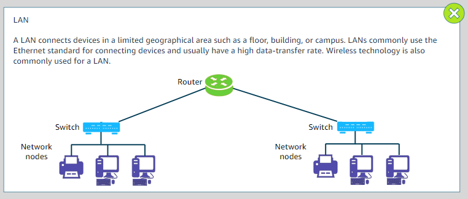
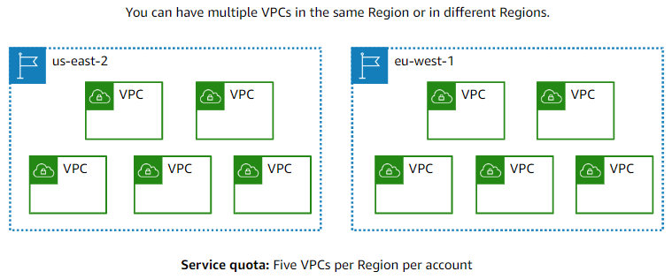

#   [Getting Started with Networking](https://awseducate.instructure.com/courses/911)

##	Overview
Computer networking refers to interconnected computing devices that can exchange data and share resources with each other. These networked devices use a system of rules, called communications protocols, to transmit information over physical or wireless technologies. Modern-day network solutions deliver more than connectivity. They are critical for the digital transformation and success of businesses today.

Amazon Virtual Private Cloud (Amazon VPC) is a service that we can use to provision a logically isolated section of the AWS Cloud. This section (called a virtual private cloud, or VPC) is where you can launch our Amazon Web Services (AWS) resources. With Amazon VPC, we have control over your virtual networking resources. These resources include the selection of our own IP address range, the creation of subnets, and the configuration of route tables and network gateways.

In this course, we will acquire the knowledge that we need to start using Amazon VPC. We will learn about the key elements of Amazon VPC and explore how to configure them. We will learn how to set up security for VPCs and learn about other AWS networking services.   

##	Objectives
By the end of this course, we will be able to do the following:

+   Describe networking fundamental concepts.
+   Explain Amazon VPC features, benefits, and use cases.
+   Discuss how to configure public and private subnets.
+   Discuss how to configure route tables to direct traffic in your network.
+   Describe how to use an internet gateway and a virtual private gateway to allow traffic into your network.
+   Discuss how to configure security in a VPC by using network access control lists (network ACLs) and security groups.
+   Describe types of IP addressing, including use and benefits.
+   Identify ways to manage your VPC.

---

# Getting started with Networking

###	1.	Beginning Scenes
**A.  Introduction to networking**

+	Network basics
+	OSI model
+	IP Address
+	VPCs

**B.  Introduction to Amazon Virtual Private Cloud(Amazon VPC)**

+	Key concepts
+	Architecture
+	Use cases
+	VPC pricing

**C.  Using Amazon VPC**
+	Subnets
+	Network gateways
+	Route tables
+	Firewalls

**D.  Managing your network**
+	Using additional VPC features 
+	AWS VPN
+	AWS Direct Connect
+	Other AWS networking services

### 2.  Keyboard Shortcuts

**A.    Windows keys**
+   Play/Pause	`Ctrl+Alt+P`
+   Previous slide	`Ctrl+Alt+,(Comma)`
+   Next slide	`Ctrl+Alt+.(period)`
+   All shortcuts	`Shift+?`

**B.    Mac keys**
+   Play/Pause	`Ctrl+Option+P`
+   Previous slide	`Ctrl+Option+,(Comma)`
+   Next slide	`Ctrl+Option+.(period)`
+   All shortcuts	`Shift+?`

### 3.	Introduction to Networking
Computer network is two or more devices connected together to share resources. Devices on network are called **nodes**. Nodes on network are divided into two categories. They are:
+   #####   Host node
    Centralized node that shares files, applications, and resources with other nodes on the network.
    Examples:
    +	File Servers
    +	Email Servers
    +	Web Servers

+   #####    Client node
    Nodes that depend on the host node for files, applications, and resources.
    Examples:
    +	Computers
    +	Printers
    +	Mobile devices

+   ####    Network Components

    

    +   #####   Server
        A sever is a physical computer that runs software services that other computer devices or software can access. Servers are distinguished by the service that they provide. Common use cases for servers include the following:
        
        +   Web servers: stores and distributes web pages and other web content by using HTTP
        +   File server:    Stores and distributes files
        +   Database server: Stores databases and manages access to the databases
        +   Print server: Controls and manages one or more remote printers on the network
        +   Mail server: Stores and delivers email, like a digital post office
        +   Proxy server: Improves security by acting as an intermediary ror requests from clients that are seeking resources

        
    +   #####   Router
        A router is a network device that connects multiple network segments into one network. It is located at any gateway. The router connects multiple switched and their respective networks to enable communication between the different networks. It acts as a switch between networks and can also filter the data tha flows through it. As soon as the router is connected, it can make intelligent decisions about how best to get network data to its destination. It bases these decisions on network performance data that it gathers from the network itself.

    +   #####   Internet services provider
        It is an organization that provides internet access to its customers. Without the services that an ISP offers, you would no be able to access other networks on the internet.

    +   #####   Cloud
        It is on-demand delivery of IT resources over the internet. You don't need to buy, own, and maintain physical data centers and servers. Instead, you can access technology services, such as servers, storage, and databases, on an as-needed basis from cloud provider like AWS.

    +   #####   Hubs and Switches
        

    +   #####   Network nodes

        

+   #### OSI Model
    It is a suite of protocols, or rules, to govern how computers communicate with one another. The layers are:
    

    **1.  Physical layer**
    It defines standards for transmitting raw data(bits) over transmission media to connect network nodes. The physical layer provides an electrical, mechanical, and procedural interface to the transmission medium.
     

    **2.  Data link layer**
    It defines standards for transferring data between adjacent network nodes in a wide area network(WAN) or between nodes on the same local area network(LAN) segment. This layer can provide the means to detect and possibly correct errors that might occur in the physical layer.
     

    **3.  Network layer**
    It is responsible for communication across different networks. It provides the means of transferring variable-length network packets from a source to a destination host through one or more networks.
      

    **4.  Transport layer**
    It provides transport transfer of data between users, and it provides reliable data transfer services to the upper layers. The transport layer controls the reliability of a given link through flow control, segmentation and de-segmentation, and error control. This layer also provides the acknowledgement of a successful data transmission and sends the next data if no errors occurred.
     

    **5.    Session layer**
    It provides the mechanism for opening, closing, and managing a session between user application processes. Communication sessions consist of requests and responses that occur between applications.
     

    **6.    Presentation layer:**
    It is responsible for formatting and delivering information to the application layer for further processing or display. It translates data bases on that the application accepts.
     

    **7.    Application layer:**
    It is closet to the user, which means that both the OSI application layer and the user interact directly with the software application. The function typically include identifying communication partners, determining resource availability, and synchronizing communication.

+   #### Network Models

    

    **1.    Peer-peers model**
    It is a computer system connected to each other for the purpose of distributing workloads. They could also be used for sharing resources such as files, printers, and storage.
    In this network model,each node has is own data and application and is responsible for its own management and security. Peers are equally privileged participants in the architecture.
    For example, files can be shared directly between systems on the network without the need for a central server.
    **Use cases:**
    +   Users are responsible for backing up each node.
    +   Security requirements are not restrictive.
    +   A limited number of peers are used.
     

    **2.    Client-server model**
    In this model, the data management and application hosting are centralized at the server and distributed to the clients. All clients on the network must use the designated server to access shared files and information that are stored on the serving computer.
    If the server goes down, no client is able to access the network until the server is restored.
    The following are examples:

    +   File server and desktop clients.
    +   Print server and desktop clients.

    **Use case:** Most business networking architecture.
     

+   #### Network types

    **1.   LAN**
    A LAN connects devices in a limited geographical area such as a floor, building, or campus. LANs commonly use the Ethernet standard for connecting devices and usually have a high data-transfer rate. Wireless technology is also commonly used for a LAN.

    

    **2.    WAN**
    A WAN connects devices in a large geographical area, such as in multiple cities or countries. WANs are used to connect LANs and use technologies such as fiber-optic cables and satellites to transmit data. The internet is considered to be the largest WAN.

    

+   #### Internet protocol (IP) address

    

    

+   ####    IPv4 and IPv6 addresses

    +   <u>__IPv4 addresses__</u>

        +   Example :19.0.2.0
        +   32 bits in length
        +   Provides up to 4.3 billion IP addresses
        +   Is more commonly used and established.
        +   Is supported by all VPNs(unlike IPv6, which currently is not)

    +   <u>__IPv6 addresses__</u>

        +   Example: 2600:1f18:22ba:8c00:ba86:a05e:a5ba:00ff
        +   128 bits in length
        +   Provides practically an unlimited number of IP addresses
        +   Accommodates more user devices
        +   Will eventually replace IPv4

+   ####   Classless Inter-Domain Routing (CIDR)

    

    +   ##### CIDR block example
        

        

    +   ##### CIDR special case
        

+   #### Subnets
    

    

    

    +   ##### Planning ahead

        <b>For Network CIDR block</b> : 10.0.0.0/24 
        It has network of six subnets. It give 256 IP addresses. The subnet are using 26 net mask CIDR block which offer 64 IP addresses for the first 4 subnet before you run out of IP addresses.

        

        We can also use 27 net mask which offer use 32 IP addresses which might not be enough.
        

        <b>For Network CIDR block </b>: 10.0.0.0/16
        It offers 65,532 IP addresses to use among subnets.

        

        When planning ahead not only computers, servers and printers are not the devices that need IP addresses but also Load balancer, switches, routers, work stations, fax machines, mobile devices need IP addresses.

        

+   #### Subnet types
    **1.    Public subnets**
    A public subnet allows internet traffic that is routed through an internet gateway to reach the subnet. A public subnet might make a good choice if you have a website that is targeting customers.

    **2.    Private subnets**   
    It denies traffic to the subnet that is routed from the public internet. You should use a private subnet your network must connect to services outside your network but must restrict external services from initiating a connection to your network. Access to the public internet from a private subnet requires a NAT devices.

+   #### Your cloud in cloud
        

### 4.  Introduction to Amazon VPC

<b>VPC flow logs can be used for:</b>

+   Networking monitoring
+   Security analysis
+   Expenses optimization

+   ####    Default VPC
     

+   ####    VPC Quotas
     

+   ####   VPC Use Case

     

    +   #####   Presentation tier
        The presentation tier where web-server host a user interact websites or applications, the user access directly over the internet.

    +   #####   Logic tier
        Logic tier is where he code is stored on an application server and where the computing processes occurred as a presentation tier interact with logic tier.

    +   #####   Data tier
        Data tier is where database is stored. Typically the database only sends and receives traffic from the logic tier. Presentation tier will not have direct access to Data tier. In most three tier architecture logic and data tier are protected in private  subnets that not directly accessible on the internet.

    +   #####   Amazon VPC multi-tier application example

         

+   ####   VPC Architectural Patterns
    +   #####   Single VPC pattern
        There are limited use cases where one VPC could be appropriate.
        +   Small, single applications managed by one person or a very small team.
        +   High-performance computing
        +   Identity management

    +   #####   Multi-VPC pattern
        **Best suited for:**
        +   Single team or single organizations, such as managed service providers.
        +   Limited teams, which makes it simpler to maintain standards and manage access
        
        **Exception:**
        +   Governance and compliance standards might require greater workload isolation regardless of organizational complexity.

    +   #####   Multi-account VPC patterns
        **Best suited for:**
        +   Large organizations and organizations with multiple IT Teams
        +   Medium-sized organization that anticipate rapid growth.    

        **Why ?**
        +   Managing access and standards can be more challenging in more complex organizations.

         

+   ####   Amazon VPC costs
     

+   ####    Components
     

+   ####   Amazon VPC CIDR blocks
     

+   ####   Amazon VPC default components
     

+   ####   VPC ID and tags
    +   #####   VPC ID
        When you create a VPC, it will be auto-assigned a VPC ID. The VPC ID is a string of random numbers and letters that identify your VPC. This ID will be required when you associate additional components to your VPC, such as subnets and route tables. VPC IDs cannot be edited.
        <b>VPC ID example: vpc-0476e890abedg995f</b>

    +   #####   VPC tags

        Because the VPC ID can be difficult to remember, you have the option to tag your VPC with a more identifiable name. By tagging your VPC, the tag name appears after the VPC ID in parenthesis when associating components to your VPC. You can access controls lists(network ACLs). It is recommended that you tag these components to be sure that you are connecting the correct components together.

         

+   ####   Subnets in AWS
     

+   ####   Subnets placement
     

+   ####   Subnetting in AWS
    

+   ####   Subnet sizes
    

+   ####   Subnet and VPC associations
    

+   ####   Network Gateways
    

    

+   ####   Route table
    

+   ####   Route table associations
    

+   ####   Security groups
    At most basic levels it filter inbound and outbound traffic that is allowed in our instances.
    

+   ####   Security group rules
    +   #####   Inbound rules
        By default, it has no inbound rules. Therefore, no inbound traffic that originates from another host to your instance is allowed until you add inbound rules to he security groups.
        The source in an inbound rule determines the traffic that can reach your instance.
        This example shows an inbound rule that is configured to allow Secure Shell(SSH) traffic to a specific IPV4 address. As a result, the user of the specified IP address can update the instance through SSH access.

        

    +   #####   Outbound rules
        By default, a security group includes an outbound rule tha allows all outbound traffic. You can remove the rule and add outbound rules that allow specific outbound traffic only.
        

+   ####   Security groups stateful characteristic
    

+   ####  Choosing security groups

    

+   #### Network ACLs
    

+   ####   Subnet and Network ACL Associations
    

+   ####   Network ACL stateless character
    

+   ####   Network ACL rules
    

+   ####   Network ACLs rule evaluation
    
    
    

+   #### Default and custom network ACLs
    

+   ####   Comparing Security groups and ACL
    

+   ####   VPC and more
    **Options to create a VPC from the AWS Management Console:**

    +   #####   VPC only
        +   You must manually add each component.
        +   You must connect and associate each component together.

    +   #####   VPC and more
        +   Components are created based on a template that you can adjust
        +   You do not need to associate or connect components unless you need to make changes.

+   ####   Deleting a VPC
    **Requires a manual deletion first**
    +   EC2 instances
    +   RDS instances
    +   Elastic load balancer
    +   NAT gateways
    +   Transit gateways
    +   VPC endpoints

    **Automation deletion with VPC**
    +   Subnets
    +   Internet gateways
    +   Egress-only internet gateways
    +   Route tables 
    +   Security groups
    +   Network ACLs
    +   DHCP options
    +   Gateway endpoints

+   ####   Activity: Configuring a VPC based on the use case
    +   #####   Scenario
        You must have a business with a website that is hosted on an Amazon Elastic Compute Cloud(Amazon EC2) instance. You have an application server and customer data stored on a backend database that you want to keep private. You want to use Amazon VPC to set up a VPC that meets the following requirements.

        +   The VPC should be in the N. Virginia Region, where you currently have five VPCs.
        +   The first VPC address of your network must be 10.0.0.0.
        +   You web server should be in a separate subnet from your application and database servers.
        +   Your architecture must be highly available so that customers can access your site,
        +   Your severs must be accessible to a group of administrators by using SSH access.
        +   Security groups and network ACLs should be configured to allow only required traffic.
        +   Five IP addresses that you consider a threat must be considered in security settings.

    +   #####   VPC configurations
        Requirements to consider:
        +   The VPC should be in the N. Virginia Region, where you currently have five VPCs.
        +   The first address of your network must be 10.0.0.0.
        +   Each subnet must have 230 usable addresses.

        The requirements say that this VPC should be in the N. Virginia Region. Therefore, you must submit a ticket to AWS to increase the number of VPCs for the N. Virginia Region.

        To accommodate the requirement that the first address of your network be 10.0.0.0, consider using the CIDR block 10.0.0.0/16. This option will give you enough IP addresses for multiple subnets.

    +   #####   Network gateways
        Requirements to consider:
        +   Your architecture must be highly available so that customers can access your site.
        
        Because you VPC is hosting a website on a web server that is public facing, an internet gateway must be attached. Any instances in the public subnet that will have access to the internet will also need a public IP address.

    +   #####   Subnets
        Requirements to consider:
        +   Your web server should be in a separate subnet from your application servers and database servers.
        +   Your architecture must be highly available so that customers can access your site.

        For a highly available architecture that customers will always be able to access, put at least two public subnets in two different Availability Zones. Traffic would be controlled by an Elastic Load Balancer(ELB) balancer.

        

    +   #####   Route tables
        Requirements to consider:
        +   You have an application server and customer data stored on a backend database you want to keep private.
        +   Your customers must always be able to access your web server.

        You should have a route table that is configured so that your public subnets have a route to the internet through the internet gateway. The private subnets route tables should not have any access to the internet gateway.
        
    +   #####   Security groups
        Requirements to consider:    
        +   your servers must be accessible to a group of administrators through SSH access.
        +   Security groups and network ACLs should be configured to allow only required traffic.

        Your security groups for application, database, and web servers should all allow SSH inbound rules. Rules should be configured so that the web server can communicate with the application server, which should be able to communicate with the database server.    

    +   #####   Network ACLs
        Requirements to consider:
        +   Security groups and network ACLs should be configured to allow only required traffic.
        +   Five IP addresses that you can consider a threat must be considered in security settings.

        Your network ACLs should be configured to complement the security groups. However, remember that security groups only need inbound or outbound allow rules, but network ACLs must be configured to allow inbound and outbound rules.

+   ####    Managing Your Network 
    +   #####   Elastic IP address
        

    +   #####   Elastic IP address flexibility and costs
        

    +   #####   NAT Gateway
        

    +   #####   AWS VPN
        +   create Virtual private gateway
        +   create customer gateway
        +   create private route table
        +   establish site-to-site VPN connection
        

    +   #####   AWS Direct Connect
        Used to establish dedicated private network connection between the network and one of the direct connect locations.
            

    +   #####   VPC Endpoints
        +   ######   Interface VPC endpoints:
            AWS Private link is a technology that provides private connectivity between VPCs, AWS services, and your on-premises networks without exposing your traffic to the public internet. You can create interface VPC endpoints(interface endpoints), which you can use to connect to services that are powered by AWS PrivateLink. You are charged for creating and using an interface endpoint to a service.

             

        +   ######   Gateway endpoints
            Provide reliable connectivity to Amazon Simple storage service(Amazon S3) and Amazon DynamoDB without requiring an internet gateway or a NAT device for your VPC. Gateway endpoints do not enable AWS PrivateLink. There is no additional charge for using gateway endpoints.

    +   #####   VPC Peering
          

    +   #####   VPC Peering restriction
            

    +   #####   Other AWS networking services
        +   ######   Amazon Route S3
             

        +   ######   Amazon CloudFront
             

        +   ######   Amazon API Gateway
             