#   [Getting Started with Security](https://awseducate.instructure.com/courses/905)

##	Overview
AWS Lambda is a compute service that lets us run code without provisioning or managing servers. Lambda runs our code on a high-availability compute infrastructure and performs all the administration of the compute resources, including server and operating system maintenance, capacity provisioning and automatic scaling, and logging. With Lambda, we can run code for virtually any type of application or backend service. 

In this course, we acquire the knowledge that we need to start using AWS Lambda. You learn about the benefits of serverless services and how to use serverless services to decouple our architectures. We learn about the key concepts and features of AWS Lambda including creating functions, configuring functions, monitoring and best practices. We also learn about additional AWS serverless services that are available to us. 

##	Objectives
By the end of this course, we will be able to do the following:
+   Describe microservices and Serverless concepts.
+   Discuss event-driven architectures.
+   Describe the features and benefits of AWS Lambda functions.
+   Discuss how to configure AWS Lambda functions.
+   Identify how to monitor AWS Lambda functions.
+   Describe the best practices for working with AWS Lambda.
+   Identify the features and benefits of additional AWS Serverless services.
---

# Getting started with Serverless

### Introduction to Serverless

+       Microservices
    +   Architectural and organizational approach to software development
    +   Software is composed of small independent services.
    +   Communicate over well-defined APIs.
    +   Owned by small, self-contained teams.

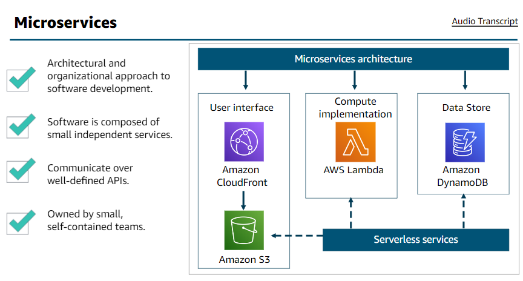    

#####   Tightly versus loosely coupled
1.      Monolithic
    +   Tightly coupled
    +   In this application, if one piece were to fail, the entire application would crash, as this example illustrates. If there is a spike in demand, the entire architecture must be scaled. Adding features to a monolithic application becomes more complex as time goes on. Pieces of the code base must work with each other to sync properly.

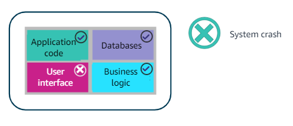    

2.      Microservices
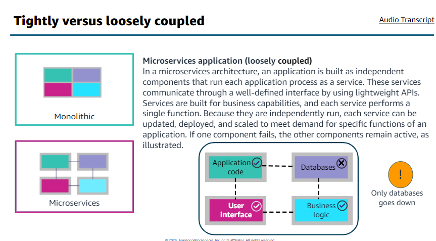 

#####   Benefits of microservices
+   use public APIs

+   use the right tool for the job

+   secure your services

+   be a good citizen

+   company transformation

+   automate everything
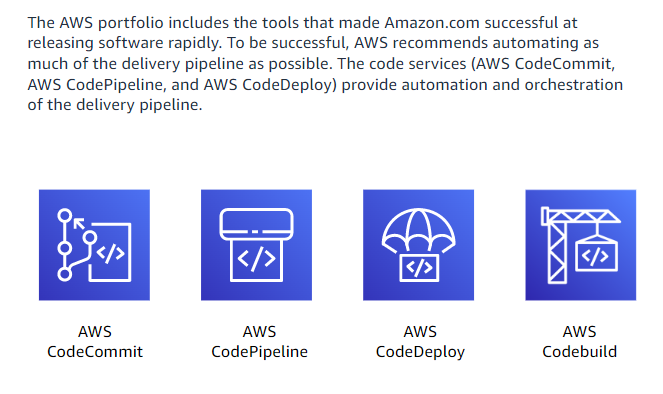

#####   Downside of monoliths
All processes are tightly coupled and run as a single service.
Adding or improving a monolithic application's features becomes more complex as the code base grows.
Dependent and tightly coupled processes increase the impact of a single process failure.

+       Serverless  
Build and run applications and services without thinking about servers.
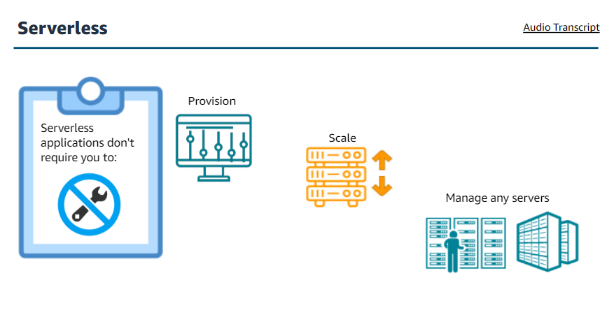

We can build them for nearly any type of application or backend service, and everything required to run and scale your application with high availability is handled for you.
Developers can focus on their core product. 
Not worrying about managing and operating servers or runtime.

#####   Benefits
1.   No server management
AWS founded the concept of serverless on the following principles:
When adapting a serverless service for building a serverless architecture, these ideals are fundamental to serverless strategy.

2.   Pay-for-value services
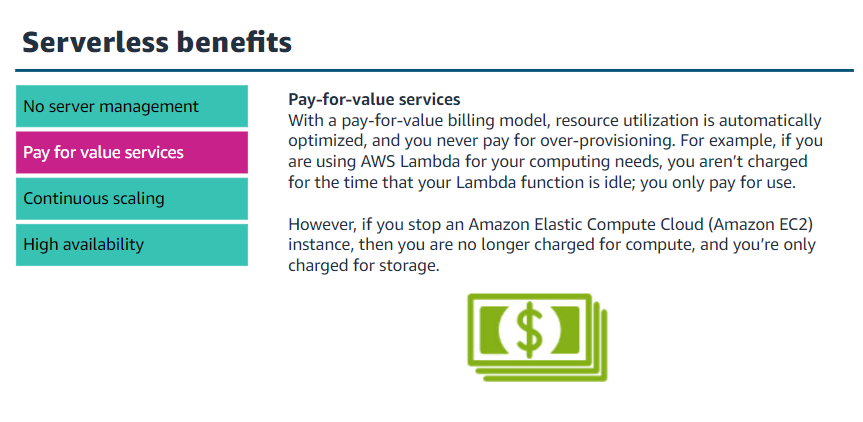

3.   Continuous scaling
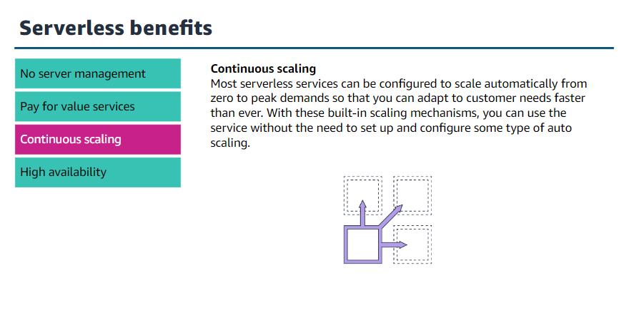

4.   High availability
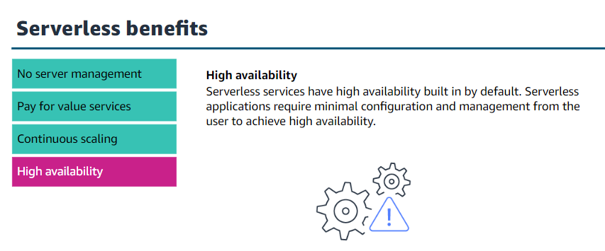

5.       Event driven architectures

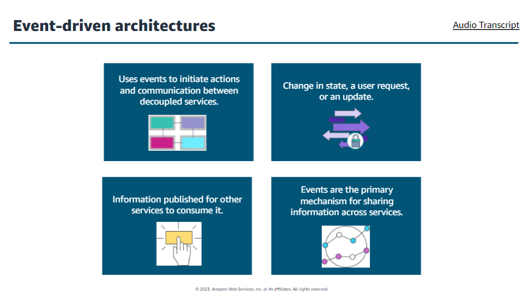

##### Benefits
+       Scale and fail independently
    By decoupling your services, they are only aware of the event router, not each other. This means that your services are interoperable, but if one service has a failure, the rest will keep running. The event router acts as an elastic buffer that accommodates surges in workloads.
+       Audit with ease
    An event router acts as a centralized location to audit your application and define policies. These policies can restrict who can publish and subscribe to a router and control which users and resources have permission to access your data. You can also encrypt your events.
+       Develop with agility
    

+       Cut costs
 

##### Serverless and non-serverless services work together
 

6.       Hybrid methods

### Introduction to Lambda
 

#####   Function configuration elements
+   Name
+   Description
+   Memory
+   Ephemeral Storage

#####   Some Lambda function triggers
+   S3 events
+   Amazon EventBridge
+   Amazon CloudWatch alarms
+   Other lambda functions

#####   AWS lambda function

#####   AWS lambda core components

#####   Lambda function invoking

#####   Types of invocation
+   Synchronous

+   Asynchronous

+   Polling
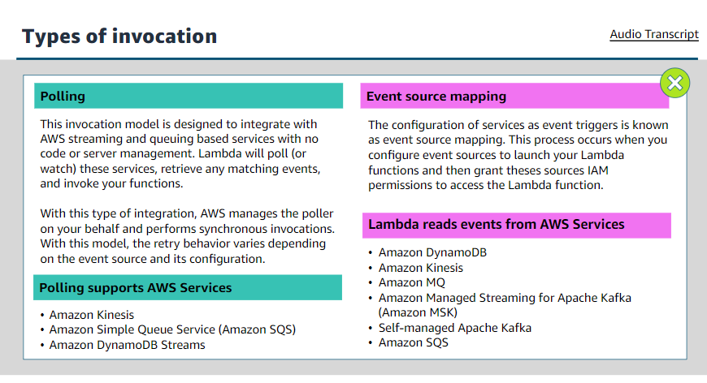

### Execution environment lifecycle

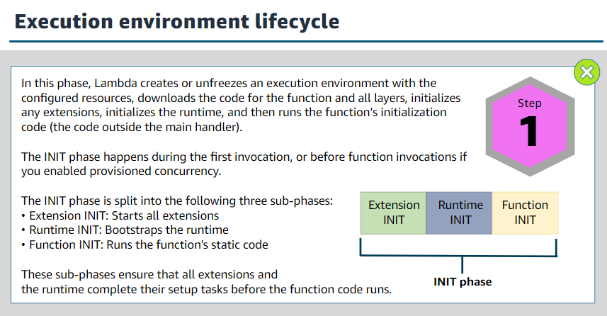

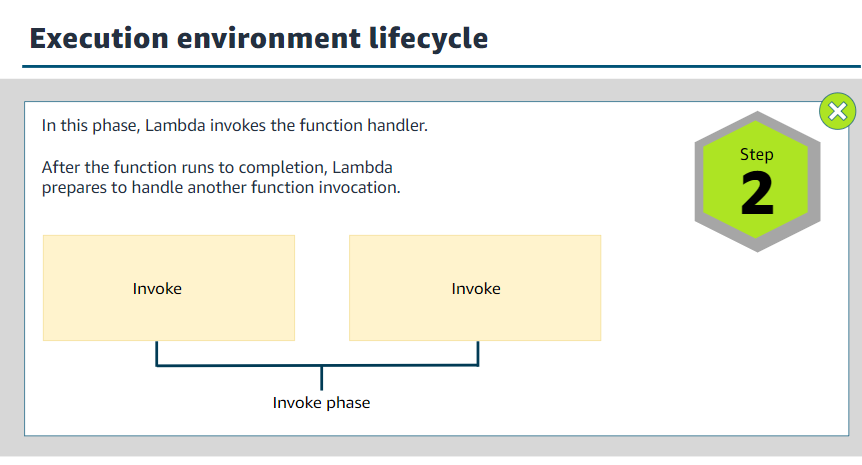

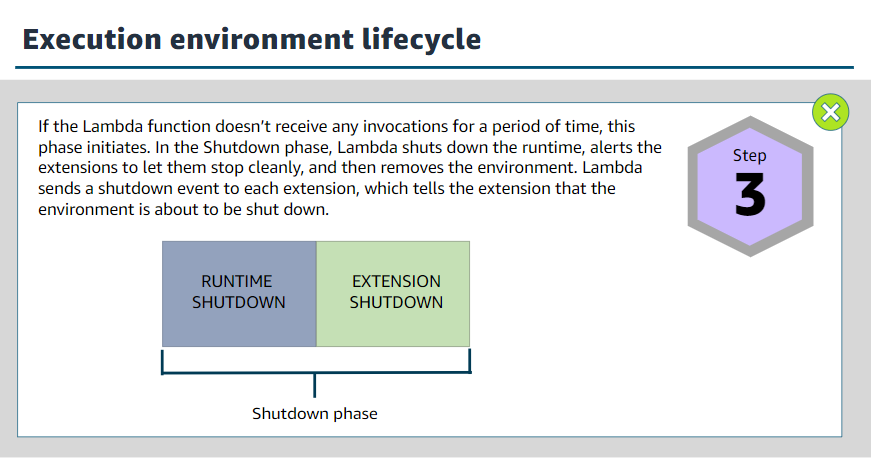

### Cold and warm starts

#####   Event source

#####   AWS lambda permission

### Identifying limits

+   memory
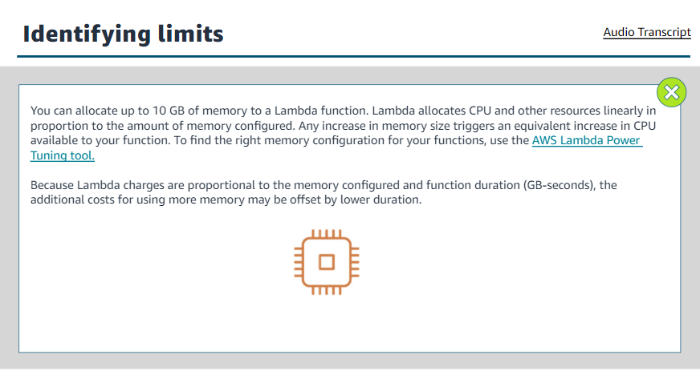

+   timeout
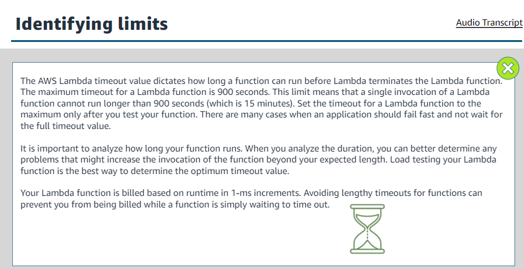

+   Concurrency
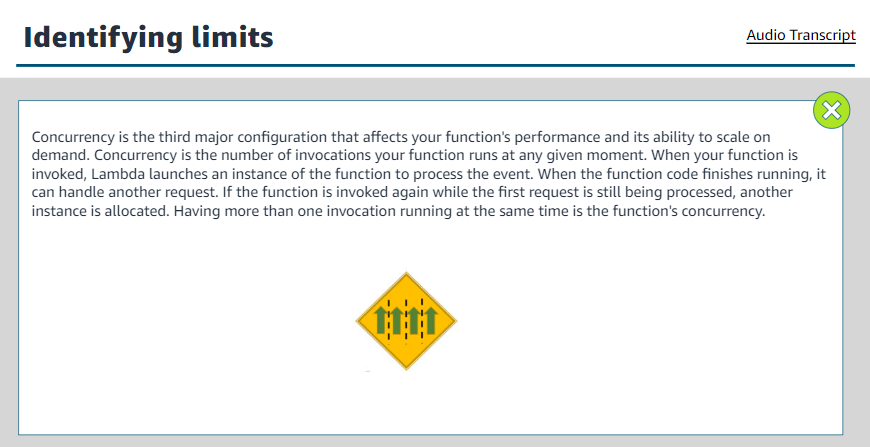

#####   AWS lambda use cases
+   Web applications
    It includes
    +   static websites
    +   Complex web applications
    +   packages for flask and express
    +   built-in-https endpoints for single-function microservices

+   Backends: includes applications and services, mobile, IOT

+   Data processing: includes real-time processing, MapReduce

+   Chatbot: An example of chatbot use case would be powering chatbot logic.

+   Amazon Alexa: includes powering voice-activated application, alexa skills kit

+   IT automation: Policy engines, extending AWS services, Infrastructure management

#####   Pricing
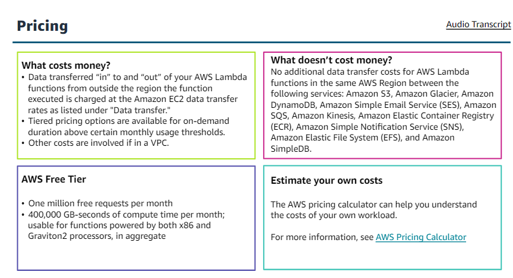

### Preparing to work with Lambda
Coding experience and expertise in the following domains.
+   Linux OS and commands
+   Security services and concepts
+   Cloud concepts and IP networking
+   Distributed computing concepts.

#####   Three ways to build an AWS Lambda function

#####   Function basic information

#####   Handler method

1.      Event handler

2. Context object

#####   Design best practices
+   Separate business logic
Separate your core business logic from the handler event.
This makes your code more portable, and you can target unit tests on your code without worrying about the configuration of the function.

+   Modular functions
It will reduce the amount of time that it takes for your deployment package to download and unpack before invocation. Instead of having one function tha does compression, thumbnailing, and indexing, consider having three different functions that each serve a single purpose. 
Follow same principles you would apply to developing microservices.

+   Treat function as stateless

+   Only include what you 

#####   Best practices of writing code
+   Include logging statements

+   Use return coding

+   Provide environment variables

+   Add secrets and reference data

+   Avoid recursive code

+   Gather metrics with Amazon CloudWatch

+   Reuse execution context

#####   Configuration memory and timeout

#####   Configuring timeout

#####   Configuring concurrency and scaling

1.      Reserved concurrency
    It guarantees the maximum number of concurrent instances for the function. When a function has reserved concurrency, no other function can use that concurrency. There is no charge for configuring reserved concurrency for a function.

2.      Provisioned
    It initializes a requested number of execution environments so that they are prepared to respond immediately to your function's invocations. Note that configuring provisioned concurrency incurs charges to your AWS account.

#####   Destination and types
+   A destination can send records of asynchronous invocations to other services.
+   Configure separate destinations for events that fail processing and for events that process successfully.
+   Configure destinations on a function, a version, or an alias.
+   Address errors and successes without needing to write more code.

1.  Success
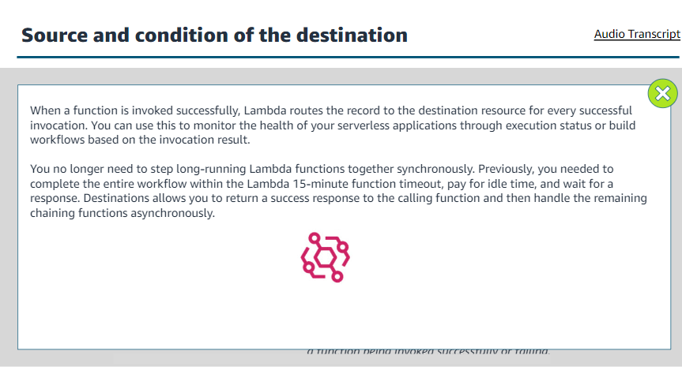

2.  Failure
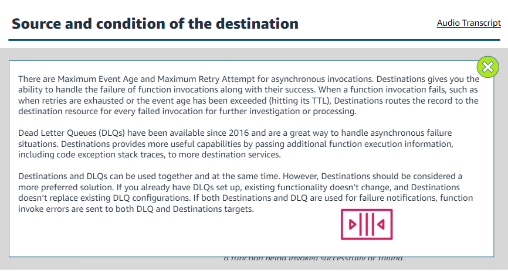

### Types of monitoring graphs
1.      Invocations
    This graph includes the number of times that your function code is run, including successful runs and runs that result in a function error. If the invocation request is throttled or otherwise resulted in an invocation error, invocations aren't recorded.

2.      Duration
    This shows the amount of time that your function code spends processing an event. The billed duration for an invocation is the value of duration rounded up to the nearest millisecond.

3.      Errors
    This includes number of invocations that result in a function error. Function errors include exceptions thrown by your code and exceptions thrown by the Lambda runtime. The runtime returns errors for issues such as timeouts and configuration errors.

4.      Throttles
    This shows number of times that a process failed because of concurrency limits. When all function instances are processing requests and no concurrency is available to scale up, Lambda rejects additional requests.

5.      IteratorAge
    This pertains to event source mappings that read from streams. This shows the age of the last record in the event. The age is the amount of time between when the stream receives the record and when the event source mapping sends the events to the function.

6.      DeadLetterErrors
    For asynchronous invocation, this is the number of times Lambda attempts to send an event to a dead-letter queue but fails.

7.      Concurrent Executions

### Amazon CloudWatch Lambda Insights

### Lambda Insights Dashboard

### Monitoring using AWS X-Ray

### AWS Serverless Service
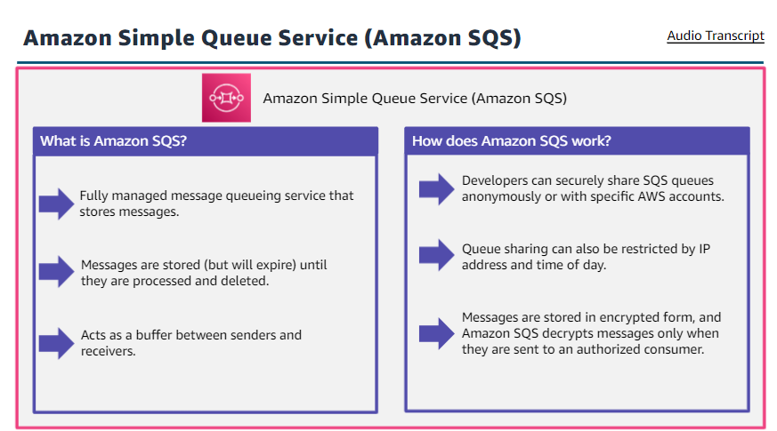

#####   Amazon SQS benefits
+   Fully managed messaging queue
+   Loosely coupled
+   High volume capabilities
+   Fault tolerance

#####   Achieving loose coupling with Amazon SQS
+   Use asynchronous processing to get your responses from each step quickly.
+   Handle performance and service requirements by increasing the number of job instance.
+   Exception or transaction failure, the order processing can be retried.

#####   Amazon SQS queue types
+   Standard

+   FIFO

#####   Amazon SQS use cases

#####   Amazon Simple Notification Service (Amazon SNS)
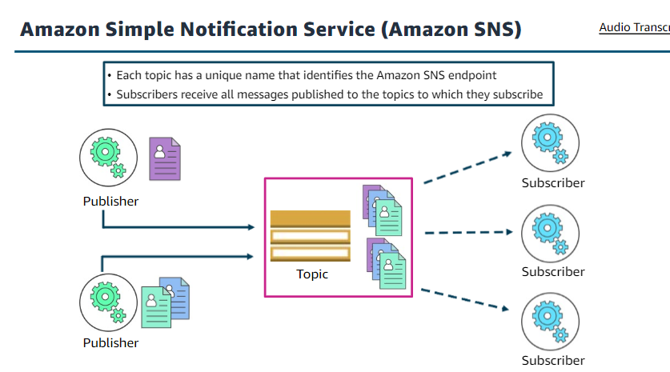

#####   Amazon SNS subscription types
1.      Email
    Messages are sent to registered addresses as email.
Email-JSON sends notifications as a JSON objects, while email sends text-based email.

2.      Mobile text messaging(SMS)
    Messages are sent to registered phone number as SMS text messages.

3.      HTTP/HTTPS
    Subscribers specify a URL as part of the subscription registration. Notifications will be delivered through an HTTPS POST to the specified URL.

4.      Amazon SQS
    Users can specify an SQS standard queue as the endpoint. Amazon SNS will enqueue a notification message to the specified queue.
Note that FIFO queues are not currently supported.

5.      AWS Lambda
    Messages can also be delivered to AWS Lambda functions for handling message customizations, enabling message persistence or communicating with other AWS service.

### Amazon SNS characteristics

+   Single published message
All notification message contain a single published message. Amazon SNS attempts to deliver messages from the publisher in the order they were published into the topic. However, network issues could potentially result in out-of-order messages at the subscriber end.

+   No recall options
When a message is delivered successfully, there is no way to recall it.

+   HTTP or HTTPS retry

+   Order and delivery not guaranteed
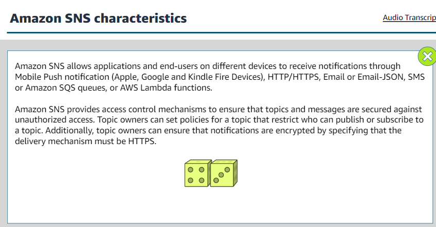

### Amazon SNS use cases

### Amazon SNS and Amazon SQS differences

### Serverless characteristics of S3
1.      Pay for value

2.      Elastic storage

3.      Continuous scaling

4.      Fault tolerance

5.      No server management

### Lambda@Edge

### Amazon API Gateway
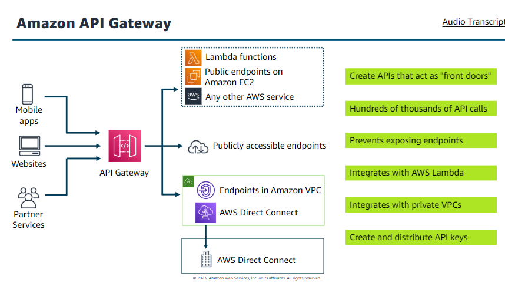

### API Gateway use case

### AWS Fargate

### Container
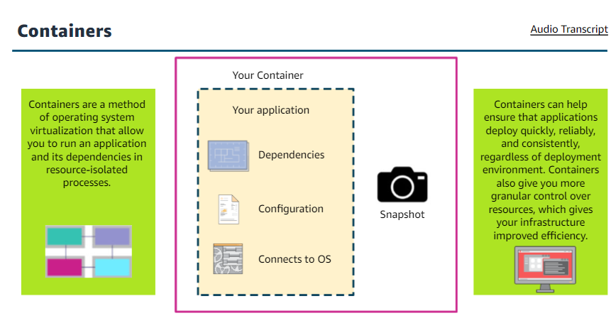

### AWS Fargate use cases
1.      Web apps, APIs, and microservices
    Build and deploy your applications, APIs, and microservices architectures with the speed and immutability of containers. With Fargate, you don't need to own, run, and manage the lifecycle of a compute infrastructure so that you can focus on what matters most, your applications.

2.      Run and scale container workloads
    Use AWS Fargate with Amazon ECS or Amazon EKS to easily run and scale your containerized data processing workloads. Fargate also enables you to migrate and run your Amazon ECS Windows containers without re-factoring or re-archtiecting your legacy applications.

3.      Support AI and ML training applications
    Create an artificial intelligence and machine learning development environment that's flexible and portable. With Fargate, achieve the scalability that you need to boost server capacity without over-provisioning to train, test, and deploy your ML models.

4.      Optimization Costs
    With AWS Fargate, there are no expenses, you pay for only the resources that you used. Further optimize costs with Compute Savings Plans and Fargate Spot, then use Graviton2 powered Fargate for up to 40 percent price performance improvements.

### AWS Step Functions

### AWS Steps Functions benefits

1.      Build and deploy rapidly
    AWS Step Functions helps you to quickly build and deploy your workflows. You can get started quickly with Workflow Studio, a drag-and-drop interface. With Step Functions, you can express complex business logic as low-code, event-driven workflows that connect services, systems, or people within minutes.

2.      Write less integration code
    Because AWS Step Functions can integrate with many other AWS services, you don't have to write as much code. Therefore, you can compose AWS resources from over 200 services into resilient business workflows, data pipelines, or applications. For example, these services can include AWS Lambda, Amazon ECS, AWS Fargate, AWS Batch, Amazon DynamoDB, Amazon SNS, Amazon SQS, Amazon SageMaker, Amazon EventBridge, and Amazon EMR.

3.      Build fault-tolerant and stateful workflows
    It helps you build workflows that are fault tolerant and stateful. It manages state, checkpoints, and restarts for you to make sure that your workflows run in order and as expected. Built-in try or catch, retry, and rollback capabilities deal with errors and expectations automatically based on your defines business logic.

4.      Designed for reliability and scale
    It can help you build workflows that are fault tolerant and stateful. IT manages state, checkpoints, and restarts for you to make sure that your workflows run in order and as expected. Built-in try or catch, retry, and rollback capabilities deal with errors and expectations automatically based your defined business logic.

### Steps Functions features and functionality
1.      AWS service integration

2.      Coordination of components
    Step Function can coordinate any application that can make an HTTPS connection, regardless of where it's hosted. For example, it can be hosted on Amazon EC2 instances, mobile devices, or on-premises servers. By using step functions, you can quickly create distributed applications that use AWS services along with your own microservices.

3.      Workflow abstraction
    Step Functions keeps the logic of your application strictly separated from the implementation of your application. You can add, move, swap, and reorder steps without having to make changes to your business logic. Through this separation of concerns, you workflows gain modularity, simplified maintenance, scalability, and code reuse.

4.      Built-in error handling
    It can handle errors and exceptions with built-in try or catch and retry whether the task seconds or months to complete You can automatically retry failed or time-out tasks and respond differently to different types or errors. You can also recover gracefully by reverting to designated cleanup and recovery code. Learn more about Step Functions error handling and how you can handle error conditions by using a state machine.

5.      History of each job
    Step functions delivers real time diagnostics and dashboards. It integrates with Amazon CloudWatch and AWS CloudTrail and can log every job run including overall state, failes steps, input, and outputs. If things go wrong, you can quickly identify not only where there's an error, but also why, and you can quickly troubleshoot and resolve failures. 
    Lambda also has its own logs, which can be set up to have more debugging details.

6.      Visual monitoring
    Launching an application can be as easy as pressing a button and then watching the steps run visually. In this way, you can quickly verify that everything is operating in order and as expected. The console clearly highlights errors so that you can quickly pinpoint their root cause and troubleshoot issues.

7.      Compliance
    Step Functions is a Health Insurance Portability and Accountability ACT(HIPAA) eligible service. You can use it with applications that contain healthcare-related information, such as personal health information (PHI). Step Functions is also compliant with System and Organization Control (SOC) measures. The results of these third-party audits are available on the AWS SOC Compliance site. Step Functions can also help you conform to other common compliance standards.

### State machine

<b>Example</b>

### Step Functions States
1.      Task state
    Do some work in machine state.

2.      Choice state
    Make a choice between branches to run.

3.      Fail or succeed state
    Stop execution with a failure or success.

4.      Pass state
    Pass its input to its output or inject some fixed data.

5.      Wait state
    Provide a delay for a certain amount of time or until a specified time or date.

6.      Parallel state
    Begin parallel branches of execution.

7.      Map state
    Dynamically iterate steps.

### Keyboard shortcuts

###  LAB

#####   Task 1: Creating a Lambda function
+   In the AWS Management Console, on the Services menu, enter Lambda. From the search results, choose Lambda.

+   Choose Create Function.

+   Edit the following:
Function name: resize_image
Runtime: Python3.9

+   Expand the Change default execution role section. Choose Use an existing role. In the dropdown list for Existing Role, choose ResizeImageLambdaRole.

+   Choose Create function.

+   Scroll to the Layers section.

+   Choose Add a layer.

+   Choose Custom layers.

+   From the Custom layers dropdown list, choose PillowPythonLambdaLayer.

+   From the Version dropdown list, choose 1 or the option with the highest version number.

+   Choose Add.

+   Scroll to the Code source section of the page.

+   Copy the code below, and replace the default source code in the lambda_function.py file with it.

<b>

import boto3
import os
import sys
import uuid
from urllib.parse import unquote_plus
from PIL import Image
import PIL.Image

s3_client = boto3.client('s3')

def resize_image(image_path, resized_path):
   with Image.open(image_path) as image:
      image.thumbnail(tuple(x / 2 for x in image.size))
      image.save(resized_path)

def lambda_handler(event, context):
   print('Begin resizing image')
   for record in event['Records']:
      bucket = record['s3']['bucket']['name']
      key = unquote_plus(record['s3']['object']['key'])
      print(bucket)
      print(key)
      tmpkey = key.replace('/', '')
      download_path = '/tmp/{}{}'.format(uuid.uuid4(), tmpkey)
      upload_path = '/tmp/resized-{}'.format(tmpkey)
      s3_client.download_file(bucket, key, download_path)
      resize_image(download_path, upload_path)
      s3_client.upload_file(upload_path, os.environ['RESIZED_BUCKET'], key)
   print('Resizing image complete')
</b>

+   To deploy your Lambda function, choose Deploy.

+   Choose the Configuration tab, and then choose General configuration. Choose Edit.

+   In the Memory field, enter 512 MB. Then, choose Save.

+   At the top of these instructions, choose Details. Next to AWS, choose Show. Copy the value next to ResizedBucketName. Use it as the value in step 25.

+   In the AWS Management Console, choose Environment variables.

+   Choose Edit.

+   Choose Add environment variable.

+   Enter the following values:
  Key: RESIZED_BUCKET
  Value: Enter the value that you retrieved in step 21.

+   Choose Save.

#####   Task 2: Configuring an Amazon S3 trigger to invoke a Lambda function 

In this task, you configure an S3 trigger on an existing S3 bucket and your Lambda function. The Lambda function resizes images and places them in another bucket.

+   In the Function overview section of the Lambda console near the top of the page, choose Add trigger.

+   In the Trigger configuration section, choose S3 from the dropdown list.

+   For Bucket, choose the bucket with original in the name.

+   For Event Type, choose All object create events.

+   Acknowledge the notification for Recursive invocation by selecting the check box.

+   Choose Add.

You have configured your Lambda function to be initiated when a new object is uploaded to the S3 bucket.

#####   Task 3: Uploading an image to the Amazon S3 bucket
In this task, you upload an image file to your bucket.

+   Open the context (right-click) menu for the following link, and download the file to your computer:

    +   large-image.jpg

+   In the AWS Management Console, on the Services menu, enter S3.  From the search results, choose S3.

+   Choose the link for the bucket that has original in the name.

+   Choose Upload.

+   Choose Add files.

+   Choose the file that you downloaded.

+   Choose Upload.
  Your file is uploaded to the bucket.

+   Choose Close.

+   If you are working on Task 4, you can now return to step 55.

+   When your Lambda function runs correctly, the image file that you uploaded is reduced in size and placed in the S3 bucket that you specified when you set the environment variable for RESIZED_BUCKET.

+   Return to the Buckets section in the S3 Console.

+   Choose the link for the bucket that has resized in the name.

   Notice the file size. It's significantly reduced from the original size of 4.9 MB.

 

+   When you uploaded the image file, S3 initiated the resize_image Lambda function. Review the logs to see how your function performed.

+   Navigate back to the Lambda console.

+   Choose the link for the resize_image function.

+   Choose the Monitor tab.

+   Choose Logs.

+   In the Recent Invocations table, choose a row to expand the details.
Notice the metrics that are recorded for each function invocation. You might have to wait for up to one minute for the data to be updated.

+   The DurationInMS column tells you how long your function ran for this invocation.  

+   The first time that your Lambda function is invoked, the Lambda execution environment has to download your code and start a new execution environment. This process is called a cold start. The @initDuration metric in the Recent invocation details signifies the cold start time.

Note the MemorySetInMB column. The amount of memory that's available to your Lambda function can be adjusted to affect the performance of your Lambda function.

+   The amount of memory also determines the amount of virtual CPU available to a function. Adding more memory proportionally increases the amount of CPU, which increases the overall computational power available. If a function is CPU-, network- or memory-bound, then changing the memory setting can dramatically improve its performance.

Notice how long it took your function to run. It could be faster. Adjust your Lambda function so that it runs faster.

#####   Task 4: Optimizing Lambda function memory for performance
+   Choose the Configuration tab.

+   Choose General Configuration.

+   Choose Edit.

+   Adjust Memory to 1024 MB.

+   Choose Save.

+   Upload your image to the original S3 bucket again. If you need help, review steps 35-41.

+   Repeat steps 49-54 using 2048 MB and 3008 MB as the value for Memory.

Your function now runs in approximately 500 milliseconds with 3008 MB of memory and an image that is 5 MB.