#   [Getting Started with Storage](https://awseducate.instructure.com/courses/908)

## Overview

When you consider running your workloads on Amazon Web Services (AWS), you might first consider your storage options. AWS storage provides the services that you need to build the storage solution that’s right for your business. You will review the primary storage types and the differences between them. You will also learn how to identify the right solution in the cloud based on your requirements. 

You will then focus on Amazon Simple Storage Service (Amazon S3), an object storage service that offers industry-leading scalability, data availability, security, and performance.  Customers of all sizes and industries can use Amazon S3 to store and protect any amount of data for a range of use cases. These use cases include websites, mobile applications, backup and restore, archive, enterprise applications, Internet of Things (IoT) devices, and big data analytics. 

In this course, you acquire the knowledge that you need to start using Amazon S3. You learn about the key elements of Amazon S3 and explore how to configure them. You learn how to upload data to Amazon S3 and what additional AWS services you can use to transfer data to Amazon S3 at scale. You also learn the basic elements of security within Amazon S3.

##  Objectives
By the end of this course I will be able to do the following:


+   Discuss different types of storage solutions and their features and benefits.
+   Discuss the features and concepts of Amazon S3.
+   Describe Amazon S3 storage classes and associated use cases.
+   Discuss how to use Amazon S3 to create a bucket, upload objects, and work with objects.
+   Describe Amazon S3 configurations for cost savings and security.
+   Identify other AWS storage solutions and their use cases.
+   Use Amazon S3 to create a static website.

Click <a href="./Getting Started with Storage/README.md">Getting Started with Storage</a>

[]()
<small>**_Getting Started with Storage_**</small>

+   In this module we learn about basic storage domain and AWS course storage services. It is broken into following four sections:
    ####  [1.  Introduction to Storage](#introduction-to-storage)
    ####  [2.  Introduction to Amazon S3](#introduction-to-amazon-s3)
    ####  [3.  Using Amazon S3](#using-amazon-s3)
    ####  [4.  Additional AWS Storage Services](#additional-aws-storage-services)

[]()
<small>**_Four Sections_**</small>

### Introduction to Storage
+   #### Introduction to Storage

    Computers use data to complete tasks, and this data must be stored to be accessed. Some data can be stored internal to the computer itself, such as files that help the computer start up and run. More data can be stored on servers to be accessed by our computer. When data is on server in the cloud, people  all around the world can access it. 

    []()
    <small>**_Introduction to Storage_**</small>

    There are different types of storage for different applications. Before learning about the types of cloud storage, it is important to understand the difference between **_On-premises storage and Cloud storage_**

    <table>
    <tr>
        <th>On-Premises</th>
        <th>Cloud Storage</th>
    </tr>

    <tr>
    <td>
    <p align="center">
        
    </p>
    </td>

    <td>
    <p align="center">
        
    </p>
    </td>
    </tr>

    <tr>
    <td>
    <p align="center">
        
    </p>
    </td>

    <td>
    <p align="center">
        
    </p>
    </td>
    </tr>

    <tr>
    <td>
    <b>On-premises storage</b> means that our server is hosted within our organization's infrastructure and might be physically onsite. Company controls, administers, and maintains the server. Data and other information are shared between computers through our local network.
    </td>

    <td>

    With <b>Cloud Storage</b>, an outside service provider like AWS hosts our data. The cloud providers procures, installs, and maintains all hardware, software, and other supporting infrastructure in its data centers. We access these services and manage our account through the internet.
    </td>
    </tr>

    </table>

+   ####    Benefits of Cloud Storage

    []()
    <p align="center">
    <small><strong><i>Benefits of Cloud Storage</i></strong></small>
    </p>


    <b>1.  Cost Efficient</b> so we pay for only what we use.

    <b>2.  Secure</b> because data is saved across multiple servers.

    <b>3.  Accessible</b> to multiple users in an account.

    <b>4.  Scalable</b> so it can grow and shrink as our workloads change.

    <b>5.  Managed</b> so we don't have to worry about servers, and we can focus on our data and applications.

    <b>6.  Backed up</b> so copies of data are stored in different physical locations in case of failure.

+   ####    Types of Cloud Storage

    []()
    <p align="center">
    <small><strong><i>Types of Cloud Storage</i></strong></small>
    </p>

    Storage comes in three basic types: <b>block storage, file storage, and object storage</b>.

    #####   1.   Block Storage

    []()

    Block storage breaks up data into blocks and then stores those blocks as separate pieces, each with a unique identifier. They are stored wherever it is most efficient. Thus, it can store those blocks across different systems and each block can be configured to work with different operating systems.
    
    <br>

    #####   2.   Cloud Storage

    []()
    File storage is a methodology that helps users, applications, and services access data in a shared file system. Data is stored in a hierarchical structure. This structure is similar to a centralized shared network drive in a company where employees store and access file.

    <br>

    #####   3.   Object Storage

    []()

    In Object storage, files are stored as objects based on attributes and metadata. Each object consists of data, metadata, and an object key. The metadata has information about the data (object size, object purpose, and more), and the object key is the unique identifier of the object. When you update files in object storage, the entire file object is updated, instead of a piece of a file, as in block storage.

+   ####    Choosing the right storage type

    []()
    <p align="center">
    <small><strong><i>Choosing the right storage type</i></strong></small>
    </p>

+   ####    Storage use cases

    [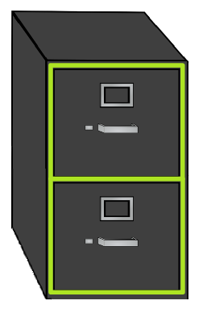]()

    Storage use cases gives ideas for how to solve storage problems that we might face. We will discuss about two use cases:  

    #####   1.   Block storage use cases

     [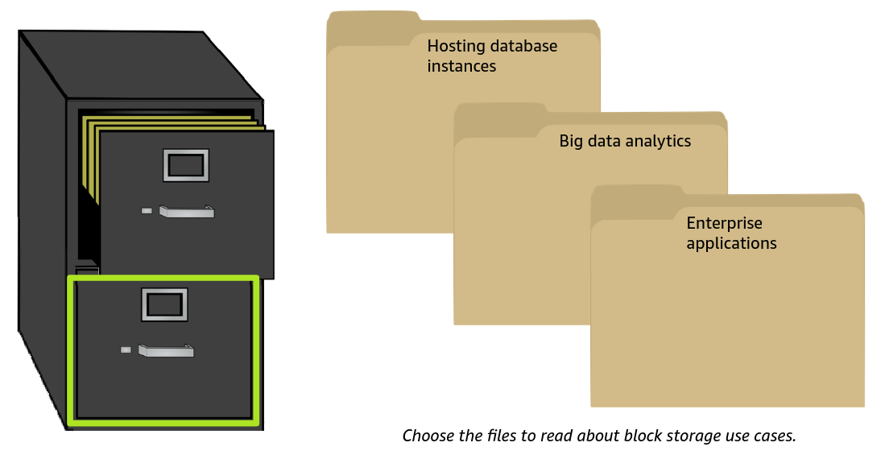]()
    <p align="center">
    <small><strong><i>Block storage and its types</i></strong></small>
    </p>

    ######  Hosting database instances
    Block storage scales with your performance needs, whether you are supporting millions of gaming customers or billions of e-commerce transactions. Databases such as SAP HANA, Oracle, Microsoft SQL Server, MySQL, and PostgreSQL are widely deployed on block storage.
    Block storage volumes provide consistent and low-latency performance for running NoSQL databases such as Cassandra, MongoDB, and CouchDB.

    ######  Big data analytics
    Block storage offers data persistence, dynamic-performance adjustments, and the ability to detach and reattach volumes. Therefore, you can resize clusters for big data analytics engines such as Apache Hadoop and Apache Spark.
    Block storage provides persistent, fast storage to address key components of your solution, including data warehouses, search and indexing, NoSQL databases, and streaming data.

    ######  Enterprise applications
    Block storage provides high availability and high durability storage to reliably run mission-critical applications on AWS.
    The design of block storage provides versatile storage services with:
    +   Low latency and consistently high input/output operations per second (IOPS) and throughput performance
    +   Capacity and performance scalability without workload disruption
    +   High availability

    #####   2.   Object storage use cases

    [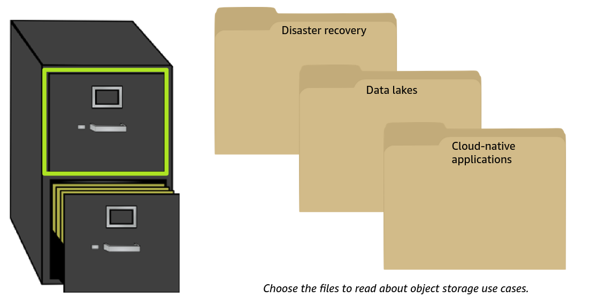]()
    <p align="center">
    <small><strong><i>Object storage and its types</i></strong></small>
    </p>

    ######  Disaster recovery
    Protect critical data, applications, and IT systems that run in the AWS Cloud or your on-premises environment without incurring the expense of a second physical site. With object storage and other cloud services, you can create disaster recovery architectures to recover from outages caused by natural disasters, system failures, and human errors.

    ######  Data lakes
    Accelerate innovation by building a data lake with object storage. You can then extract valuable insights using query- in-place, analytics, and machine learning tools.
    You can also store large amounts of data that you only need to access periodically. For instance, suppose that your business does a lot of production work, in any medium. You probably need a lot of space to store your finished projects after their useful life is complete. However, you probably also need access to the files in case you or a client needs them again in the future.

    ######  Cloud-native applications
    Build fast, cost-effective cloud-native applications by using object storage to store development and production data. The microservices that make up cloud-native applications share this data. With object storage, you can upload any amount of data and access it anywhere to deploy applications faster and reach more users.

+   ####	AWS core storage services
    +   #####   Amazon Elastic Block Store (Amazon EBS)

        [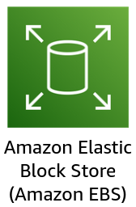]()

        Amazon EBS is a scalable, high-performance block-storage service designed for Amazon Elastic Compute Cloud (Amazon EC2). You can use Amazon EBS to create storage volumes and attach them to Amazon EC2 instances. All EBS volume types offer durable snapshot capabilities and are designed for 99.999 percent availability. Amazon EBS provides a range of options that you can choose from to optimize storage performance and cost for your workload.

        [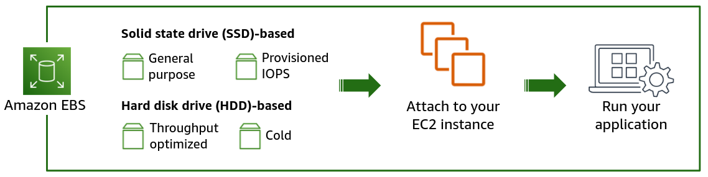]()
        <p align="center">
        <small><strong><i>Amazon(EBS) Working</i></strong></small>
        </p>  

    +   #####   Amazon Elastic File System (Amazon EFS)

        []()

        Amazon Elastic File System (Amazon EFS) is a simple elastic file system that lets you share file data without provisioning or managing storage. It can be used with AWS services and on-premises resources.
        Amazon EFS is well suited to support a broad spectrum of use cases. These use cases include storage for serverless applications, web serving and content management, application development and testing, and database backups.

        [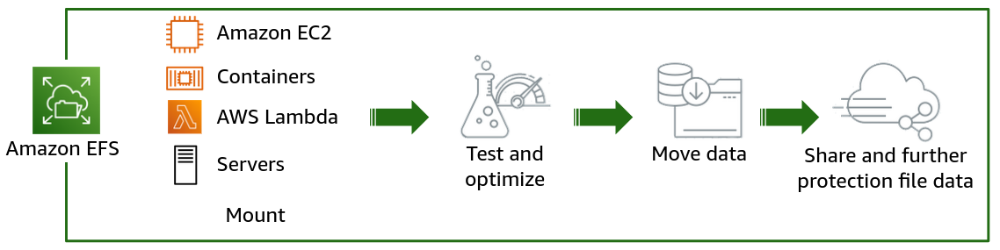]()
        <p align="center">
        <small><strong><i>Amazon(EFS) Working</i></strong></small>
        </p> 

    +   #####   Amazon Simple Storage Services

        []()

        Amazon Simple Storage Service (Amazon S3) is an object storage service that stores data as objects within buckets. An object is a file and any metadata that describes the file. A bucket is a container for objects.
        Amazon S3 can be used for many applications. It can be used for data lakes, websites, mobile applications, backup and restore, archive, enterprise applications, loT devices, and big data analytics.

        [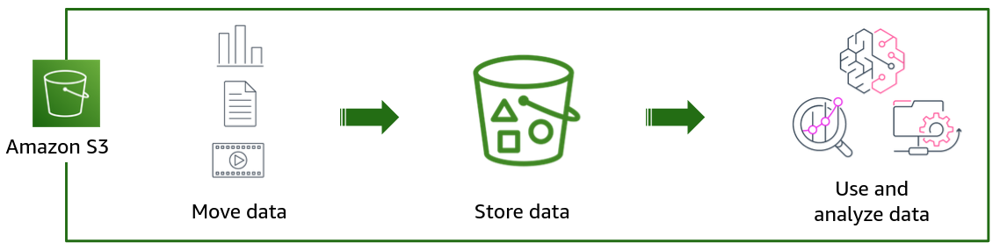]()
        <p align="center">
        <small><strong><i>Amazon(S3) Working</i></strong></small>
        </p>

+   ####	Introduction to Storage summary

    [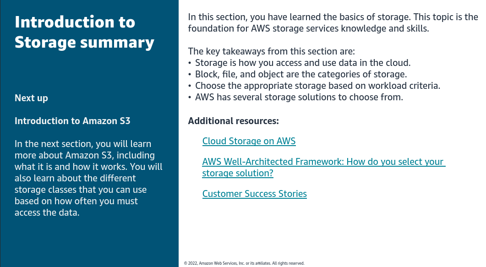]()
    <p align="center">
    <small><strong><i>Storage Summary</i></strong></small>
    </p>

### Introduction to Amazon S3
+   ####    Introduction to Amazon S3
    Amazon S3, an object-level storage service. Amazon S3 stores objects inside buckets within the Region of our choice. Objects are then used in our applications or business operations.

    [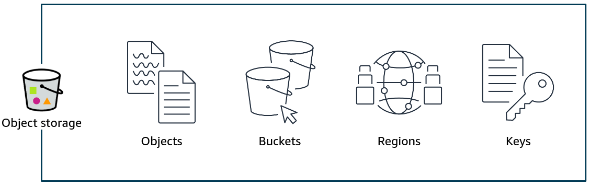]()
    <p align="center">
    <small><strong><i>Amazon S3 Object Storage</i></strong></small>
    </p>

+   ####    Meet Amazon S3

    Amazon S3 is an object storage service that you can use to collect, store, and analyze data in any amount from anywhere in the world. Amazon S3 is available to businesses of all sizes and in any industry for a range of use cases.

    Common use cases include:
    +	<b>Data lakes</b>, for storing large amounts of data
    +	<b>File storage</b>, for static website hosting
    +	<b>Backups</b> of data, for use in disaster recovery
    +	<b>Archive</b>, for data that isn't being actively used but saved for the future.
    
    Amazon S3 offers high levels of <b>scalability, data durability and availability, perfomance, and security</b>.

+   ####    Basic S3 workflow

    First, we move our data into  Amazon S3. It accepts data of all file types. Although there is no limit to the amount of data that can be stored, individual objects must be less than 5 terabytes (TB).

    The data is stored as objects in an S3 bucket. Each object has a unique identifier.

    Using the unique identifier, we can use the objects in applications or to analyze data.

    [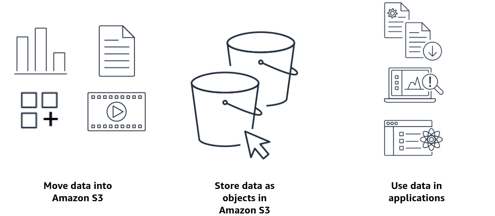]()
    <p align="center">
    <small><strong><i>Basic S3 Workflow</i></strong></small>
    </p>

+   ####    Object-level storage

    [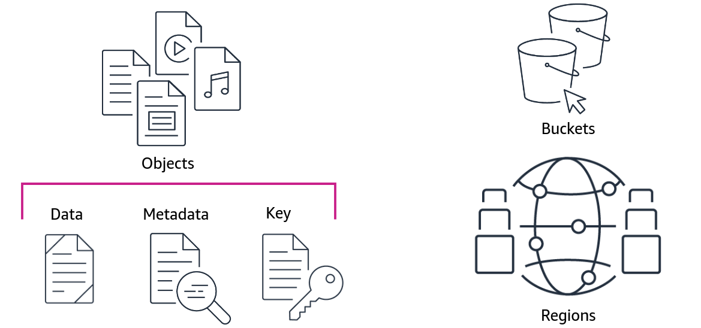]()
    <p align="center">
    <small><strong><i>Object-level storage</i></strong></small>
    </p>

    The files, or objects, that we upload to Amazon S3 consist of data and metadata. The metadata consists of information about the data, such as content type, last modified date, and more. In addition to the data and metadata, an object's key serves as a unique identifier.
    S3 buckets are created inside regions. Objects are stored in a bucket, which is similar to a directory or folder in your computer. When you store  an object in a bucket, the combination of a bucket name, key, and version ID uniquely identifies the object  so that you can interact with that object.

+   ####    Active and archive storage

    [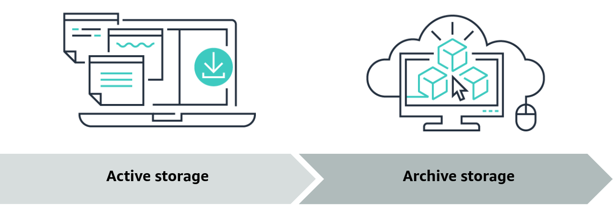]()
    <p align="center">
    <small><strong><i>Active and archive storage</i></strong></small>
    </p>

    Object storage can be classified by how often we must access our data. The two broad categories are active storage and archive storage. 

    Active storage is for the data we use all the time. It also includes data that we access less frequently, but it is important that data can be accessed quickly. Examples are files for a static website or backups.

    Archive storage is for data that we rarely access but must be maintained. Examples could include data for compliance or business continuity operations.

+   ####    Amazon S3 storage classes

    [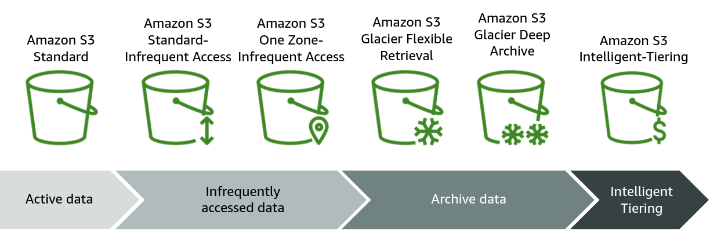]()
    <p align="center">
    <small><strong><i>Amazon S3 Storage classes</i></strong></small>
    </p>

    Amazon S3 storage classes support virtually every storage use case from backup and recovery, to archive and digital preservation, to data lakes, business critical applications, and analytics. Storage class are based on the data access, resiliency, and cost requirements of our workloads.

    +   ##### Amazon S3 Standard 
    +   ##### Amazon S3 Standard-infrequent Access(IA)
    +   ##### Amazon S3 One Zone-infrequent Access(IA)
    +   ##### Amazon S3 Glacier Flexible Retrieval
    +   ##### Amazon S3 Glacier Deep Archive
    +   ##### Amazon S3 Intelligent-Tiering

+   ####    Amazon S3 storage classes use cases
    +   #####   Amazon S3 Standard
        +   Websites that only include static content
        +   Storage for log files that are frequently accessed, reviewed, or have analytics run against them
        +   Storage for application installers, configuration files, and provisioning and deployment tools

    +   #####   Amazon S3 Standard-infrequent Access(IA)
        +   Backups of your systems
        +   Files that are rarely accessed but must be quickly accessed if needed.

    +   #####   Amazon S3 One Zone-infrequent Access(IA)
        +   Storage for cross-Region replication backups from other 53 buckets
        +   Off-site storage of copies of on-premises backups, which gives us extra protection for your backups 
        +   Easily replaceable files

    +   #####   Amazon S3 Glacier Flexible Retrieval

        +   Storage of long term backups or archives for compliance purposes, or for backups that need to be retained for a long period of time
        +   Replacement for magnetic tapes stored on-premises or off site
        +   Digital media asset archive for large media files

    +   #####   Amazon S3 Glacier Deep Archive

        +   Archives or datasets that must be retained for compliance purposes
        +   Long-term data libraries

    +   #####   Amazon S3 Intelligent-Tiering

        +   Unpredictable workloads 
        +   Unknown workloads
        +   Rapidly changing workloads

+   ####    Choosing a Storage class - case 1

    >A user uploads a video to your application and your application generates a thumbnail preview of the video. Your user agreement permits a user to access the video thumbnail for one year. However, your usage data indicates that most thumbnail previews are not often accessed after 60 days but must be accessed quickly.
    <b>Which storage class might you recommend?</b>
    
    _<b>Amazon S3 - Infrequent Access</b> is the best choice for this situation. Using Amazon S3 - IA gives users quick access to the thumbnail but saves costs. You could consider using a lifecycle policy to move the thumbnail into archive storage after 60 days._

+   ####    Choosing a Storage class - case 2

    >A business wants to implement stronger business continuity practices and keep backups of their data for a long period of time. They do not anticipate needing to access the data often. But they want to be able to have the data within a few hours in the event of disaster recovery.
    <b>Which storage class might you recommend?</b>

    _<b>Amazon S3 Glacier Flexible Retrieval</b> is a low-cost option for long-term storage. Data can be retrieved in a number of hours with standard retrieval or 1-5 minutes with expedited retrieval._

+   ####    Choosing a Storage class - case 3

    >A company builds a cloud-native application with Amazon S3 storage for school exams. The application gets some use during the school term but then is used very heavily during the exam season near the end of the term. The application has unpredictable use patterns, and the company is trying to control costs.
    <b>Which storage class might you recommend?</b>
    
    _<b>Amazon S3 Intelligent-Tiering</b> should be used when workloads are unpredictable. Amazon S3 Intelligent-Tiering will optimize storage costs by automatically moving data to the most cost-effective access tier when access patterns change._

+   ####    Amazon S3 costs

    <table>

    <tr>
    <th>What costs money ?</th>
    <th>What doesn't cost money ?</th>
    </tr>

    <tr>
    <td>

    Pricing depends on the storage class you choose and the features that you require:
    
    **•** GB per month
    **•** Transfers OUT to other Regions or the internet
    **•** PUT, COPY, POST, LIST, and GET requests
    
    </td>

    <td>

    **•** Transfer IN to Amazon S3.
    **•** Transfer between S3 buckets in the same Region. 
    **•** Transfer OUT to Amazon EC2 in the same Region. 
    **•** Transfer OUT to Amazon CloudFront in the same Region.
    **•** DELETE and CANCEL requests.
    </td>
    </tr>

    <tr>
    <th>AWS Free Tier</th>
    <th>Estimate your own costs</th>
    </tr>

    <tr>
    <td>

    New AWS customers receive 5 GB of Amazon S3 for the first 12 months. Each month of the first 12 months includes:

    **•** 20,000 GET requests
    **•** 2,000 PUT, COPY, POST, or LIST requests
    **•** 100 GB of data transfer out
    </td>

    <td>

    The AWS pricing calculator will help you understand the costs of your own workload.

    For more information, see [AWS Pricing Calculator](https://calculator.aws/#/)
    </td>
    </tr>
    </table>

+   ####    Introduction to Amazon S3 summary

    In this section you have learned the basics of Amazon S3. Amazon S3 is an object storage service.

    The key takeaways from this section are:
    +   Amazon S3 is an object storage service.
    +   Buckets can store unlimited data but no object larger than 5 TB. 
    +   Amazon S3 has storage classes to suit every use case.
    +   Pricing is based on the type of object, how long it's stored, and how it is accessed. As with all AWS services, pricing is transparent.

### Using Amazon S3

+   ####    Using Amazon S3
    Now that we are familiar with the basics of Amazon S3, we will learn how to use the service. In this section, we will walk through the basic steps to create and configure a bucket, upload objects, and manage the service. Then, we will learn how to configure andwork with our buckets and objects.

    [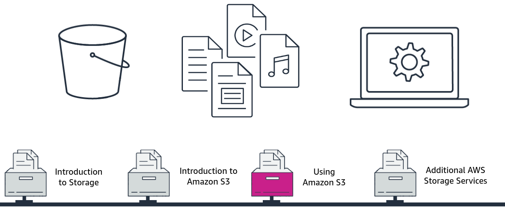]()
    <p align="center">
    <small><strong><i>Using Amazon S3</i></strong></small>
    </p>

+   ####    Create a bucket

    The first step to create a bucket is to give the bucket a name. The name that we assign to our bucket must be globally unique even though  the bucket is created inside a Region.
    Bucket names can be 3-63 characters and must include only lowercase letters, numbers, dots (.), and hyphens (-). Bucket names begin and end with a letter or number.

    [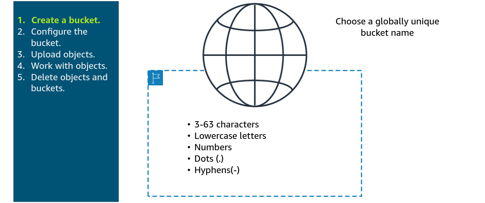]()
    <p align="center">
    <small><strong><i>Create a bucket</i></strong></small>
    </p>

    When we store an object in a bucket, the combination of a bucket name, key, and version ID uniquely identifies the object.

    For example, if we store an object called `myphotos.zip` in a bucket called `photobucket`, the URL would be as follows:
    `https://photobucket.s3.amazonaws.com/2021-04-13/myphotos.zip`
    The key  is `2021-04-13/myphotos.zip`. We use this unique URL to reference objects within the bucket.

    [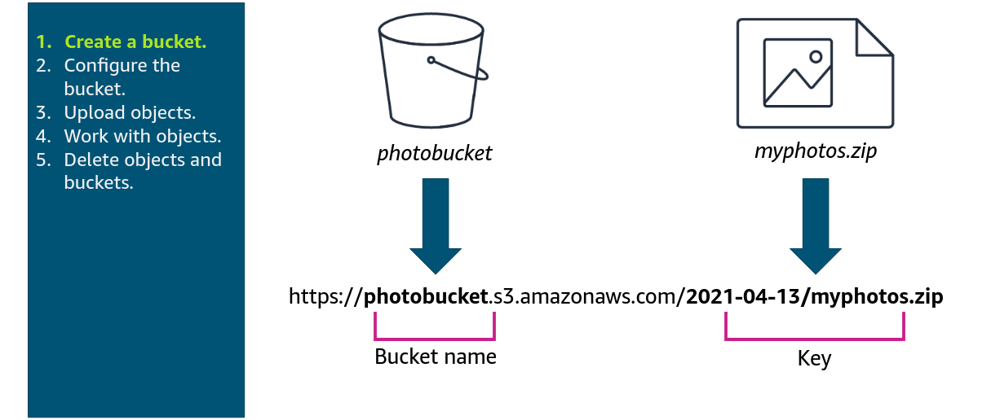]()
    <p align="center">
    <small><strong><i>Create a bucket - Object Storage</i></strong></small>
    </p>

+   ####    Configure the bucket - Choose a Region

    After giving the bucket a name, we can make a series of configurations. If we leave all the defaults, the bucket will be secure and accessible by only you.
    First, you **Choose a Region** for the bucket. The Region will default to the Region that's currently selected for our AWS account. We choose a Region close to us to minimize latency and costs.

    [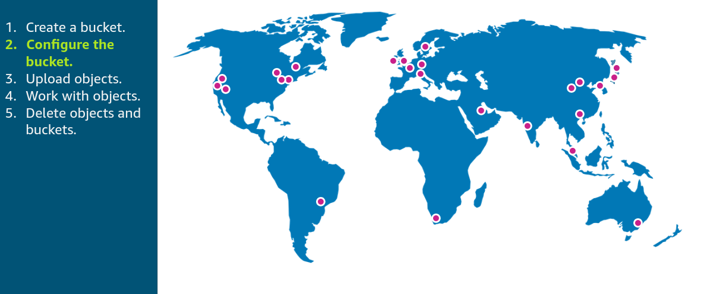]()
    
    <small>**Note: Not all Regioins shown, visit [AWS Global Infrastructure](https://aws.amazon.com/about-aws/global-infrastructure/) for an up-to-date-map of Regions.**</small>

+   ####    Configure the bucket - object ownership and access

    [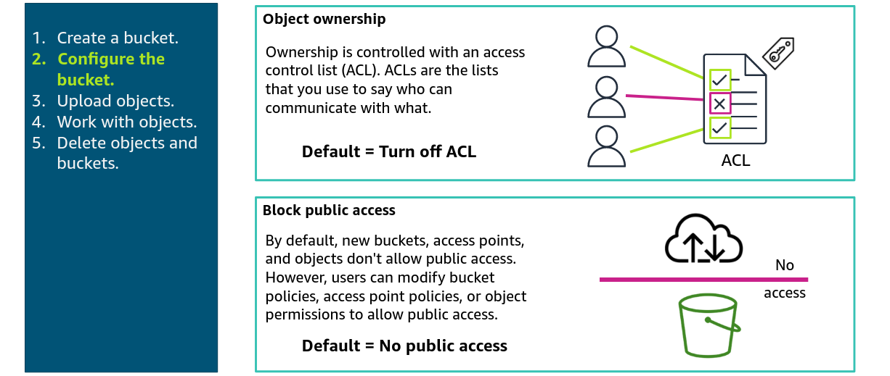]()
    <p align="center">
    <small><strong><i>Object Ownership and Access</i></strong></small>
    </p>

+   ####    Configure the bucket - bucket versioning

    <b>Versioning</b> gives us the ability to keep multiple variants of an object in the same bucket. We can use versioning to preserve, retrieve, and restore every version of every object stored in your S3 bucket. With versioning, we can recover from both unintended user actions and applications failures. The versioning state applies to all the objects in that bucket.
    When we enable versioning in a bucket, all new objects are versioned and given a unique version ID. Obect that already existed in the bucket at the time versioning is enabled will thereafter always be versioned. They will be given a unique version ID when they are modified by future requests. 
    Versioning is disabled by default and can be enabled later. We can enable and suspend versioning at the bucket level. After we version-enable a bucket, it can never return to an unversioned state. But we can suspend versioning on that bucket.

    [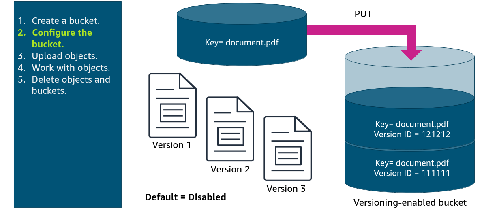]()
    <p align="center">
    <small><strong><i>Bucket Versioning</i></strong></small>
    </p>

+   ####    Configure the bucket - tags

    We can add tags to our bucket to track our storage costs or criteria for individual projects
    For example, in the tag **_project/Alpha_**, project is the key and **_Alpha_** is the value. Another tag could be **_cost-center/Alpha_**. We can add tags to a bucket from the properties page at any point.
    

    [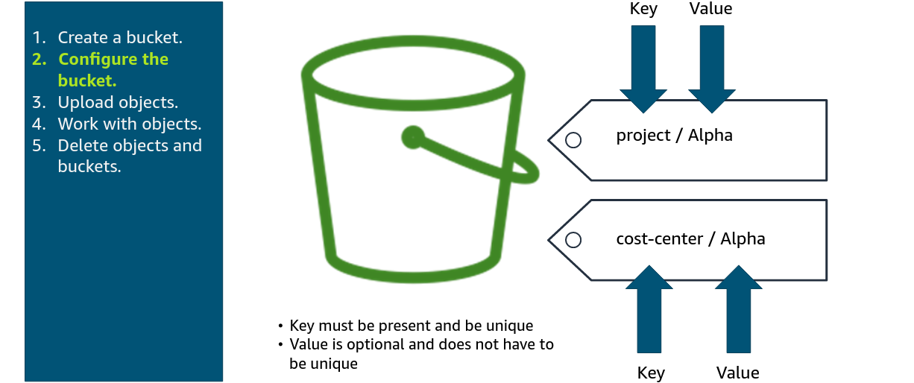]()
    <p align="center">
    <small><strong><i>Configure the bucket - tags</i></strong></small>
    </p>


+   ####    Upload objects

    After configuring our bucket, choose **Create bucket**, and your bucket will be created. Now we can upload objects to the bucket.

    [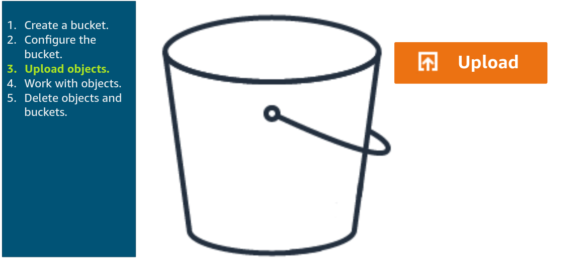]()
    <p align="center">
    <small><strong><i>Upload objects</i></strong></small>
    </p>

    Object size also has limits for objects that are uploaded by using the console. Objects are limited to **160 GB**
    We can upload larger objects by using the command line interface (CLI).
    >We will receive a notification with the status of the upload so you can retry any items that failed to load.

    [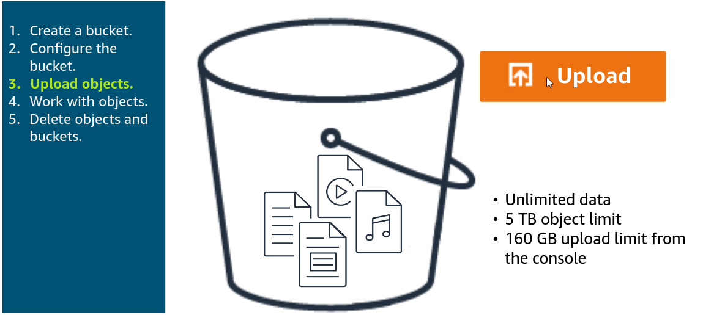]()
    <p align="center">
    <small><strong><i>Upload objects - data</i></strong></small>
    </p>

+   ####    Upload objects - choose storage class

    When we upload objects, we can choose the storage class for the objects that are part of the upload. The default class is **S3 Standard**.
    After the upload, we will see the storage class of each object in the console.
    We can change the storage class of objects at any time by choosing the objects and then choosing **Edit storage class** from the **Actions** menu. This menu gives us the list of storage classes to choose from.

    [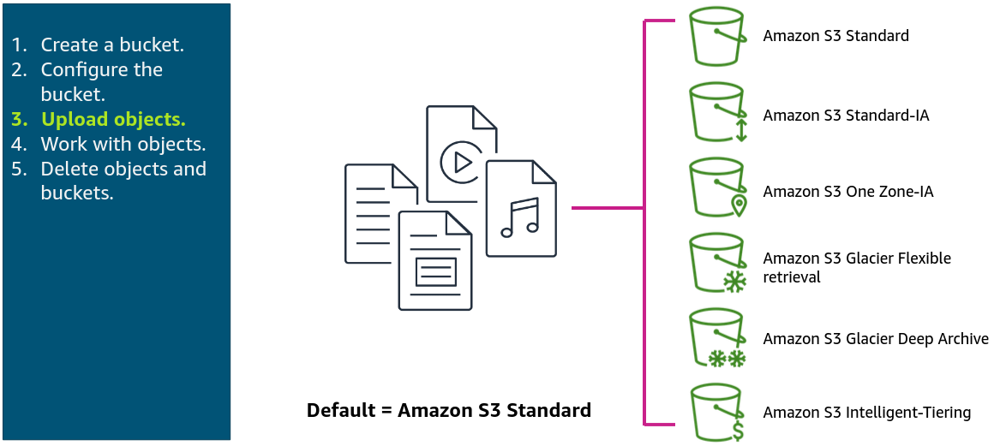]()
    <p align="center">
    <small><strong><i>Upload objects - choose storage class</i></strong></small>
    </p>


+   ####    Upload objects - multipart upload

    We can use multipart upload to upload a single object as a set of parts. Each part is a contiguous portion of the object's data. We can upload these object parts independently and in any order. If transmission of any part fails, we can retransmit that part without affecting other parts. After all of our object are uploaded, Amazon S3 assembles the parts and creates the object.

    Consider using multipart upload when you have objects with a size over **100 MB**.

    [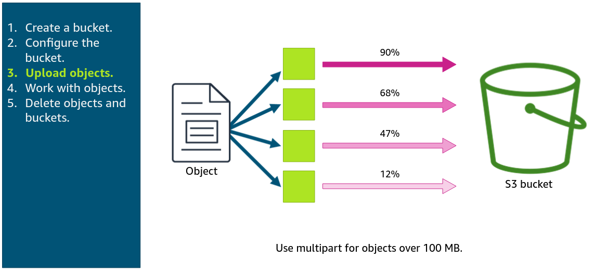]()
    <p align="center">
    <small><strong><i>Upload objects - multipart upload</i></strong></small>
    </p>

+	####	Work with objects

    [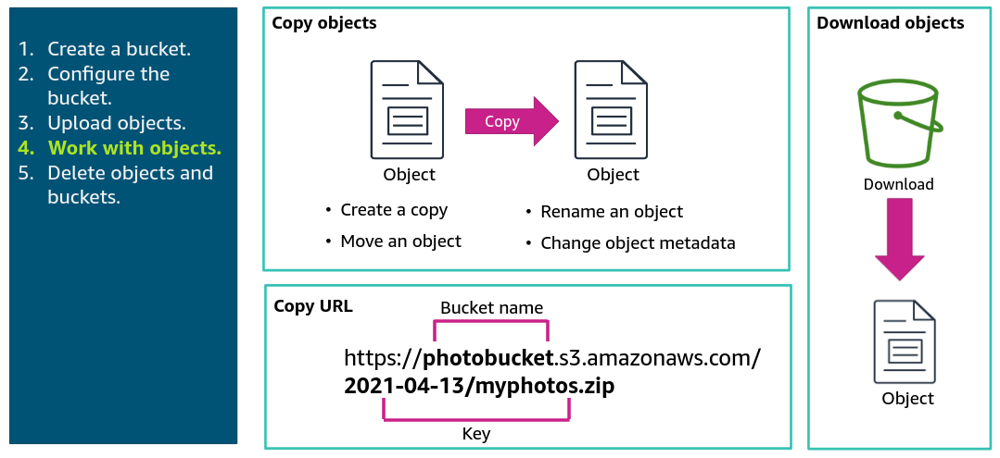]()
    <p align="center">
    <small><strong><i>Work with Objects</i></strong></small>
    </p>

+	####	Delete objects

    All objects in our S3 bucket incur storage costs, we should delete objects that we no longer need. We can delete objects from the console by choosing the object and the choosing Delete.
    In a bucket with S3 versioning enabled, we can protect our objects from accidental or malicious deletion by enabling **_multi-factor authentication (MFA)_** delete.

    **_MFA_** delete requires two forms of authentication to change a bucket versioning state permanently delete an object version. The following are the two forms of authentication:

    1. Security Credentials
    2. A valid serial number, a space, and the six-digit code displayed on an approved authentication device.

    [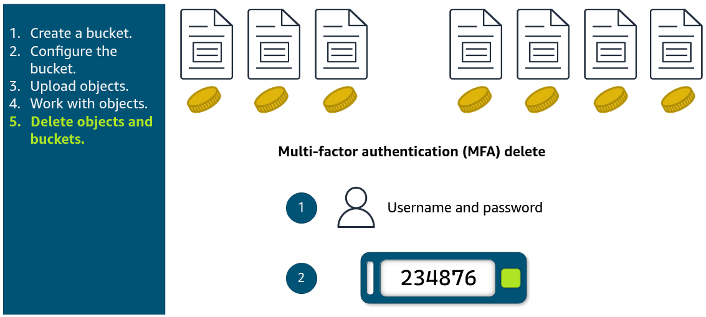]()
    <p align="center">
    <small><strong><i>Delete Objects</i></strong></small>
    </p>

+	####	Additional features

    Amazon S3 has additional features to consider. This module will review lifecycle rules, replication rules and security.

    [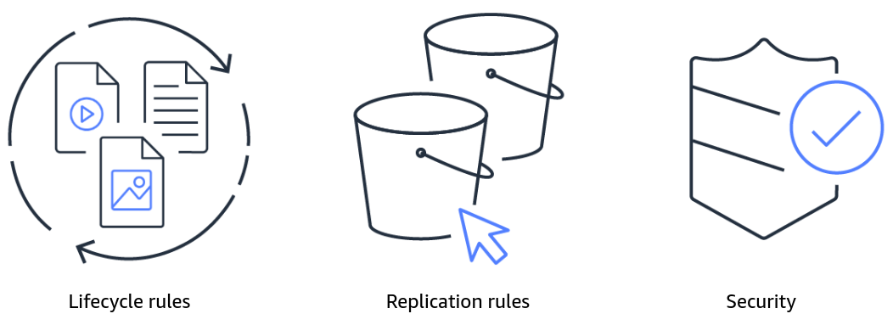]()
    <p align="center">
    <small><strong><i>Additional Features</i></strong></small>
    </p>

+	####	Additional features - lifecycle rules

    _Amazon S3 lifecycle_ is a set  of rules that define actions that amazon S3 applies to the group of objects. There are two types of  actions:

	1. Transition actions define when objects transition from one storage class to another.
	2. Expiration actions define when objects expire and deleted.

    [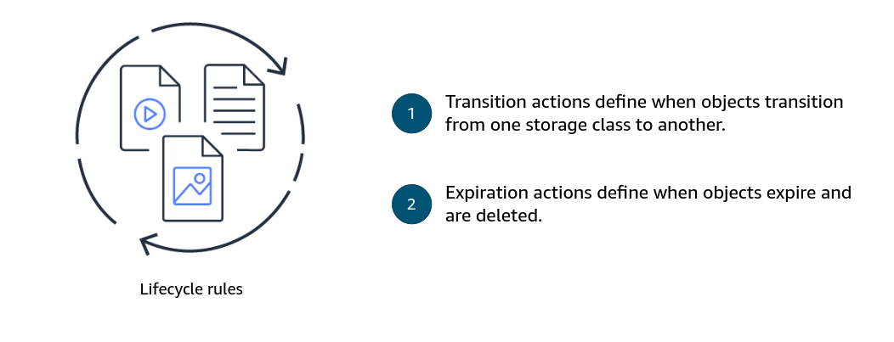]()
    <p align="center">
    <small><strong><i>Additional Features - Lifecycle rules</i></strong></small>
    </p>

    Consider example for the Additional Features - Lifecycle rules:

    [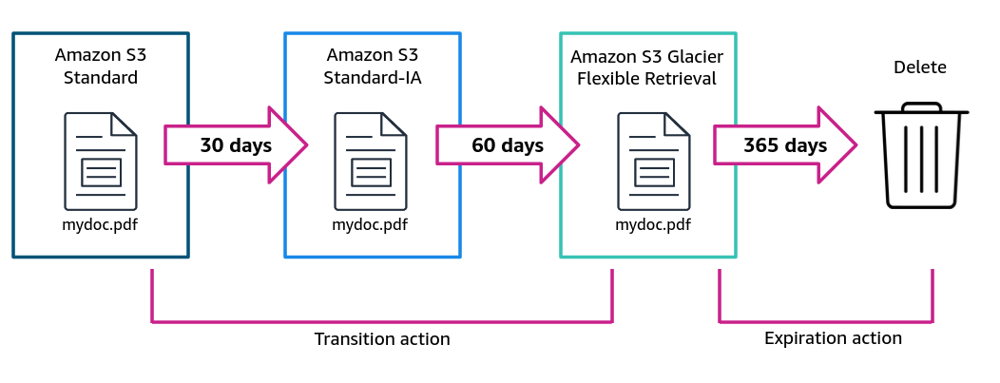]()
    <p align="center">
    <small><strong><i>Additional Features - Lifecycle rules example</i></strong></small>
    </p>

+	####	Additional features - replication rules

    **_Replication_** offers automatic copying of objects across S3 buckets. We can set up replication rules to replicate objects to the following:

    Using replication can help us to efficiently maintain copies of objects in multiple Regions, in different storage classes, and under different ownership. We can create replication rules from the console by selecting the Management tab inside our bucket.

    [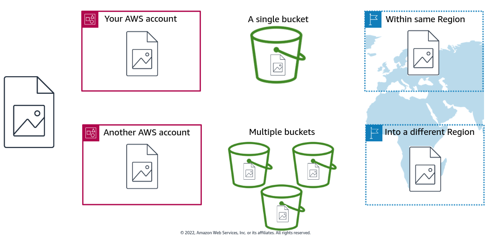]()
    <p align="center">
    <small><strong><i>Additional Features -  Replication rules</i></strong></small>
    </p>

+	####	Additional features - Cross-Region and Same-Region Replication

    When considering replication, we must decide whether we want to replicate objects within the same Region or across Regions. Both strategies have benefits, and we should base our decisions on the constraints of our workload and business needs.

    [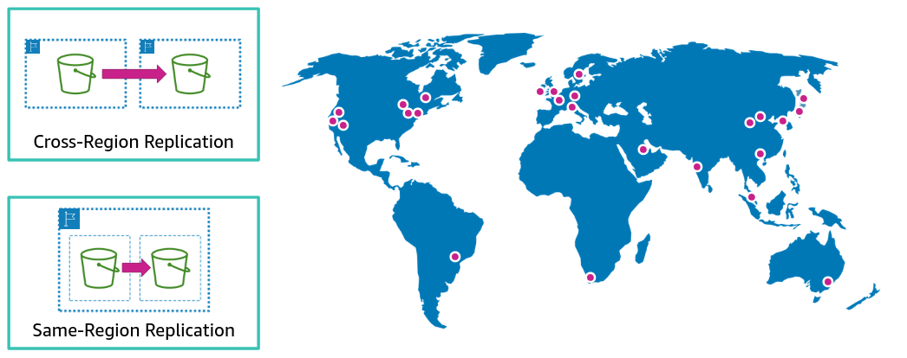]()
    <p align="center">
    <small><strong><i>Additional Features - Cross-region and Same-region Replication</i></strong></small>
    </p>

	1. Cross-Region Replication
		
	    You can use Cross-Region Replication to copy objects across Amazon S3 buckets in different AWS Regions. Consider this type of replication when you need to:

	    +   Meet compliance requirements that dictate that you store data at even greater distances for disaster recovery.

	    +   Minimize latency by maintaining object copies in AWS Regions that are geographically closer to your users.

	    +   Increase operational efficiency for compute clusters in two different AWS Regions by maintaining object copies in those Regions.

	2.  Same-Region Replication

        Same-Region Replication (SRR) is used to copy objects across Amazon S3 buckets in the same AWS Region. SRR can help you do the following:

        +   Aggregate logs into a single bucket for processing of logs in a single location. 

        +   Configure live replication between production and test accounts that use the same data. You can replicate objects between those accounts while maintaining object metadata.

        +   Abide by data sovereignty laws by storing multiple copies of your data in separate AWS accounts within a certain Region.

+	####	Bucket security
    **_Cloud security_** at AWS is the highest priority. Security is a shared responsiblity between AWS and us. As the customer, we are responsible for security in the cloud as outlined by the shared responsiblity model. Amazon S3 default setting create a bucket that is secure. 
    However, as we upload and work with objects, we might want to employ other security features.

    [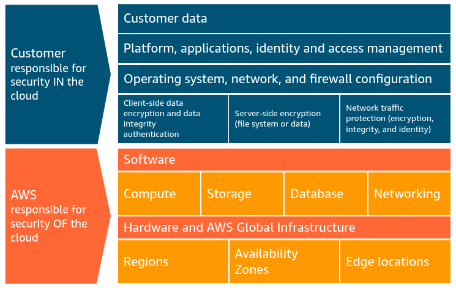]()
    <p align="center">
    <small><strong><i>Bucket security</i></strong></small>
    </p>

+	####	Bucket security - IAM policy

    By default, all Amazon S3 resources are private. Only we can access the resource. We can optionally grant access permissions to others by writing an IAM policy. We can grant users, groups, and roles controlled access to Amazon S3 and our objects.
    **_For example_**, we can use an IAM role to grant access to our S3 bucket.

    [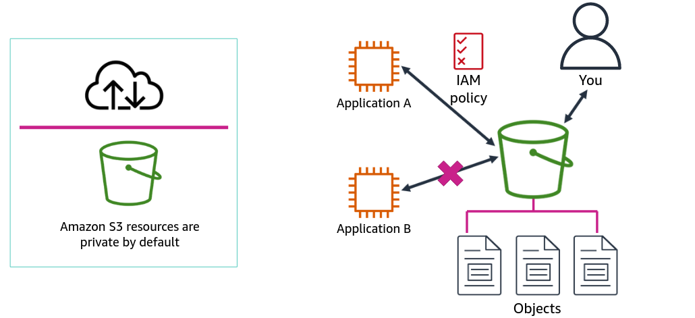]()
    <p align="center">
    <small><strong><i>Bucket Security - IAM Policy</i></strong></small>
    </p>

    +	**_Application A_** has an IAM policy attached to grant access to your bucket.
    +	**_Application B_** does not  have an IAM policy, so it is denied access.

+	####	Bucket security - Bucket Policy

    Another way to grant access to an S3 bucket is to use a bucket  policy. This policy is attached tothe bucket and can grant other AWS accounts or users access to the obects that are stored within the bucket. We can specify the type of access within the policy. Ploicies are written in json.

    [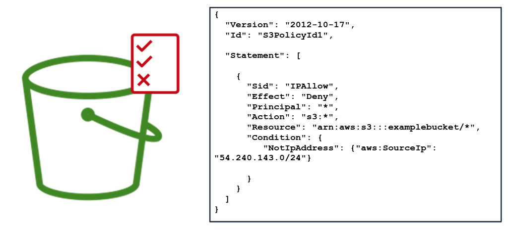]()
    <p align="center">
    <small><strong><i>Bucket Security - Bucket Policy</i></strong></small>
    </p>

    ```
    {
      "Version": "2012-10-17", 
      "Id": "S3PolicyId1",

      "Statement": [

        {
          "Sid": "IPAllow",
          "Effect": "Deny",
          "Principal": "*",
          "Action": "s3:*",
          "Resource": "arn: aws:s3::: examplebucket/*", 
          "Condition": {
             "NotIpAddress": {"aws: SourceIp": "54.240.143.0/24"}
           }
        }
      ]
    }

    ```

+	####	Bucket security - Encryption

    We can protect our data while in transit and while at rest by using different types of encryption. When we upload and download objects, we can protect our data by using **_client-side encryption_**. Data is encrypted before we upload it, and we hold all the encryption keys. Amazon S3 does not play a role in encrypting or decrypting the data. We can also protect our Amazon S3 data at rest with client-side encryption.
    We can also use **_server-side encryption_**. Amazon S3 encrypts data at the object level when we upload it. When we download the object, Amazon S3 decrypts the data.
    <br>
    
    [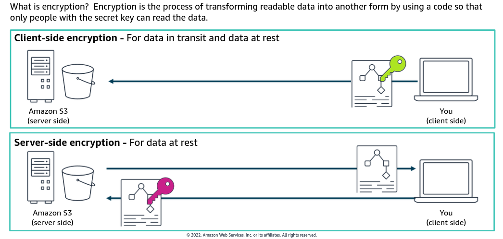]()
    <p align="center">
    <small><strong><i>Bucket security - Encryption</i></strong></small>
    </p>

+	####	Moving large amounts of data into Amazon S3

    We can begin moving data into Amazon S3 in larger chunks. AWS has service features and a family of services to assist in migrating large amounts of data.

    []()
    <p align="center">
    <small><strong><i>Moving large Amount of data into Amazon S3</i></strong></small>
    </p>

    These features and services including the following:
    #####  1. S3 Transfer Acceleration
    Amazon S3 Transfer Acceleration offers fast and straightforward data transfer into an S3 bucket by taking advantage of many Amazon CloudFront globally distributed edge locations. S3 Transfer Acceleration shortens the distance between client applications and Amazon S3 by using the global network of hundreds of CloudFront edge locations. Uploads and downloads are automatically routed through the closest edge locations to your application.

    []()
    <p align="center">
    <small><strong><i>S3 Transfer Acceleration</i></strong></small>
    </p>

    Consider Transfer Acceleration when we:
    +   Have customers all over the world who upload to a centralized bucket.
    +   Transfer gigabytes or terabytes of data across continents on a regular basis.

    #####  2. AWS Snowcone
    AWS Snowcone is a portable, rugged, and secure device for edge computing and data transfer. We can use a Snowcone device to collect, process, and move data to the AWS Cloud. We can move the data either offline by shipping the device to AWS, or online by using AWS DataSync.

    []()
    <p align="center">
    <small><strong><i>AWS Snowcone</i></strong></small>
    </p>

    We can use AWS Snowcone devices for one-time data migration scenarios where our data is ready to be transferred. Snowcone offers a quick and low-cost way to transfer up to 8 TB or 14 TB of data to the AWS Cloud by shipping the device back to AWS.

    #####  3. AWS Snowball
    The AWS Snowball service uses physical storage devices to transfer large amounts of data between Amazon S3 and our onsite data storage location at faster-than- internet speeds.

    The two different job types are import jobs and export jobs.
    +   <b>Import jobs</b>
    An import job is the transfer of 72 TB or less of our data (located in an on-premises data source). It is copied onto a single Snowball, and then moved into Amazon S3.

    +   <b>Export jobs</b>
    An export job is the transfer of any amount of data (located in Amazon S3). It is copied onto any number of Snowballs, and then moved one Snowball at a time into your on-premises data destination.

    You can use AWS Snowball devices to migrate petabytes of data into Amazon S3 for processing and analysis.

    #####  4. AWS Snowmobile

    AWS Snowmobile is an exabyte-scale data transfer service that is used to move extremely large amounts of data to AWS. You can transfer up to 100 PB per Snowmobile, a 45-foot long ruggedized shipping container, pulled by a semi-trailer truck. Snowmobile makes it easy to move massive volumes of data to the cloud, including video libraries, image repositories, or even a complete data center migration. Transferring data with Snowmobile is more secure, fast, and cost effective.

+	####	Using Amazon S3 summary

    []()
    <p align="center">
    <small><strong><i>Using Amazon S3 summary</i></strong></small>
    </p>

### Additional AWS Storage Services

+   ####    Additional AWS Storage Services

    Now, We are familiar with Amazon S3 for object storage, it's time to diveinto the AWS storage services for block storage and file storage.
	In this section, we'll review the storage types and be introduced to **_Amazon Elastic Block Store (Amazon EBS)_** and **_Amazon Elastic File System (Amazon EFS)_**.

    [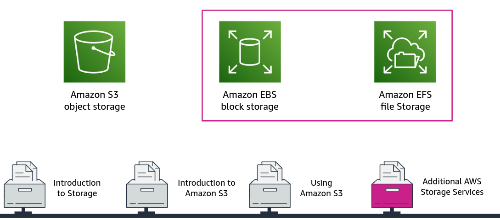]()
    <p align="center">
    <small><strong><i>Additional AWS Storage Services</i></strong></small>
    </p>

+	####	Block storage at AWS

    Recall that block storage is data that stored on device in fixed-sized blocks. AWS has two block storage solutions. 
	
	The first type of block storage is an **_Amazon EC2_** instance store, which is a temproary block-level storage for our EC2 instance. This storage consists of a preconfigured and preattached block of disk storage on the same physical server that hosts the EC2 instance. It is temproary because the storage data is lost when you stop or terminate our EC2 instance.
	
	The second type of block storage is **_Amazon EBS_**, a detachable storage associated with an Availability Zone. If we stop or terminate our EC2 instance, our data is still available in the EBS volume.
	We can detach it from the instance that we are terminating and reattach it to another instance.

    [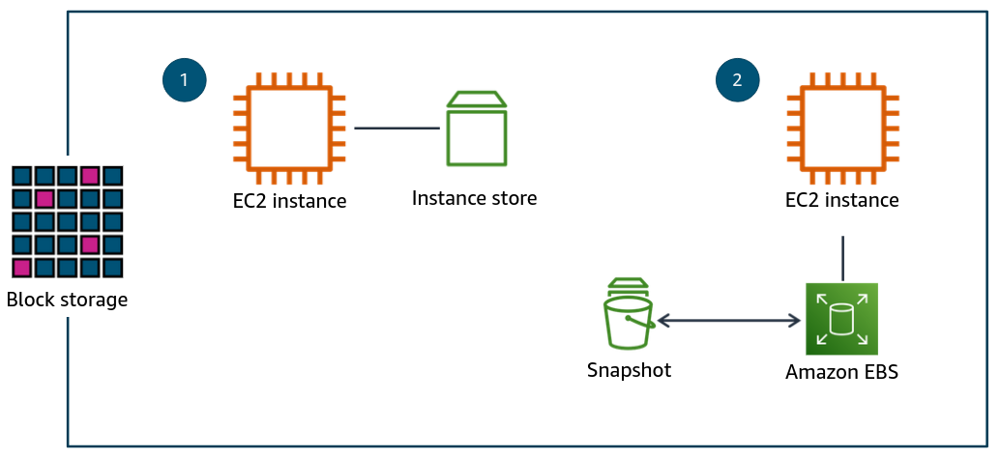]()
    <p align="center">
    <small><strong><i>Block storage at AWS</i></strong></small>
    </p>

+	####	EBS key features and benefits

    Amazon EBS is a durable, block-level storage device that was designed for Amazon EC2. EBS volumes provide six key features and benefits:

    #####  [1.  Data availability](#)
    #####  [2.  Data persistence](#)
    #####  [3.  Data encryption](#)
    #####  [4.  Data security](#)
    #####  [5.  Snapshots](#)
    #####  [6.  Flexibility](#)
    

    [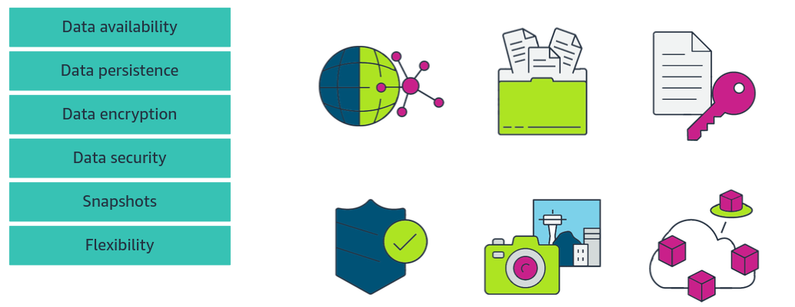]()
    <p align="center">
    <small><strong><i>EBS key features and benefits</i></strong></small>
    </p>

    +	#####	Data availability
        When you create an EBS volume, it is automatically replicated within its Availability Zone to prevent data loss due to failure of any single hardware component. You can attach an EBS volume to any EC2 instance in the same Availability Zone. After you attach a volume, it appears as a native block device similar to a hard drive or other physical device. At that point, the instance can interact with the volume just as it would with a local drive.
    