#   Getting Started with Storage

## Overview

When you consider running your workloads on Amazon Web Services (AWS), you might first consider your storage options. AWS storage provides the services that you need to build the storage solution that’s right for your business. You will review the primary storage types and the differences between them. You will also learn how to identify the right solution in the cloud based on your requirements. 

You will then focus on Amazon Simple Storage Service (Amazon S3), an object storage service that offers industry-leading scalability, data availability, security, and performance.  Customers of all sizes and industries can use Amazon S3 to store and protect any amount of data for a range of use cases. These use cases include websites, mobile applications, backup and restore, archive, enterprise applications, Internet of Things (IoT) devices, and big data analytics. 

In this course, you acquire the knowledge that you need to start using Amazon S3. You learn about the key elements of Amazon S3 and explore how to configure them. You learn how to upload data to Amazon S3 and what additional AWS services you can use to transfer data to Amazon S3 at scale. You also learn the basic elements of security within Amazon S3.

##  Objectives
By the end of this course I will be able to do the following:

+   Discuss different types of storage solutions and their features and benefits.
+   Discuss the features and concepts of Amazon S3.
+   Describe Amazon S3 storage classes and associated use cases.
+   Discuss how to use Amazon S3 to create a bucket, upload objects, and work with objects.
+   Describe Amazon S3 configurations for cost savings and security.
+   Identify other AWS storage solutions and their use cases.
+   Use Amazon S3 to create a static website.

Click <a href="./Getting Started with Storage/README.md">Getting Started with Storage</a>

[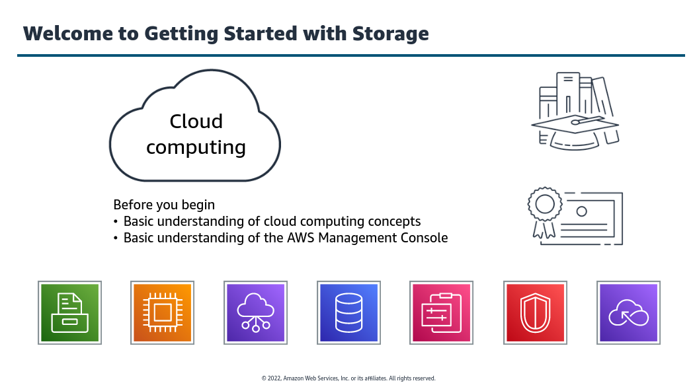]()
<small>**_Getting Started with Storage_**</small>

+   In this module we learn about basic storage domain and AWS course storage services. It is broken into following four sections:
    ####  [1.  Introduction to Storage](#introduction-to-storage)
    ####  [2.  Intoduction to Amazon S3](#)
    ####  [3.  Using Amazon S3](#)
    ####  [4.  Additional AWS Storage Services](#)

[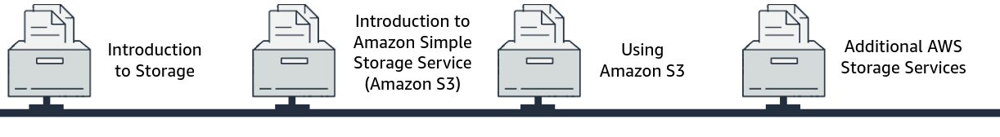]()
<small>**_Four Sections_**</small>

### Introduction to Storage
+   #### Introduction to Storage

    Computers use data to complete tasks, and this data must be stored to be accessed. Some data can be stored internal to the computer itself, such as files that help the computer start up and run. More data can be stored on servers to be accessed by our computer. When data is on server in the cloud, people  all around the world can access it. 

    [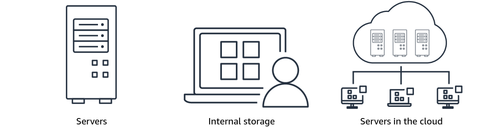]()
    <small>**_Introduction to Storage_**</small>

    There are different types of storage for different applications. Before learning about the types of cloud storage, it is important to understand the difference between **_On-premises storage and Cloud storage_**

    <table>
    <tr>
        <th>On-Premises</th>
        <th>Cloud Storage</th>
    </tr>

    <tr>
    <td>
    

        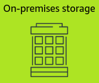
    

    </td>

    <td>
    

        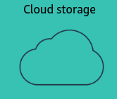
    

    </td>
    </tr>

    <tr>
    <td>
    

        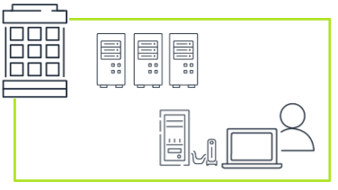
    

    </td>

    <td>
    

        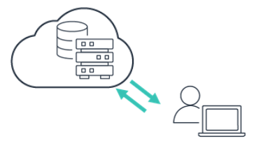
    

    </td>
    </tr>

    <tr>
    <td>
    <b>On-premises storage</b> means that our server is hosted within our organization's infrastructure and might be physically onsite. Company controls, administers, and maintains the server. Data and other information are shared between computers through our local network.
    </td>

    <td>

    With <b>Cloud Storage</b>, an outside service provider like AWS hosts our data. The cloud providers procures, installs, and maintains all hardware, software, and other supporting infrastructure in its data centers. We access these services and manage our account through the internet.
    </td>
    </tr>

    </table>

+   ####    Benefits of Cloud Storage

    [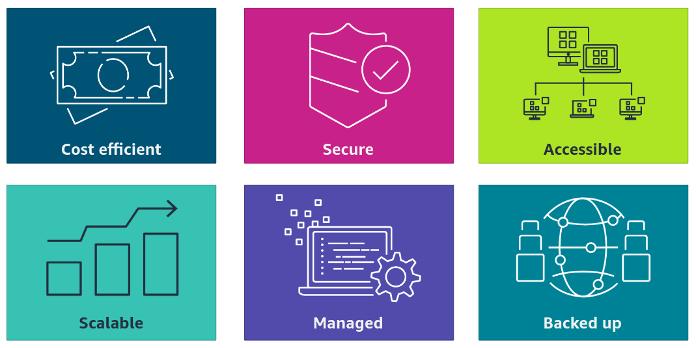]()
    

    <small><strong><i>Benefits of Cloud Storage</i></strong></small>
    

    <b>1.  Cost Efficient</b> so we pay for only what we use.

    <b>2.  Secure</b> because data is saved across multiple servers.

    <b>3.  Accessible</b> to multiple users in an account.

    <b>4.  Scalable</b> so it can grow and shrink as our workloads change.

    <b>5.  Managed</b> so we don't have to worry about servers, and we can focus on our data and applications.
    
    <b>6.  Backed up</b> so copies of data are stored in different physical locations in case of failure.

+   ####    Types of Cloud Storage

    [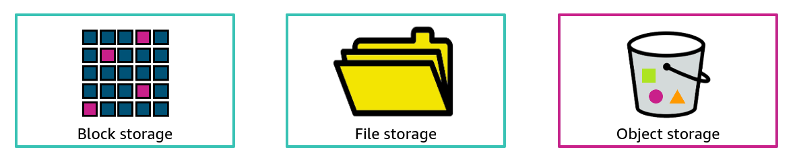]()
    

    <small><strong><i>Types of Cloud Storage</i></strong></small>
    

    Storage comes in three basic types: <b>block storage, file storage, and object storage</b>.

    <b>1.   Block Storage</b>

    [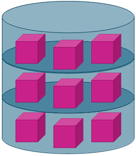]()

    Block storage breaks up data into blocks and then stores those blocks as seperate pieces, each with a unique identifier. They are stored wherever it is most efficient. Thus, it can store those blocks across different systems and each block can be configured to work with different operating systems.
    
     

    <b>2.   Cloud Storage</b>

    [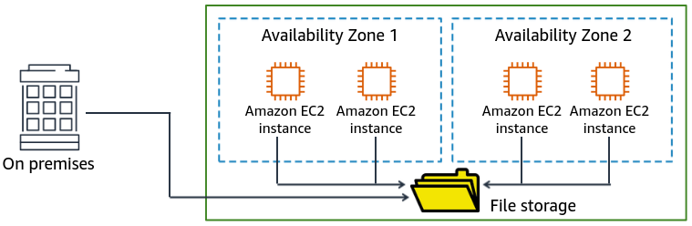]()
    File storage is a methodology that helps users, applications, and services access data in a shared file system. Data is stored in a hierarchical structure. This structure is similar to a centralized shared network drive in a company where employees store and access file.

     

    <b>3.   Object Storage</b>

    

    In Object storage, files are stored as objects based on attributes and metadata. Each object consists of data, metadata, and an object key. The metadata has information about the data (object size, object purpose, and more), and the object key is the unique identifier of the object. When you update files in object storage, the entire file object is updated, instead of a piece of a file, as in block storage.

+   ####    Choosing the right storage type

    [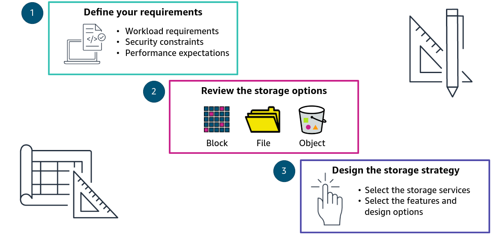]()
    

    <small><strong><i>Choosing the right storage type</i></strong></small>
    

