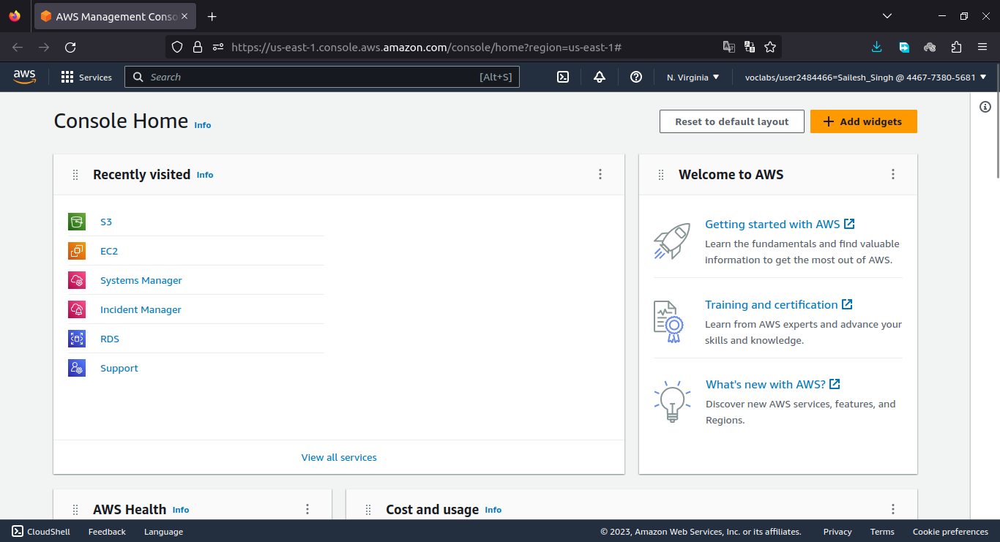
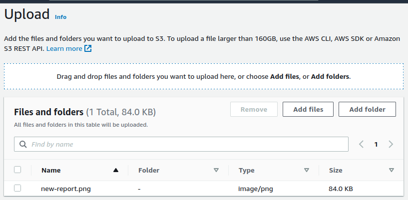
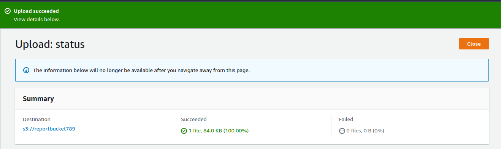
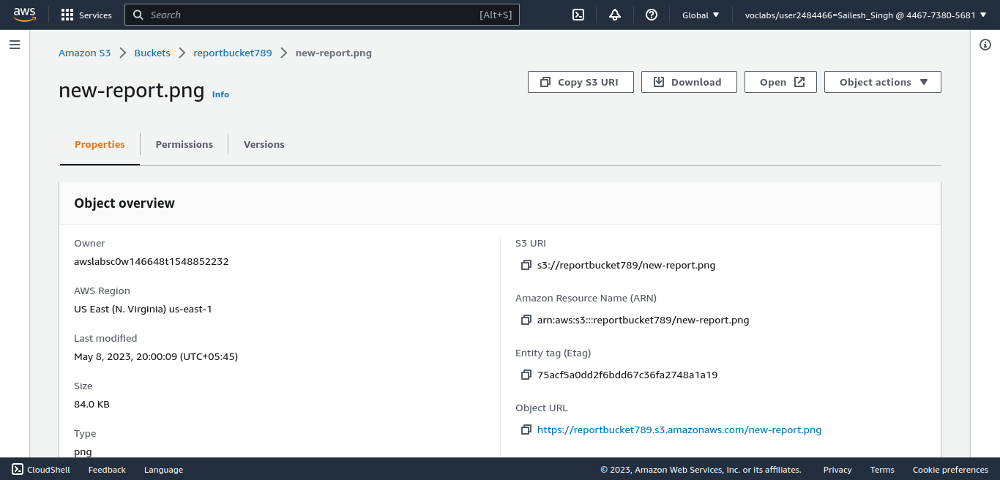
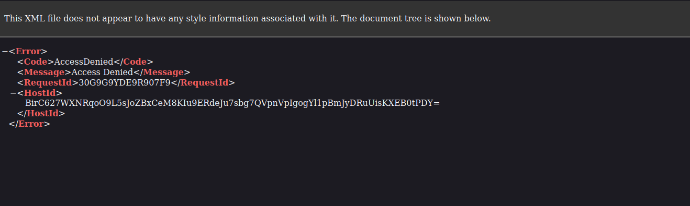
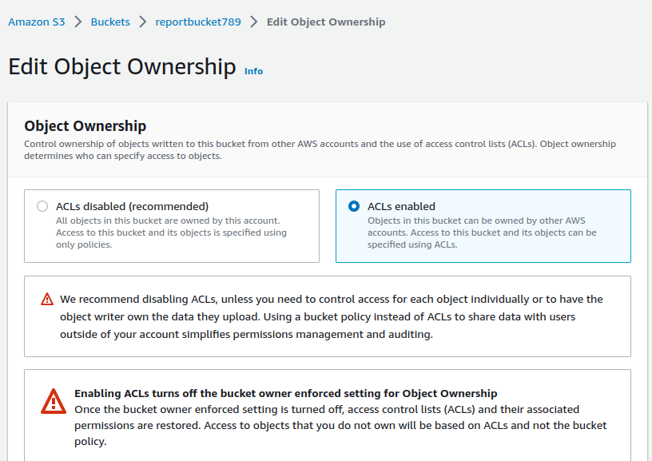

 #   Lab 1: Introduction to Amazon Simple Storage Service (Amazon S3)

### Lab overview and objectives

This lab teaches you the basic feature functionality of Amazon Simple Storage Service (Amazon S3) using the AWS Management Console. _Click to [Learn more ...](https://awseducate.instructure.com/courses/768/assignments/3145)_

After completing this lab, you will know how to:
    
+   Create a bucket in Amazon S3
+   Add an object to a bucket
+   Manage access permissions on an object and a bucket
+   Create a bucket policy
+   Use bucket versioning

####   Duration
This lab requires approximately **60** minutes to complete. You will have a total time of **240** minutes to complete this lab.

####    Task 1: Creating a bucket 

<small><b>*_Start and Launch AWS Management Console_*</b></small>

+   At the upper left of the AWS Management Console, on the <b>Services</b> menu, choose <b>S3</b>.
+   Choose <b>Create bucket</b>.
+   In the  <b>General configuration</b>  section, enter the following as the  <b>Bucket name</b>: `reportbucket(NUMBER)`

    Example bucket name: `reportbucket789`
+   Leave <b>Region</b> at its default value.
+   Click  <b>Create bucket</b>.

<small><b>*_Configure and Create bucket_*</b></small>

####    Task 2: Uploading an object to the bucket
Now that you have created a bucket for your report data, you are ready to work with objects.

+   Right-click the following link:  [new-report.png](./assets/new-report.png). Choose  <b>Save link as</b>, and save the file to your desktop.

+   In the  <b>S3 Management Console</b>, find and select the bucket name that starts with  <b>reportbucket</b>. 
+   Choose  <b>Upload</b>
+   Choose  <b>Add files</b>
+   Browse to and select the  <b>new-report.png</b>  file that you downloaded previously. 
+   At the bottom of the page, choose  <b>Upload</b>

Your file is successfully uploaded when the green bar indicating  <b>Upload succeeded</b>  appears.

+   In the <b>Upload: status </b> section in the upper right, choose  <b>Close</b>

<small><b>*_Upload Status_*</b></small>

####    Task 3: Making an object public 

In this task, you configure permissions on your bucket and your object to test accessibility.

First, you attempt to access the object to confirm that it is private by default.

+   In the  <b>reportbucket</b>  overview page, on the  <b>Objects</b>  tab, locate the  <b>new-report.png</b>  object, and choose the  <b>new-report.png</b> file name.

The  <b>new-report.png</b>  overview page opens. The navigation in the upper left updates with a link to return to the bucket overview page.

+   In the  <b>Object overview</b>  section, locate and copy the  <b>Object URL</b>  link.

<small><b>*_Object overview and Object URL_*</b></small>

The link should look similar to the following:  https://reportbucket987987.s3-us-west-2.amazonaws.com/new-report.png

+   Open a new browser tab and paste the object URL link into the address field, and then press  <b>Enter</b>. 

You receive an  <b>Access Denied</b>  error because objects in Amazon S3 are private by default.

<small><b>*_Object URL Access-denied_*</b></small>

Now that you've confirmed that the default security of Amazon S3 is private, you test how to make the object publicly accessible.

+   Keep the browser with the Access Denied error open, and return to the web browser tab with the <b>S3 Management Console</b>.

+   You should still be on the new-report.png  <b>Object overview</b> tab.

+   In the upper right, choose the  <b>Object actions</b> dropdown menu, you will notice that <b>Make public via ACL</b> is greyed out.

+   In the upper left of the page, choose the  <b>reportbucket</b> name in the navigation to go back to the main <b>reportbucket</b> overview page.

+   Choose the <b>Permissions</b> tab. 
+   We need to allow the use of ACLs first. Under <b>Object Ownership</b>  choose <b>Edit</b>. 
+   Choose <b>ACLs enabled</b>. 

<small><b>*_Enable ACL_*</b></small>

+   Choose <b>Bucket owner preferred</b>. 
+   Choose the check box next to <b>I acknowledge that ACLs will be restored</b>. 
+   Choose <b>Save Changes</b> 

<small><b>*_Select Bucket owner prefered_*</b></small>

+   Under <b>Block public access (bucket settings)</b>, choose <b>Edit</b> to change the settings. 
+   Clear the check box for the  <b>Block all public access</b> option, and then leave all other options cleared.

+   A dialogue box opens asking you to confirm your changes. Enter  `confirm` in the field, and then choose  <b>Confirm</b>

A message that says <b>Successfully edited Block Public Access settings for this bucket</b>.  displays at the top of the window. 

+   Choose the <b>Objects</b>  tab. 
+   Choose the <b>new-report.png</b> file name. 
+   At the upper right on the <b>new-report.png</b> overview page, choose the <b>Object actions</b>  dropdown menu, and select <b>Make public</b>. 

> <small>Notice the warning:  <b>When public read access is enabled and not blocked by Block Public Access settings, anyone in the world can access the specified objects.</b> This warning reminds you that if you make the object public, then everyone in the world will be able to read the object.</small>

+   Choose <b>Make public</b> and you should see the green banner <b>Successfully edited public access</b> at the top of the window. 
+   In the upper right, choose <b>Close</b> to return to the <b>new-report.png</b> object overview. 
+   Return to the browser tab that displayed  <b>Access Denied</b> for the new-report.png object, and refresh the page. 

The new-report.png object now displays properly because it is publicly accessible. 

+   Close the web browser tab that displays your new-report.png image, and return to the tab with the Amazon S3 Management Console. 

