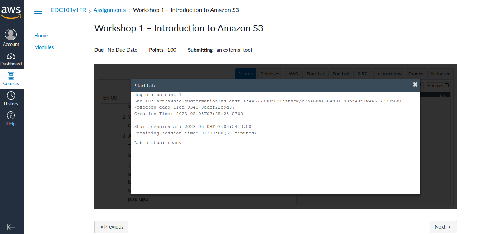
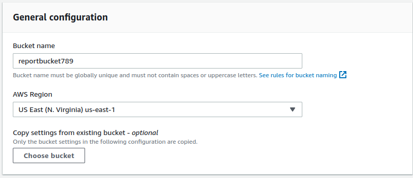
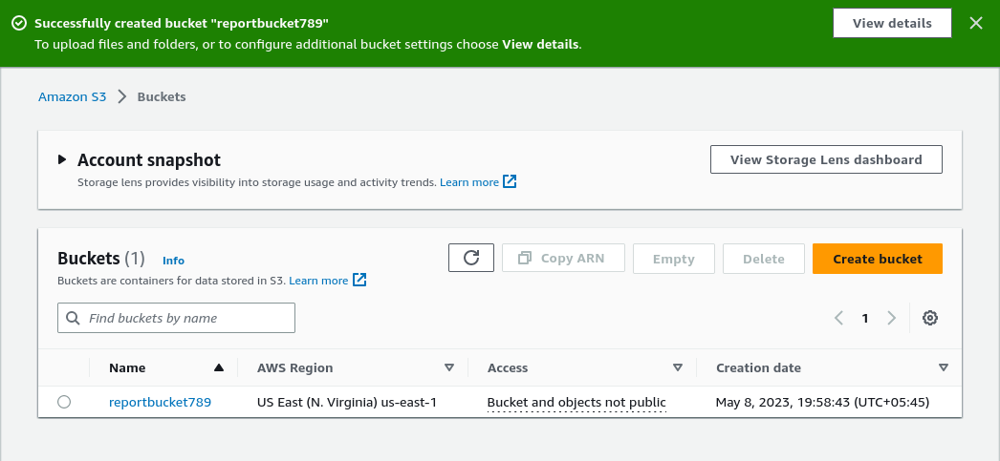

 #   Lab 1: Introduction to Amazon Simple Storage Service (Amazon S3)

### Lab overview and objectives

This lab teaches you the basic feature functionality of Amazon Simple Storage Service (Amazon S3) using the AWS Management Console. _Click to [Learn more ...](https://awseducate.instructure.com/courses/768/assignments/3145)_

After completing this lab, you will know how to:
    
+   Create a bucket in Amazon S3
+   Add an object to a bucket
+   Manage access permissions on an object and a bucket
+   Create a bucket policy
+   Use bucket versioning

####   Duration
This lab requires approximately **60** minutes to complete. You will have a total time of **240** minutes to complete this lab.

####    Task 1: Creating a bucket 

<small><b>*_Start and Launch AWS Management Console_*</b></small>

+   At the upper left of the AWS Management Console, on the <b>Services</b> menu, choose <b>S3</b>.
+   Choose <b>Create bucket</b>.
+   In the  <b>General configuration</b>  section, enter the following as the  <b>Bucket name</b>: `reportbucket(NUMBER)`

    Example bucket name: `reportbucket789`
+   Leave <b>Region</b> at its default value.
+   Click  <b>Create bucket</b>.

<small><b>*_Configure and Create bucket_*</b></small>

