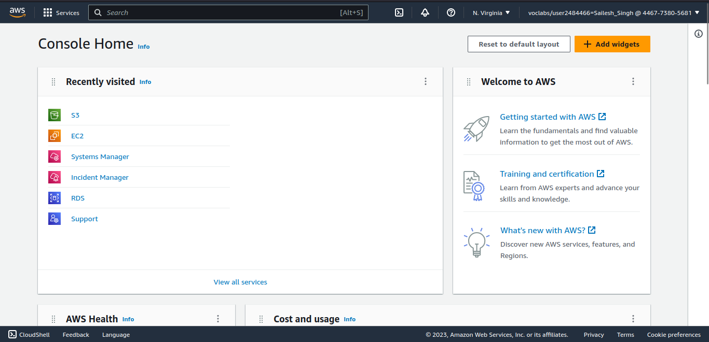
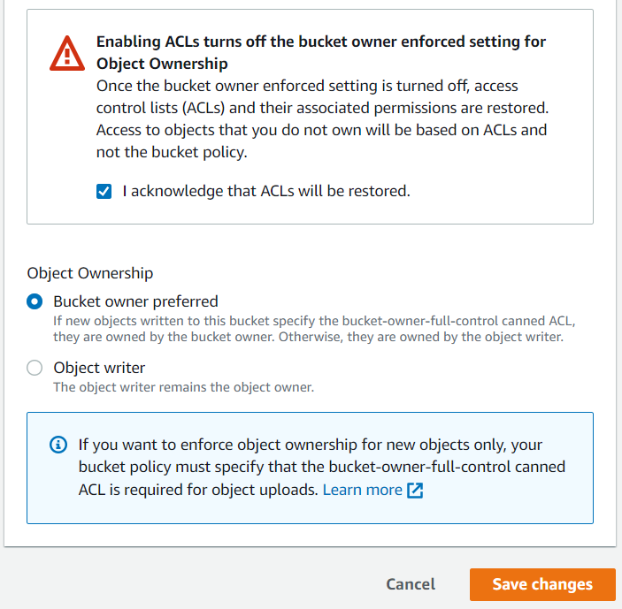

 #   Lab 1: Introduction to Amazon Simple Storage Service (Amazon S3)

### Lab overview and objectives

This lab teaches you the basic feature functionality of Amazon Simple Storage Service (Amazon S3) using the AWS Management Console. _Click to [Learn more ...](https://awseducate.instructure.com/courses/768/assignments/3145)_

After completing this lab, you will know how to:
    
+   Create a bucket in Amazon S3
+   Add an object to a bucket
+   Manage access permissions on an object and a bucket
+   Create a bucket policy
+   Use bucket versioning

####   Duration
This lab requires approximately **60** minutes to complete. You will have a total time of **240** minutes to complete this lab.


####    Task 1: Creating a bucket 

<small><b>*_Start and Launch AWS Management Console_*</b></small>

+   At the upper left of the AWS Management Console, on the <b>Services</b> menu, choose <b>S3</b>.
+   Choose <b>Create bucket</b>.
+   In the  <b>General configuration</b>  section, enter the following as the  <b>Bucket name</b>: `reportbucket(NUMBER)`

    Example bucket name: `reportbucket789`
+   Leave <b>Region</b> at its default value.
+   Click  <b>Create bucket</b>.


<small><b>*_Configure and Create bucket_*</b></small>

####    Task 2: Uploading an object to the bucket
Now that you have created a bucket for your report data, you are ready to work with objects.

+   Right-click the following link:  [new-report.png](./assets/new-report.png). Choose  <b>Save link as</b>, and save the file to your desktop.

+   In the  <b>S3 Management Console</b>, find and select the bucket name that starts with  <b>reportbucket</b>. 
+   Choose  <b>Upload</b>
+   Choose  <b>Add files</b>
+   Browse to and select the  <b>new-report.png</b>  file that you downloaded previously. 
+   At the bottom of the page, choose  <b>Upload</b>

[]()

Your file is successfully uploaded when the green bar indicating  <b>Upload succeeded</b>  appears.

+   In the <b>Upload: status </b> section in the upper right, choose  <b>Close</b>

[]()
<small><b>*_Upload Status_*</b></small>

####    Task 3: Making an object public 

In this task, you configure permissions on your bucket and your object to test accessibility.

First, you attempt to access the object to confirm that it is private by default.

+   In the  <b>reportbucket</b>  overview page, on the  <b>Objects</b>  tab, locate the  <b>new-report.png</b>  object, and choose the  <b>new-report.png</b> file name.

The  <b>new-report.png</b>  overview page opens. The navigation in the upper left updates with a link to return to the bucket overview page.

+   In the  <b>Object overview</b>  section, locate and copy the  <b>Object URL</b>  link.

[]()
<small><b>*_Object overview and Object URL_*</b></small>

The link should look similar to the following:  https://reportbucket987987.s3-us-west-2.amazonaws.com/new-report.png

+   Open a new browser tab and paste the object URL link into the address field, and then press  <b>Enter</b>. 

You receive an  <b>Access Denied</b>  error because objects in Amazon S3 are private by default.

[]()
<small><b>*_Object URL Access-denied_*</b></small>

Now that you've confirmed that the default security of Amazon S3 is private, you test how to make the object publicly accessible.

+   Keep the browser with the Access Denied error open, and return to the web browser tab with the <b>S3 Management Console</b>.

+   You should still be on the new-report.png  <b>Object overview</b> tab.

+   In the upper right, choose the  <b>Object actions</b> dropdown menu, you will notice that <b>Make public via ACL</b> is greyed out.

+   In the upper left of the page, choose the  <b>reportbucket</b> name in the navigation to go back to the main <b>reportbucket</b> overview page.

+   Choose the <b>Permissions</b> tab. 
+   We need to allow the use of ACLs first. Under <b>Object Ownership</b>  choose <b>Edit</b>. 
+   Choose <b>ACLs enabled</b>. 

[]()
<small><b>*_Enable ACL_*</b></small>

+   Choose <b>Bucket owner preferred</b>. 
+   Choose the check box next to <b>I acknowledge that ACLs will be restored</b>. 
+   Choose <b>Save Changes</b> 


[]()
<small><b>*_Select Bucket owner prefered_*</b></small>

+   Under <b>Block public access (bucket settings)</b>, choose <b>Edit</b> to change the settings. 
+   Clear the check box for the  <b>Block all public access</b> option, and then leave all other options cleared.

+   A dialogue box opens asking you to confirm your changes. Enter  `confirm` in the field, and then choose  <b>Confirm</b>

[]()
<small><b>*_Confirm dialogue box_*</b></small>

A message that says <b>Successfully edited Block Public Access settings for this bucket</b>.  displays at the top of the window. 

+   Choose the <b>Objects</b>  tab. 
+   Choose the <b>new-report.png</b> file name. 
+   At the upper right on the <b>new-report.png</b> overview page, choose the <b>Object actions</b>  dropdown menu, and select <b>Make public</b>. 

> <small>Notice the warning:  <b>When public read access is enabled and not blocked by Block Public Access settings, anyone in the world can access the specified objects.</b> This warning reminds you that if you make the object public, then everyone in the world will be able to read the object.</small>

+   Choose <b>Make public</b> and you should see the green banner <b>Successfully edited public access</b> at the top of the window. 
+   In the upper right, choose <b>Close</b> to return to the <b>new-report.png</b> object overview. 
+   Return to the browser tab that displayed  <b>Access Denied</b> for the new-report.png object, and refresh the page. 

The new-report.png object now displays properly because it is publicly accessible. 

+   Close the web browser tab that displays your new-report.png image, and return to the tab with the Amazon S3 Management Console. 

####    Task 4: Testing connectivity from the EC2 instance

+   On the <b>Services</b> menu, choose <b>EC2</b>. 
+   On the <b>EC2 Dashboard</b>, under the  <b>Resources</b> section, choose <b>Instances (running)</b>. 
+   Select the check box for <b>Bastion Host</b> and choose  Connect 
+   In the <b>Connect to instance</b> window, select the <b>Session Manager</b> tab for the connection method. 

> <small>With AWS Systems Manager Session Manager, you can connect to the bastion host instance without the need for specific ports to be open on your firewall or Amazon Virtual Private Cloud (Amazon VPC) security group. Refer to <b>AWS Systems Manager Session Manager</b> in the <b>Additional resources</b> section at the end of this lab for more information.</small> 

+   Choose <b>Connect</b> 

A new browser tab or window opens with a connection to the bastion host instance.

+   In the bastion host session, enter the following command to change to the home directory (/home/ssm-user/):

        cd  ~ 
    The output returns you to the command prompt. 

+   Enter the following command to verify that you are in the home directory:

        pwd
    
    The output should be as follows:
    
        /home/ssm-user
    
    You are now in the ssm-user's home directory where you will run all of the commands in this lab.
+   Enter the following command to list all of your S3 buckets.

        aws s3  ls
    
    The output should look similar to the following:
        
        2023-05-08 22:34:46 reportbucket789

+   In the following command, change (NUMBER)  at the end of the reportbucket name to the name of the bucket you created. Enter your adjusted command to list all the objects in your reportbucket.

        aws s3  ls  s3://reportbucket(NUMBER)

    The command looks similar to the following: <b>aws s3 ls s3://reportbucket789</b>

    The output should look like the following:

        2023-05-08 22:35:26      86065 new-report.png

+   Enter the following command to change directories into the reports directory.

        cd ~
        cd reports

+   Enter the following command to list the contents of the directory.

        ls
    
    The output shows some files created in your reports directory to test the application. 

        dolphins.jpg files.zip report-test.txt  report-test1.txt 
        report-test2.txt report-test3.txt  whale.jpg

+   n the following command, change  (NUMBER)  at the end of the reportbucket name to the name of the bucket you created. Enter your adjusted command to see if you can copy a file to the S3 bucket.

        aws s3  cp  report-test1.txt s3://reportbucket(NUMBER)

    The command looks similar to this:  aws s3 cp report-test1.txt s3://reportbucket789

    The output indicates an  upload failed  error. This error occurs because you have read-only rights to the bucket and do not have the permissions to perform the PutObject action.

+   Leave this window open. and go back to browser tab with the AWS console.

### Task 5: Creating a bucket policy

A bucket policy is a set of permissions associated with an S3 bucket. It is used to control access to an entire bucket or to specific directories within a bucket.

+   Right-click the following link: _sample-file.txt_. Choose <b>Save link as</b>, and save the file to your desktop.

+   Return to the AWS Management Console, go to the <b>Services</b> menu, and select <b>S3</b>.

+   In the  <b>S3 Management Console</b> tab, select the name of your bucket.

+   To upload the <b>sample-file.txt</b> file, choose <b>Upload</b> and use the same upload process that you used in task 2.

+   On the <b>reportbucket</b> overview page, choose the <b>sample-file.txt</b> file name. The <b>sample-file.txt</b> overview page opens.

+   Under the <b>Object overview</b> section, locate and copy the  <b>Object URL</b> link. 

+   In a new browser tab, paste the link into the address field, and then press Enter. 

Once again, your browser displays an <b>Access Denied</b> message. You need to configure a bucket policy to grant access to all objects in the bucket without having to specify permissions on each object individually. 

+   Keep this browser tab open, but return to the tab with the <b>S3 Management Console</b>.

+   Select  <b>Services</b>  and select <b>IAM</b>. In the left navigation, choose <b>Roles</b>. 
    
+   In the <b>Search</b> field, enter `EC2InstanceProfileRole`

This is the role that the EC2 instance uses to connect to Amazon S3. 

+   Select <b>EC2InstanceProfileRole</b>. In the  <b>Summary</b> section, copy the <b>Role ARN</b> to a text file to use in a later step. 

    It should look similar to the following:
    <b>arn:aws:iam::446773805681:role/EC2InstanceProfileRole</b> 

+   Choose <b>Services</b> and <b>S3</b>, and return to the <b>S3 Management Console</b>.

+   Choose the <b>reportbucket</b>. 
+   Choose the  <b>Permissions</b> tab. 
+   In the <b>Permissions</b> tab, scroll to the  <b>Bucket policy</b> section, and choose <b>Edit</b> 

+   Below the <b>Policy examples</b> and <b>Policy generator</b> buttons, find the <b>Bucket ARN</b>. Copy the Bucket ARN to a text file to use in a later step.  

    It looks like the following:

        Bucket ARN 
        arn:aws:s3:::reportbucket789

+   Choose Policy generator
+   For Select Type of Policy, select S3 Bucket Policy.
+   For Effect, select Allow.
+   For Principal, paste the EC2 Role ARN that you copied to a text file in a previous step.
+   For AWS Service, keep the default setting of Amazon S3.
+   For Actions, select GetObject and PutObject.
+   For Amazon Resource Name (ARN), enter *
+   Choose Add Statement. The details of the statement you configured are added to a table below the button. You can add multiple statements to a policy.
+   Choose Generate Policy.

A new window displays the generated policy in JSON format. It should look similar to the following:

```
{
  "Id": "Policy1683557035200",
  "Version": "2012-10-17",
  "Statement": [
    {
      "Sid": "Stmt1683557032361",
      "Action": [
        "s3:GetObject",
        "s3:PutObject"
      ],
      "Effect": "Allow",
      "Resource": "*",
      "Principal": {
        "AWS": [
          "arn:aws:iam::446773805681:role/EC2InstanceProfileRole"
        ]
      }
    }
  ]
}
```

+   Copy the policy that you created to your clipboard.
+   Close the web browser tab, and return to the S3 Management Console tab with the Bucket policy editor.
+   Paste the bucket policy that you created into the Bucket policy editor.
+   In the Bucket policy editor, update the Resource value replacing * with the Bucket ARN you saved earlier followed by /*: The updated Resource line in the lab policy should be similar to the following example:

        "Resource" :  "arn:aws:s3:::reportbucket789/*" 

+   Choose Save changes.
+   Return to the AWS Systems Manager (Systems Manager) window. If your session has timed out, reconnect to Systems Manager using the previous steps in the lab.
+   Enter the following command to verify that you are in the /home/ssm-user/reports directory. 

        pwd

    The output should be as follows:

        /home/ssm-user/reports

+   n the command below, replace  (NUMBER)  with the number you used to create your bucket. Enter your adjusted command to list all objects in your reportbucket.  

        aws s3  ls  s3://reportbucket(NUMBER) 

    The command should look similar to the following: <b>aws s3 ls s3://reportbucket789</b>

    The output should look similar to the following:

```
sh-4.2$ aws s3 ls s3://reportbucket987987 

2023-05-08 22:42:46      86065 new-report.png 

2023-05-08 22:42:46        90 sample-file.txt 
```

+   Enter the following command to list the contents of the reports directory.

        ls

+   In the command below, replace  (NUMBER)  with the number you used to create your bucket. Enter your adjusted command to try copying the report-test1.txt file to the S3 bucket.

        aws s3  cp  report-test1.txt s3://reportbucket(NUMBER)

    The command should look like the following:  <b>aws s3 cp report-test1.txt s3://reportbucket789</b>

    The output returns the following:

        upload: ./report-test1.txt to s3://reportbucket789/report-test1.txt

+   In the command below, replace  (NUMBER)  with the number you used to create your bucket. Enter your adjusted command to see if the file successfully uploaded to Amazon S3.

        aws s3  ls  s3://reportbucket(NUMBER)

The output should look similar to the following:
```
2023-05-08 22:44:46      86065 new-report.png 

2023-05-08 22:44:46         31 report-test1.txt 

2023-05-08 22:44:46         90 sample-file.txt 
```
You have successfully uploaded (PutObject) a file from the EC2 instance to your S3 bucket.

+   In the command below, replace  (NUMBER)  with the number you used to create your bucket. Enter your adjusted command to retrieve (GetObject) a file from Amazon S3 to the EC2 instance.

        aws s3  cp  s3://reportbucket(NUMBER)/sample-file.txt sample-file.txt

    The output should look similar to the following:

        download: s3://reportbucket789/sample-file.txt to ./sample-file.txt 

+   Enter the following command to see if the file is now in the /reports directory. 

        ls

    The output should look similar to the following:

    ```
    dolphins.jpg  files.zip  report-test1.txt  report-test2.txt  
    report-test3.txt  sample-file.txt 
    ```

>   You now see the sample-file.txt in your file list. Congratulations! You have successfully uploaded and retrieved a file from Amazon EC2 to the S3 bucket. 

+   Return to the browser tab that displayed the Access Denied error for the sample-file.txt, and refresh the page.

+   Go to the AWS Policy Generator, and add another statement to the bucket policy allowing everyone (*) read access (GetObject). Take a moment to  generate this policy. This policy allows the EC2InstanceProfileRole to have access to the bucket while giving everyone access to read the objects via the browser.

    Below is an expample of the above:

    ```
    {
        "Sid": "Stmt1683558222244",
        "Effect": "Allow",
        "Principal": "*",
        "Action": "s3:GetObject",
        "Resource": "arn:aws:s3:::reportbucket789/*"
    }
    ```

+   To test if your policy works, go to your browser with the  Access Denied  error and refresh it. If you can read the text, then congratulations! Your policy was successful.

If not, look at the following policy for help. The modified policy should look like the following policy. Notice that there are two statements: one with the EC2InstanceProfileRole and one where the principal is  "*"  for everyone. 

If you had trouble generating the policy on your own, you can copy the policy below and paste it into the BucketPolicy Editor. Remember to replace the existing EC2InstanceProfileRole ARN in the policy below with the EC2InstanceProfileRole ARN you copied in a previous step. Ensure that you replace the reportbucket example ARN with the bucket you created and the  /*  appears at the end of the Bucket ARN. See the last line of the policy as an example.

```
{
    "Version": "2012-10-17",
    "Id": "Policy1683557035200",
    "Statement": [
        {
            "Sid": "Stmt1683557032361",
            "Effect": "Allow",
            "Principal": {
                "AWS": "arn:aws:iam::446773805681:role/EC2InstanceProfileRole"
            },
            "Action": [
                "s3:GetObject",
                "s3:PutObject"
            ],
            "Resource": "arn:aws:s3:::reportbucket789/*"
        },
        {
            "Sid": "Stmt1683558222244",
            "Effect": "Allow",
            "Principal": "*",
            "Action": "s3:GetObject",
            "Resource": "arn:aws:s3:::reportbucket789/*"
        }
    ]
}
```

+   Leave the tab open with the sample-file.txt displayed. You return to this tab in the next task. 

In this task, you created a bucket policy to allow specific access rights to your bucket. In the next section, you explore how to keep copies of files to prevent against accidental deletion.

####    Task 6: Exploring versioning

Versioning is a means of keeping multiple variants of an object in the same bucket. You can use versioning to preserve, retrieve, and restore every version of every object stored in your S3 bucket. With versioning, you can easily recover from both unintended user actions and application failures.

+   You should be on the S3 bucket  Permissions  tab from the previous task. If you are not, choose the link to the bucket at the upper left of the screen to return to the bucket overview page.

+   On the  reportbucket  overview page, choose the  Properties  tab. 

+   Under the  Bucket,  Versioning  section, click  Edit  select  Enable  then click  Save changes . 

Versioning is enabled for an entire bucket and all objects within the bucket. It cannot be enabled for individual objects.

+   Right-click this link, and save the text file to your computer <b>using the same name as the text file in the previous task :  sample-file.txt</b> 

+   In the Amazon S3 Management Console, on the reportbucket, choose the Objects tab. 

Under the Objects section, find Show versions . 

+   Choose  Upload  and use the same upload process that you used in tasks 2 and 5 to upload the new  sample-file.txt  file. 

+   Go to the browser tab that has the contents of the sample-file.txt file. 

+   Make a note of the contents on the page, and then refresh   the page.  

If a version is not otherwise specified, Amazon S3 always returns the latest version of an object.  

+   Close the web browser tab with the contents of the text file.

+   In the Amazon S3 Management Console, choose the  sample-file.txt  file name. The  sample-file.txt  overview page opens. 
    
+   Choose the  Versions  tab, and then select the check box for the bottom version, which reads  null . (This is not the latest version.)

+   Click  Open.

You should now see the original version of the file using the Amazon S3 Management Console.

However, if you try to access the older version of the sample-file.txt file using the object URL link, you will receive an access denied message. This message is expected because the bucket policy you created in the previous task allows permission to access only the latest version of the object. In order to access a previous version of the object, you need to update your bucket policy to include the <b>s3:GetObjectVersion</b> permission. The following bucket policy example includes the additional <b>s3:GetObjectVersion</b> action that allows you to access the older version using the link. You do not need to update your bucket policy with this example to complete this lab. You can try to do this on your own after you complete the task.

```
{ 
    "Id" :  "Policy1557511288767" , 
    "Version" :  "2012-10-17" , 
    "Statement" : [ 
    { 
        "Sid" :  "Stmt1557511286634" ,
        "Action" : [ 
        "s3:GetObject" , 
        "s3:GetObjectVersion"
        ], 
        "Effect" :  "Allow" , 
        "Resource" :  "arn:aws:s3:::reportbucket987987/*" , 
        "Principal" :  "*" 
    } 
    ] 
} 
```

+   Return to the  AWS Management Console  tab, and choose the link for the bucket name at the upper left to return to the bucket overview tab. 
+   Locate the   Show versions  option, and toggle the button to on   to show the versions. 

Now you can view the available versions of each object and identify which version is the latest. Notice that the  new-report.png  object has only one version. The version ID is  null  because the object was uploaded before versioning was enabled on this bucket. 

Also notice that you can now choose the version name link to navigate directly to that version of the object in the console. 

+   Next to Show versions, toggle the button to off   to return to the default object view. 
+   Select the check box to the left of the sample-file.txt. 
+   With the object selected, choose  Delete 
+   The  Delete objects  page appears. 
+   At the bottom, in the  Delete objects?  section, enter  delete and choose the  Delete objects  button to confirm deletion of the object. 
+   In the upper right of the page, choose  Close  to return to the bucket overview. 

The  sample-file.txt  object is no longer displayed in the bucket. However, if the object is deleted by mistake, you can use versioning to recover it. 

+   Locate the   Show versions  option, and toggle the button to on   to show the versions. 

Notice that the  sample-file.txt  object is displayed again, but the most recent version is a  Delete marker . The two previous versions are also listed. If versioning has been enabled on the bucket, objects are not immediately deleted. Instead, Amazon S3 inserts a delete marker, which becomes the current object version. The previous versions of the object are not removed.

+   Select the check box for the version of the  sample-file.txt  object with the  Delete marker . 
+   With the object selected, choose  Delete 
+   The  Delete objects  window appears. 
+   At the bottom in the  Permanently delete objects?  section, enter  `permanently delete` and choose the  Delete objects  button to confirm deletion of the object. 
+   On the upper right of the page, choose Close to return to the bucket overview. 
+   Next to Show versions, toggle the button to off   to return to the default object view. 

Notice that the  sample-file.txt  object has been restored to the bucket. Removing the delete marker has effectively restored the object to its previous state.

Next, you delete a specific version of the object. 

+   To delete a specific version of the object, locate the   Show versions  option, and toggle the button to on   to show the versions. 

You should see two versions of the  sample-file.txt  object. 

+   Select the check box for the latest version of the  sample-file.txt  object. 
+   With the object selected, choose  Delete 
+   The  Delete objects  window appears. 
+   At the bottom in the  Permanently delete objects?  section, enter `permanently delete` and choose the  Delete objects  button. 
+   On the upper right of the page, choose  Close  to return to the bucket overview. 

Notice that there is now only one version of the  sample-file.txt  file. When deleting a specific version of an object, no delete marker is created. The object is permanently deleted.

+   Next to  Show versions , toggle the button to off   to return to the default object view. 
+   Choose the  sample-file.txt  file name. The sample-file.txt overview page opens. 
+   Copy the  Object URL  link displayed at the bottom of the window. 
+   In a new browser tab, paste the link into the address field, and then press Enter. 

The browser page displays the text of the original version of the  sample-file.txt  object.

 ####  Summary

You have successfully created an S3 bucket for your company to use to store report data from your EC2 instance. You created a bucket policy so that the EC2 instance can PutObjects and GetObject from the reportbucket, and you successfully tested uploading and downloading files from the EC2 instance to test the bucket policy. You have enabled versioning on the S3 bucket to protect against accidental object deletion. You have successfully completed the configuration for your EC2 reportbucket.

#### END Of LAB 1