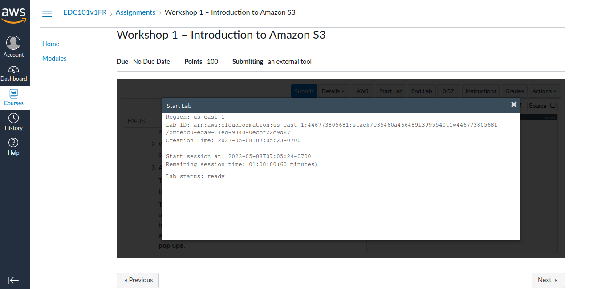
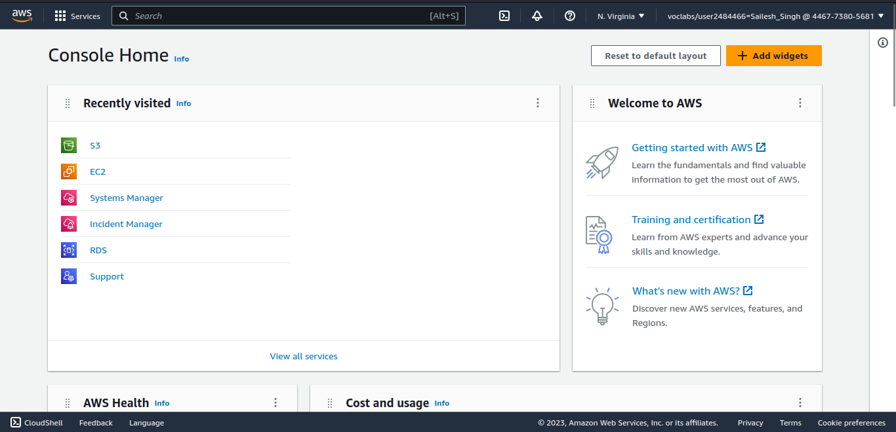

#   Lab 2: Introduction to Amazon EC2

### Lab overview and objectives

This lab provides you with a basic overview of launching, resizing, managing, and monitoring an Amazon Elastic Compute Cloud (Amazon EC2) instance. 

Amazon EC2 is a web service that provides resizable compute capacity in the cloud. It is designed to make web-scale cloud computing simple and intuitive to use.  _Click to [Learn more...](https://awseducate.instructure.com/courses/768/assignments/3146)_

After completing this lab, you will know how to:

+   Launch a web server with termination protection enabled 
+   Monitor Your EC2 instance 
+   Modify the security group that your web server is using to allow HTTP access 
+   Resize your  EC2 instance to scale 
+   Explore Amazon EC2 limits 
+   Test termination protection 
+   Terminate your EC2 instance 

####   Duration
This lab requires approximately **45** minutes to complete. You will have a total time of **180** minutes to complete this lab.

####    Task 1: Launching your EC2 instance 

<small><b>*_Start and Launch AWS Management Console_*</b></small>

+   In the AWS Management Console on the Services menu, choose EC2.
+   In the left navigation pane, choose EC2 Dashboard to ensure that you are on the dashboard page.
+   Choose Launch instance, and then select Launch instance.

#####   Step 1: Name your EC2 instance 

+   In the Name and tags section, for Name, enter Web-Server
+   Choose the Add additional tags link.
+   From the Resource types dropdown list, ensure that both Instances and Volumes are selected.

