#   Introduction to Cloud 101

### This is the foundation for Cloud Practitioner Journey

We build our foundation journey from AWS educate course. Click [Introduction to Cloud 101](https://awseducate.instructure.com/courses/746) to start learning.

## Module 1: Introduction to Cloud 101

[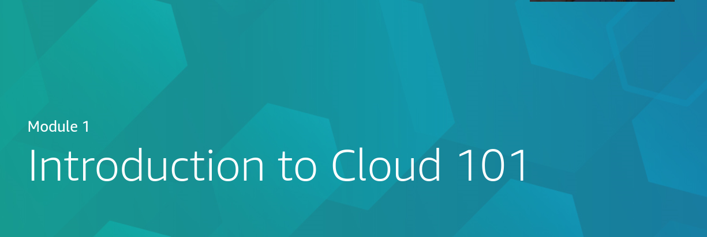](https://awseducate.instructure.com/courses/746/pages/introduction-to-cloud-101?module_item_id=13188)

We should learn about the cloud because of following reasons:

[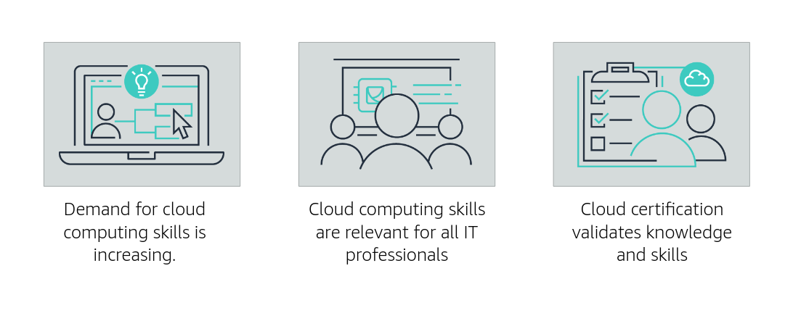]()

## Module 2: Introduction to Cloud Computing

[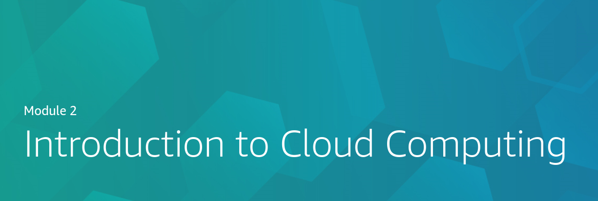](https://awseducate.instructure.com/courses/746/pages/introduction-to-cloud-computing?module_item_id=13189)

### Objectives

+       Define cloud computing
+       Describe the basics of cloud computing
+       Discuss the benefits of cloud computing
+       Identify cloud service models and cloud deployment models

### Why Cloud Computing?

[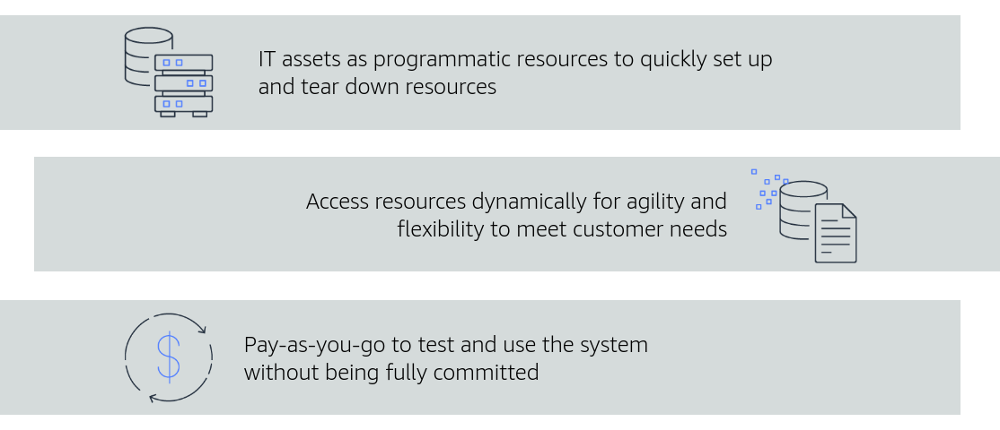](https://awseducate.instructure.com/courses/746/pages/introduction-to-cloud-computing?module_item_id=13189)

### Definition Cloud Computing
Cloud Computing is the on demand delivery of IT resources over the internet with pay-as-you-go pricing.

<table>
<tr>
    <th> On demand delivery </th>
    <th> IT resource over the internet </th>
    <th> Pay-as-you-go pricing </th>
</tr>
<tr>
</tr>

<tr>
<td>
     

        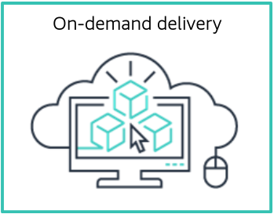
     

>   _On demand delivery means a cloud provider has the resources you need, when you need them._
</td>
<td>
     

        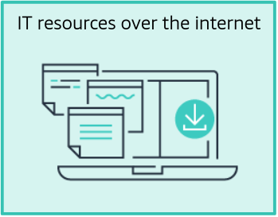
     

>   _Servers, networks, atorage, development tools, and applications._
</td>
<td>
     

        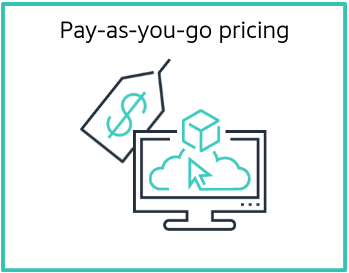
     

>   _Pay only for what you need when you use it._
</td>
</tr>
</table>

### Who uses Amazon Web Services (AWS) cloud computing?
---
[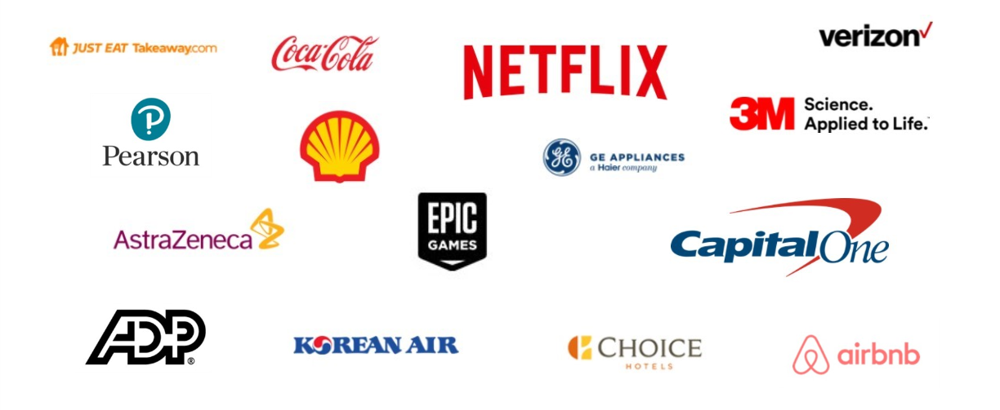]()

---

### Brief history of cloud computing

[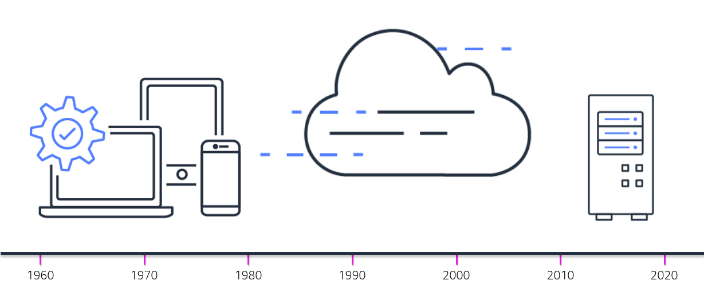]()

<table>
<tr>
    <th> Date </th>
    <th> Description </th>
</tr>
<tr>
<td>
    <b>1961</b>
</td>
<td>
    Computer scientist John McCarthy suggested that computing would one day be sold as utility.
</td>
</tr>
<tr>
<td>
    <b>1969</b>
</td>
<td>
    The US Department of Defense used TCP/IP protocol to launch Advanced Research  Projects Agency Network <i>(ARPANET)</i>
</td>
</tr>
<tr>
<td>
    <b>1985</b>
</td>
<td>
    100,000 computers were connected to the Internet.
</td>
</tr>
<tr>
<td>
    <b>1991</b>
</td>
<td>
    The World Wide Web launched.
</td>
</tr>
<tr>
<td>
    <b>1997</b>
</td>
<td>
    The term <i>cloud</i> was mentioned in an article by Professor Ramnath Chellappa from Emory University.
</td>
</tr>
<tr>
<td>
    <b>2002</b>
</td>
<td>
    AWS launches  public cloud.
</td>
</tr>
<tr>
<td>
    <b>2006</b>
</td>
<td>
    AWS launches Amazon Elastic Compute Cloud (Amazon EC2) to the public.
</td>
</tr>
<tr>
<td>
    <b>2008</b>
</td>
<td>
    Multiple region cloud provider data centers are established.
</td>
</tr>
</table>

### Client-Server Model
Modern computing is based on the client-server model.

<table>

<tr>
<td>

A __client__ can be a web browser or desktop application that a person interacts with to make requests to computer servers.
</td>
<td>
     

        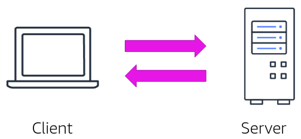
     

>   _Client-Server model_
</td>
<td>

A __server__ can be services such as Amazon Elastic Compute Cloud (Amazon EC2), a type of virtual server.
</td>
</tr>
<tr>
<td colspan=3> 

>   For Example, suppose that a client makes a request for a news article, the score in an online game, or a funny video. The <b>server</b> evaluates the details of this request and fulfills it  by returning the information to the client.
</td>
</tr>
</table>

### Six benefits of cloud computing

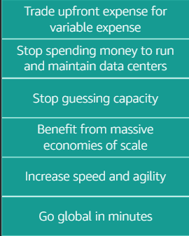

    <small>
      <b><i>Benefits of cloud computing</i></b>
    </small>

####   1.  Trade upfront expense for variable expense  

[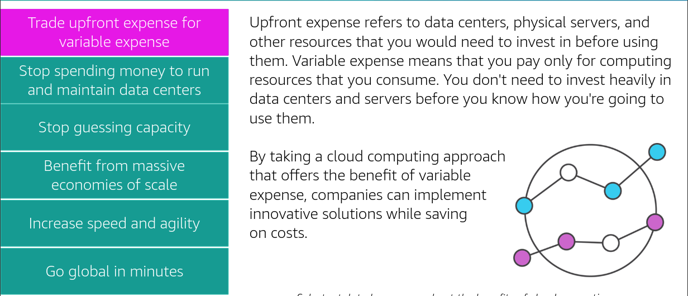<small>**_Trade upfront expense for variable expense_**</small>]()

####   2.  Stop spending money to run and maintain data centers
[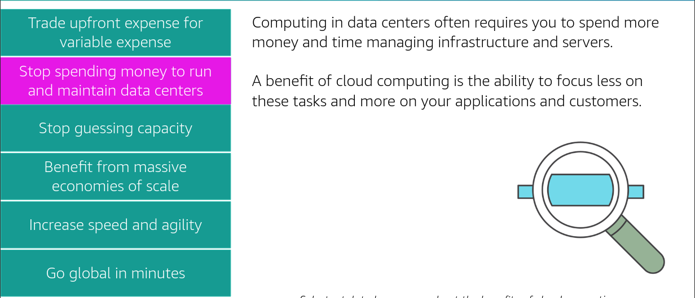<small>**_Stop spending money to run and maintain data centers_**</small>]()

####   3.  Stop guessing capacity
[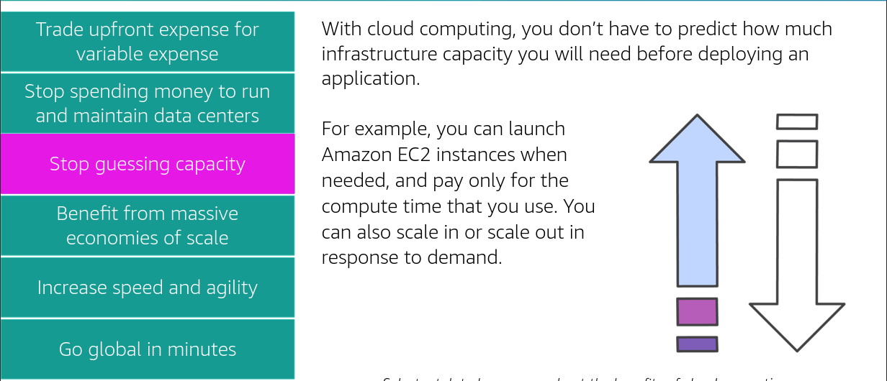<small>**_Stop guessing capacity_**</small>]()

####   4.  Benefit from massive economics of scale
[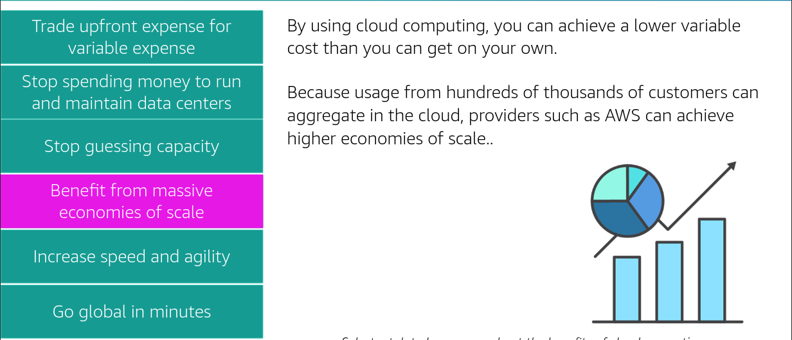<small>**_Benefit from massive economics of scale_**</small>]()

####   5.  Increase speed and agility
[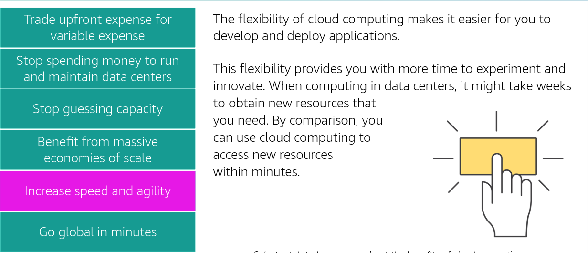<small>**_Increase speed and agility_**</small>]()

####   6.  Go global in minutes
[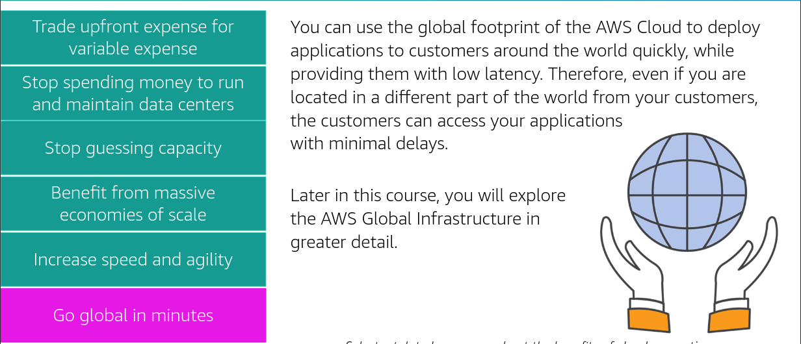<small>**_Go global in minutes_**</small>]()

### Deploying to the cloud

As cloud computing has grown in popularity, several different models and deployment strategies have emerged to help meet specific needs of different users. Each type of cloud service and deployment method provides you with different levels of control, flexiblity and management. 

[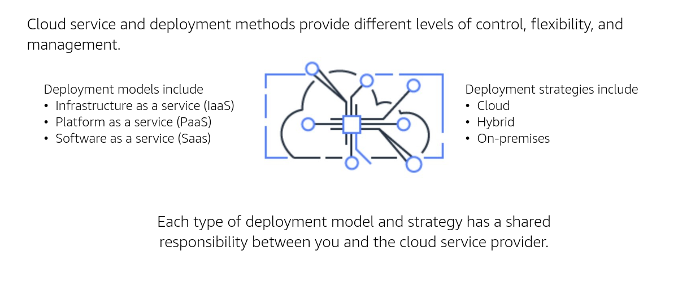]()

Understanding the differences between deployment models, and which deployment strategies you can use helps you decide which set of services is right for your needs.

### Cloud Computing models
Cloud computing is offered in three different service models and each one satisfies a unique set of bussiness requirements. Those three models known as:
+   #### Infrastructure as a Service (IaaS)
    IaaS contains the basic building blocks for cloud IT. It typically provides access to networking features, computers(Virtual or on dedicated hardware), and data storage space. Infrastructure as a servive provides the highest levl of flexibility and management cinrol over your IT resources.

+   #### Platform as a Service (PaaS)
    It removes the need for organizations to manage the underlying infrastructure. They can focus on the deployment and management of applications. These tools give developers the ability to be more efficient because they dont need to worry about resource procurement, capacity planing, software maintenance, and patching.

+   #### Software as a Service(SaaS)
    It is a completed software product that the service provider runs and manages. With a SaaS offering, you donot have to think about how the service is maintained or how the underlying infrastructure is managed. Yu only must think about how you wil use that particular piece of software.

### Cloud Computing deployment models
Choice of deployment model depends on your desired infrastructure, data storage needs, and access requirements. Your unique business requirement will help guide the type of cloud deployment model that you choose.

+   #### Cloud
    You can migrate existing applications to the cloud, or you can design and build new application in the cloud. You can build hose application on low-level infrastructure that requires your IT staff to manage them. Alternatively, you can build them by using higher-level services tha reduce the management, architecting, and scaling requirements of the core infrastructure.
+   #### Hybrid
    In this, cloud-based resources are conneced to on-premises infrastructure. You can integrate cloud-based resources wih legacy IT application. You migh want to use this approach in a number of situations. For example, you have legacy appliacations that are better maintained on premises, or goverment regulations require your bussiness o keep certain records on premises.
+   #### On-Premises
    It is also known as private cloud deployment. In this model, resources are deployed on premises by using virualization and resource management tools, Increase resource utilization by using application management and virtualizatuon technologies.

## Module 3: Introduction to AWS

[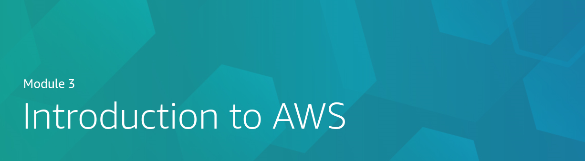](https://awseducate.instructure.com/courses/746/pages/introduction-to-aws?module_item_id=13376)

### Objectives
Aws has an extensive, reliable, and secure global cloud infrastructure with over 175 services for a wide range of use cases. These services are built on a robust infrastructure where the customer and AWS share the responsiblities for programming and security.

+       Discuss the history of AWS cloud computing
+       Describe the AWS global infrastructure
+       Discuss the customer and AWS parts of the shared responsibility model
+       Describe the Well-Architected Framework and discuss how to apply the pillars
+       Define the total cost of ownership and billing considerations

### AWS offerings

[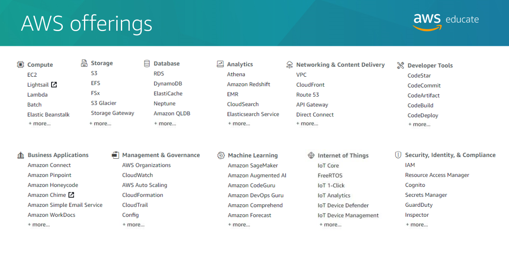](https://awseducate.instructure.com/courses/746/pages/introduction-to-aws?module_item_id=13376)

### AWS benefits

[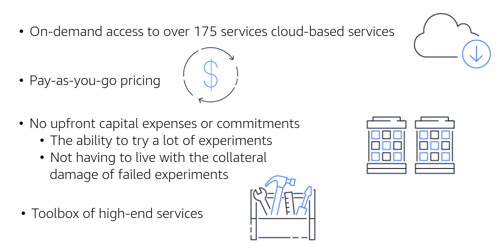]()

### Brief History of of AWS

Customers are increasingly choosing AWS to host their cloud-based infrastructure, and they realize increased performance, Security Reliability, and scale wherever they go. Now, we'll review a brief history of Amazon Web Services to learn how it all began.

<table>
<tr>
    <th> Date </th>
    <th> Description </th>
</tr>
<tr>
<td>
    <b>1994</b>
</td>
<td>
    Amazon is established as an online retailer.
</td>
</tr>
<tr>
<td>
    <b>2003</b>
</td>
<td>
    Chiris Pinham and Benjamin Black suggest selling IT as a service.
</td>
</tr>
<tr>
<td>
    <b>2004</b>
</td>
<td>
    Amazon Simple Queue Service is released as Amazon's first IT service.
</td>
</tr>
<tr>
<td>
    <b>2006</b>
</td>
<td>
    Amazon is established and launches its first Region in N. Virginia.
</td>
</tr>
<tr>
<td>
    <b>2007</b>
</td>
<td>
    AWS is supporting infrastructure for more than 180,000 developers.
</td>
</tr>
<tr>
<td>
    <b>2010</b>
</td>
<td>
    Amazon.com is fully supported on AWS services.
</td>
</tr>
<tr>
<td>
    <b>2012</b>
</td>
<td>
    AWS lholds its first re:invent conference.
</td>
</tr>
<tr>
<td>
    <b>2013</b>
</td>
<td>
    Amazon launches its certification program.
</td>
</tr>
<tr>
<td>
    <b>2017</b>
</td>
<td>
    AWS releases a host of artificial intelligence services.
</td>
</tr>
<tr>
<td>
    <b>2020</b>
</td>
<td>
    AWS launches a Region in Cape Town, South Africa. AWS now provides Regions on every continent except Antartica.
</td>
</tr>
<tr>
<td>
    <b>2008</b>
</td>
<td>
    Multiple region cloud provider data centers are established.
</td>
</tr>
</table>

### AWS is the leader in cloud computing

 
  
<b><i>Leader board of cloud computing</i></b>

 

 AWS has consistently been the leader in cloud infrastructure. Since 2010, AWS has been evaluated as the leader in the 2020 Gartner Magic Quadrant for cloud Infrastructure and platform services. Among the top cloud vendors. AWS has placed highest in both axes of measurement: <i><b>Ability to Execute and Completeness of vison</b></i>

https://user-images.githubusercontent.com/58818777/233159240-2c3ca444-3172-4473-a5c8-a420ebeab934.mp4

### AWS Global Infrastructure

[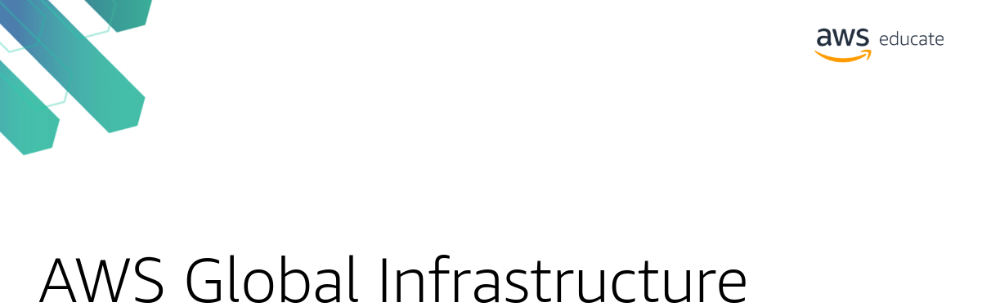](https://awseducate.instructure.com/courses/746/pages/introduction-to-aws?module_item_id=13376)

[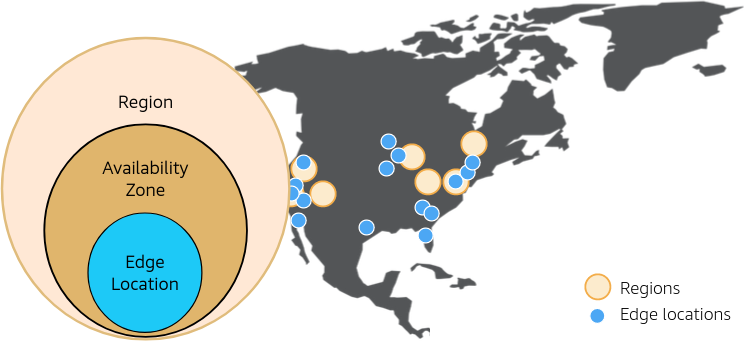](https://awseducate.instructure.com/courses/746/pages/introduction-to-aws?module_item_id=13376)

The main components of the AWS Global Infrastructure are <b>_Regions, Availability zones, and edge locations_</b> that are available in North America.
+   <b>Region</b>
    +   AWS has the concept of a Region, which is a physical location around the world where data centers are clustered together.
    +   Each AWS Region consists of multiple, isolated, and physically seprate Availability Zones within a geographic area.
+   <b>Availability Zone</b>
    +   A group of logical data centers is called an Availability Zone.
    +   An Availabilty Zone is a zoned area within a Region that can harbor one or more data centers. Availability Zones house all the hardware devices that AWS offers.
    +   With their own power infrastructure, the Availability Zones are physically seperated by ameaningful distance (up to 100km or 60 miles) fromany other Availability Zone in the Region.
    +   Availability Zones are interconnected with high bandwidth, low-latency networking, to provide low-latency networking between zones that is sufficient to accomplish synchronous replication (same time replication)
+   <b>Edge Location</b>
    +    Edge locations are connected are connected to the AWS Regions through the AWS network across the globe. They link with tens of thousands of networks for improved origin fetches and dynamic content acceleration.
    +   AWS has over 200 edge locations that are placed in 90 cities, across 47 countries.  

### Map of AWS Region

[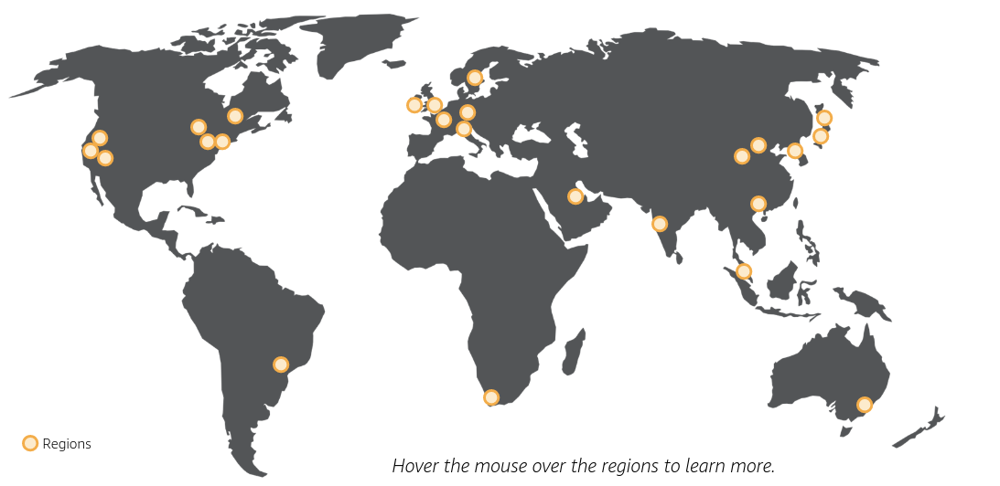]()
<small>**_Map of AWS Region_**</small>

### Planning for failure
When building the architecture in the cloud. It is important to plan for the failure. When you build your architecture, you want to have a plan in place to resolve any failures that might occur.

+   #####   Storage

    

    When a file is stored in Amazon S3,the file is redundantly copied into every Availability Zone in that Region. If one Availability Zone goes down, you still have two copies of that file available for you to use.

+   #####   Compute

    

    It is a best practice to spread out your computing resources across multiple Availability Zones to gurantee high availability. So, if one Availability Zone goes down, your architecture is still up and running.

+   #####   Database

    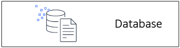

    You can configure your database for Multi-AZ deployment. If your Availability Zone with your primary database fails, one of the standby databases in a healthy Availability Zone automatically becomes your new primary database. Therefore, your architecture is still functioning.

### AWS Regions

[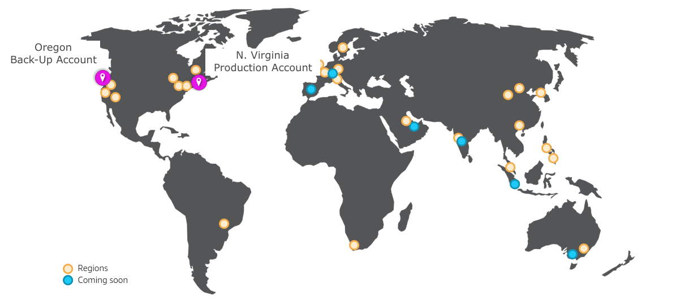]()

In addition to planning for failure at a Regional level with the AWS global infrastructure. You can plan for failure at global level.

>   For Example, suppose that your production architecture is located in the Northern Virginia Region. You can have a backup that mirrors your production architecture at a lower scale in the Oregon Region or any Region around the world.

All that you would have to do is scale up your resources in the backup Region. We will learn more about disaster recovery as you dive deeper into AWS.

### Global Infrastructure benefits

[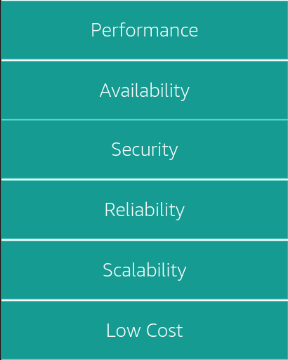]()

<table>
<tr>
    <th> Topic </th>
    <th> Description </th>
</tr>
<tr>
<td>
    <b>Performance</b>
</td>
<td>
    The AWS Global Infrastructure offers high-performing, low-latency cloud infrastructure with virtually unlimited capacity, which provides high availability.
</td>
</tr>
<tr>
<td>
    <b>Availability</b>
</td>
<td>
    Availability Zones are designed for physical redundancy and to provide resilience. They provide uninterrupted performance, even in the event of power outages, internet downtime, floods, and other natural disasters.
</td>
</tr>
<tr>
<td>
    <b>Security</b>
</td>
<td>
    The infrastructure is monitored 24/7 to help ensure the confidentiality, integrity, and availability of AWS customers' data. Customers can build on the most secure global infrastrusture and know that they always own their data. They can encrypt their data, move it, and manage retention.
</td>
</tr>
<tr>
<td>
    <b>Reliability</b>
</td>
<td>
    The AWS Global Infrastructure is designed and built for redundancy and reliability, from regions to networking links to load blancers to routers to frimware.
</td>
</tr>
<tr>
<td>
    <b>Scalability</b>
</td>
<td>
    With the AWS Global Infrastructure, companies can be flexible and take advantage of the conceptuality infinite scalability of the cloud. Companies can quickly get resources as they need them, deploying hundreds or even thousands of servers in minutes.
</td>
</tr>
<tr>
<td>
    <b>Low Cost</b>
</td>
<td>
    The AWS Global Infrastructure provide the  industry's most extensive data center footprint. As a result, more customers can benefit from cloud economics and reduce the <small><b><i>Total Cost of Ownership (TCO)</i></b></small> of their overall IT infrastructure.
</td>
</tr>
</table>

### Shared Responsiblity

The AWS Shared Responsiblity model is a security model that is used to protect cloud environments that use AWS services. It is divided into two parts:

<b> 1.  The customer is responsible for the security in the cloud. 2.   AWS is Responsible for the security of the cloud and </b>

[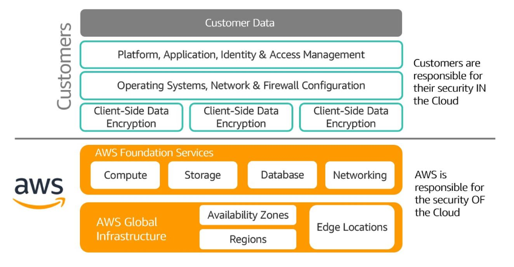]()

####  Customers 

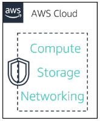

Customers are responsible for the security of everything that they create and put __IN__ the AWS Cloud.

+   When uing AWS services, you, the customer, maintain complete control over your content. You are responsible for managing security requirements for your content. These requirements include which content you choosw to store on AWS, which AWS services you use, and who has access to that content. You also control how access rights are granted, managed, and revoked.

####  AWS Cloud

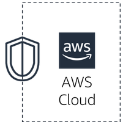

AWS manages the security __OF__ the cloud, specifically the physical infrastructure that hosts your resources, which include:

+   Physical security of data centers
+   Hardware and software infrastructure
+   Network infrastructure
+   Virtualization infrastructure

[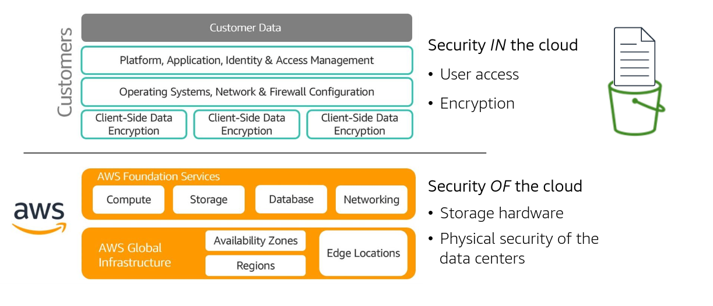]()

As an example, suppose that you create a bucket by using __Amazon S3__ to store files in. Then we, *the customer are responsible for security in the cloud*.

+   We are responsible for granting access permissions to users and 
+   Applying any encryption requirement to the buckets and files.

*AWS is responsible for security OF the cloud*. This responsibility includes:
+   Maintaining the storage hardware that the file is hosted on and
+   The physical security of the data centers where the hardware is located.

## Module 4: AWS Core Services 

### Objectives

AWS offers a broad set of global cloud-based products including compute, storage, databases, analytics, networking, mobile, developer tools, management tools, security and enterprise applications. These services help you build elastic, agile, resilient architectures. You will be able to:

+   Define the different types of services
+   Identify the main categories of services as part of an architecture
+   Describe each service, its use, features, and benefits

### Monolithic architecture

Applications are made up of multiple components. The components communicate with each other to transmit data, fulfill requests, and keep the application running.

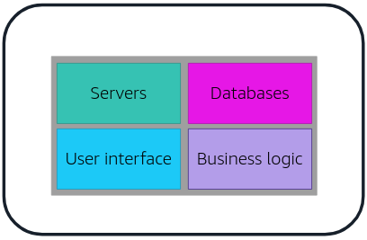

Suppose that you have an application with tightly coupled components. These components might include servers, databases, the user interface, business logic, and others. This type of architecture can be considered a __monolithic application__.

<table>
<tr>
<td>

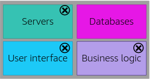

In this approach to application architecture, if a single component fails, then other component likely fail.

</td>
<td>

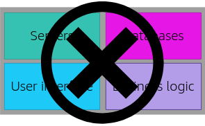

In this event, it is even possible that the entire application will fail.

</td>
</tr>
</table>

### Microservices architecture

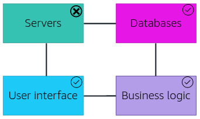

To help maintain application availability when a single components fails, you can design your application through a microservices approach. The loose compiling prevents the entire application from failing. When designing application on AWS. You can take a microservices approach with services and components that fulfill different functions.

### Types of Services

There are three types of services provided by AWS:

#####   1.  Managed Services

A managed service is a way to describe the services that require you to manage infrastructure management tasks like patching, backup, and repair. These services grant you virtual access to the underlying operating system and servers. With managed services, you are responsible for scaling and building for high availability.

#####   2.  Fully Managed Services

A Full managed service is a way to describe the services that automate infrastructure management tasks that AWS handles, like patching, backup, and repair. These services do not grant you any virtual access to the underlying operating system or servers. With a fully managed service, you are still responsible for scaling and building for high availability.

#####   3.  Serverless Services

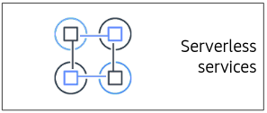

Serverless is a way to describe the services, practices, and strategies that you can use to build more agile applications. In this way, you can innovate and respond to change faster. With serverless services, AWS handles infrastructure management tasks like capacity provisoning and patching so that you can focus on building applications that serve your customers. Serverless services come with automatic scaling, built-in high availability, and a pay-for-value billing model.

### AWS Core Service Architecture

[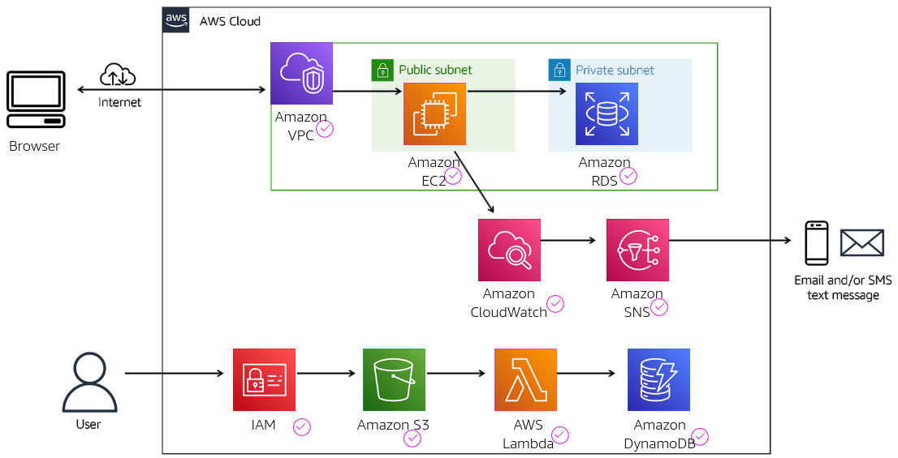]()

The detailed description of Core Service Architecture are as follws:
####    Identity and Access Management (IAM)

+   #####   What does IAM do?
    IAM is a centralized security management system that is included in every AWS account to control identity access to AWS services. By attaching IAM permission policies to identities, you can manage which services each identity can access and the kinf of actions the identity can perform.
    Identities in IAM are users, groups and roles.

     <b>User</b>
    An IAM user is an entity that you create in AWS. The IAM user represents the person or services who uses the IAM user to interact with AWS. 
    <b>Group</b>
    An IAM user group is a collection of IAM users. You can use user groups to specify permissions for a collection of users, which can make those permissions easier to manage for those users. 
    <b>Role</b>
    An IAM role is an identity with permission policies that are attached to it. An IAM user or service can assume these policies to temporarily take on different permissions for a specific task.

+   #####   What problem does IAM solve?

    IAM solves the problem of users having more access than they should. IAM is built by using the principle of least privilege. This principle states that an identity will not have access to any AWS services until you grant the identity access. By this method, no one should be able to provison or access resources that you have not explicitly granted them access to. 
    For example, if you create a new user, then that user cannot access the EC2 Dashboard by default. You must attach an IAM policy to that user to grant them access to the EC2 Dashboard.

+   #####   What are the benefits of IAM?

    +   IAM has a simple user interface that makes it easy to gran and control user access to AWS services.
    +   IAM has many system-generated policies that you can use, and you create additional custom policies that meet the needs of your specific requirements.

+   #####   How can I architect a cloud solution using IAM ?
    Using IAM roles, you can grant someone from a different AWS account access to your account to perform a specific task.

    

    
    

    In the diagram, a user in the Dev account is assuming a role in the production account. The role returns a temproary security credential. It grants the user temproary access to the AWS service based on the policy that is attached to the role.

+   #####   How can I use IAM ?
    +   Fine-grained access control
    +   Multi-factor authentication
    +   Analyze access
    +   Integrate with your corporate directory

+   #####   What else should I keep in mind when using IAM?
    AWS evaluates policies depends on the types of policies that apply.
    +   Implicit deny
    +   Explicit allow
    +   Explicit deny

+   #####   How much does IAM cost?
    IAM is a service in your AWS accoun that is offereed at no additional charge. You are charged only when you access other AWS Services by using your IAM users credentials.

####    Amazon Simple Storage Service - S3

+   #####   What does Amazon S3 do?

    Amazon S3 is object storage that is built to store and retrieve any amount  of data from any where at any time. It's a simple storage service that offers industry-leading durability, availability, performance, security, and virtually unlimited scalability at low costs.

+   ##### What problem does Amazon S3 solve?

    Amazon S3 solves two main problems:
    1.  You don't need to estimate how much storage space you will need. You create your bucket and add as many files as you need to. Amazon S3 is elastic and scales automatically to meet your storage requirements.

    2.  Files that are uploaded to Amazon S3 are automatically replicated across multiple Availability Zones in the Region. Thus, your files are always highly available and highly durable, so that you can access them when you need them.

+   #####   What are the benefits of Amazon S3?

    The following list describes a few of the benefits that Amazon S3 offers.

    +   Amazon S3 offers you industry-leading performance, scalability, availability, and durability that you can use to easily build applications that use cloud native storage. As a result, you consistently have your data when you need it. 

    +   Because Amazon S3 is serverless, it is highly scalable. Therefore, you can start small and grow your application as you want, with no compromise on performance or reliability.  

    +   Amazon S3 also has unmatched security, compilance, and audit capabilities in the cloud.

+   #####   How can I architect a cloud solution by using Amazon S3?

    You can architect a solution by using Amazon S3 to host a static website anywhere in the world.
     

     

    
    

     

    In this example, Amazon S3 is being used to host static website. The website content is uploaded to Amazon S3 and directed to Amazon CloudFront (a content delivery service) to deliver the content to the internet. Users can then access the website on their browser.

+   #####   How can I use Amazon S3?

    +   ######  Backup and restore
        Amazon S3 can be used to build scalable, durable, and secure backup and restore solutions to augument or replace existing on-premise capabilities.

    +   ######  Disaster recovery
        You can protect critical data, applications, and IT systems with Amazon S3 that are running in the AWS Cloud or in your on-premises environment. You can avoid the expense of a second physical site.

    +   ######  Archive
        Retire physical infrastructure, and archive data with Amazon Simple Storage Service Glacier and S3 Glacier Deep Archive. These S3 storage classes retain objects long-term at the lowest rates. You create an S3 Lifecycyle policy to archive objects throughout their lifecycles, or upload objects directly to the archival storage classes.

    +   ######  Data lakes and big data analytics

        Accelerate innovation by building a data lake on Amazon S3, and extract valuable insights by using query-in-place, analytics, and machine learning tools. As your data lake grows, use S3 Access Points to easily configure access to your data, with specific permissions for each application or set of applications.

+   #####   What else should I keep in mind when using Amazon S3?

    Amazon S3 is designed for object storage, not block storage.

    __Object storage__ is a storage option that is meant for read-intensive files that are not written to. If the file needs a change, then the file can be overwritten. Examples of object storage are pictures, videos, documents, and static websites.
     

    __Block storage__ is a more structured set of data hosting that is often written to. Examples of object storage are pictures, videos, documents, and static websites. Amazon S3 is not designed for these uses. Amazon offers Amazon Elastic Block Store to meet these needs.

+   #####   How much does Amazon S3 cost?

With Amazon S3, you pay only for what you use. It has no minimum fee. Some prices vary across Amazon S3 Regions. Billing prices are based on the location of your S3 bucket.

####    AWS Lambda

+   #####   What does AWS Lambda do?

    AWS Lambda is a serverless compute service that you can use to run function code without provisoning or managing servers. You can use Lambda torun function code  for virtually any type of application or backend service. You upload your code, and Lambda takes care of everything that is required to run and scale your code with high availability.

+   #####   What problem does AWS Lambda solve?
    AWS lambda removes all administration for application or backend services that can be processed in snippets of code. You upload your code as a `.zip` file or container image. Then, Lambda automatically and precisely allocates compute power to run your code based on the incoming request or event, for any scale of traffic, You can set up your code to automatically trigger from over 200 services and software as a service (SaaS) applications or call it directly from any web or mobile app.

+   #####   What are the benefits of AWS Lambda?

    The following list describes the main benfits that AWS Lambda offers.

    +   AWS Lambda is serverless, so you have no servers to manage. Lambda automatically runs your code without requiring you to provision or manage infrastructure. You write the code and upload it to Lambda either as a `.zip` file or as a container image.

    +   AWS Lambda has built in continuous scaling that scales your applicatio by running  code in response to each event. It scales precisely with the size of the workload, from a few requests per day to hundreds of thousands per second.

+   #####   How can I architect a cloud solution using AWS Lambda?

    You can architect with Lambda by configuring Lambda to perform an action when an event occurs in a triggering service.

     
     

    
    

     

    In this example, a user uploads a photo into Amazon S3 - Bucket A. This action triggers the Lambda code to run and resize the photo and place the photo in Amazon S3 - Bucket B. From Bucket B, the user can download the resized photo. Lambda then sends an email or a text message to the appropriate users to alert them that the photo is ready to download.

    +   #####   How can I use AWS Lambda?

    +   ######  Web applications
        By combining AWS Lambda with other AWS services, developers can build powerful web applications that automatically scale up and down. These applications run in a highly available configuration across multiple data centers - with zero administrative effort required for scalability, backups, or multi-data redundancy.

    +   ######  Data processing
        You can use AWS Lambda to execute code in response to triggers such as changes in data, shifts in system state, or action by users. Lambda can be directly triggered by AWS services such as Amazon S3, DynamoDB, Kinesis, Amazon SNS, and CloudWatch, or it can be orchestrated into workflows by AWS Step Functions. Thus, you can build a variettty of real-time serverless data processing systems.

    +   ######  Real-time file processing

        You can use Amazon S3 to trigger AWS Lambda to process data immediately after an upload. You can also connect to an existing Amazon Elastic File System (Amazon EFS) file system directly, which enables massively parallel shared access for large-scale file processing. For example, you can use Lambda to thumbnail images, transcode videos, index files, process logs, validate content, and aggregate and filter data in real-time.

    +   ######  Real-time stream processing
        You can use AWS Lambda and Amazon Kinesis to process real-time streaming data for application activity tracking, transaction order processing, and click stream  analysis. You can also use it for data cleansing, metrics generation, log filtering, indexing, social media analysis, and Internet of Things (IoT) device data telemetry and metering.

+   #####   What else should I keep in mind when using AWS Lambda?

    AWS Lambda has a 15-minute limit on its runtime for each invocation. If your computing needs require more than 15 minutes for runtime, then you would need to use an EC2 instance instead of Lambda.

+   #####   How much does AWS Lambda cost?

    With AWS Lambda, you pay only for what you use. You are charged based on the number of requests for your Lambda functions and the duration, the time it takes for you code to run.
    The AWS Lambda always free usage tier includes 1 M free requests per month and 400,000 GB-seconds of compute time per month.

    No charge is incurred when your code is not running.

#### Amazon DynamoDB

+   #####   What does Amazon DynamoDB do?

    Amazon DynamoDB is a serverless non-relational database that can store and retrieve any amount of data and serve any level of request traffic. You can scaleyour database tables' throughput capacity up or down without downtime. You can use the AWS Management Console to monitor resource utilization and performance metrics.

+   #####   What problem does Amazon DynamoDB solve?
    You can use it to offload the administrative burdens of operating and scaling a distributed database. Therefore, you dont need to worry about hardware provisioning, setup and configuration, replication, software patching, or cluster scaling.

+   #####   What are the benefits of DynamoDB?

    The following list describes a few of the benefits that DynamoDB offers.
     

    +   DynamoDB supports some of the world's largest scale applications by providing consistent, single-digit millisecond response times at any scale.
     

    +   DynamoDB is serverless with no servers to provision, patch, or manage and no software to install, maintain, or operate.
     

    +   DynamoDB supports ACID transactions so that you can build business-critical applications at scale. DynamoDB encrypts all data by default and provides fine-grained identify and access control on all your tables.
     

+   #####   How can I architect a cloud solution using DynamoDB?

    You can use Amazon DynamoDB store an application's stores data.

     
    

    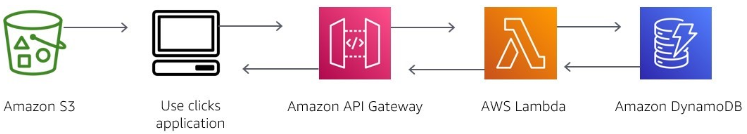
    

     

    In this example, a user accesses an application that is  stored in Amazon S3. The user chooses an option to receive data. Amazon API Gateway will then trigger Lambda to retrieve data from DynamoDB and send it back to the user's interface.

+   #####   How can I use DynamoDB ? 

    +   ######  Retail
        Many companies in the retail space use common DynamoDB design patterns to deliver consistently low latency for mission-critical use cases. Being free from scaling concerns and operational burden is a key competitive advantage. It provides for high-velocity, extreme-scaled events such as Amazon Prime Day, whose magnitudes are difficult to forecast. By scaling up and down, these cutomers pay only for the capacity that they need. They can keep precious technical resources focoused on innovations rather than operations.
         
    
    +   ######  Gaming
        Companies in the gaming vertical use DynamoDB in all capabilities of game platforms, including game state, player data, session history, and leaderboards. The main benefit that these companies get from DynamoDB is its ability to scale reliably to millions of concurrent users and requests while ensuring consistently low latency. This latency can be measured in single-digit milliseconds.
         

    +   ######  Banking
        Banking and finance companies use DynamoDB to build more cloud-native applications to increase agility, reduce time to market, and minimize operational overhead. These companies also use DynamoDB to ensure the security, reliability, and continued high availability of their applications.
         

    +   ######  Ad Tech
        Companies in the advertising technology (ad tech) use DynamoDB as a key-value store for storing various kinds of marketing data. Examples of such data would include user profiles, user events, clicks, and visited links.

+   #####   What else should I keep in mind when using DynamoDB ?

    DynamoDB is a non-relational database. If you need a relational database, you would use Amazon RDS.

    +   ######  Relational Database
        __Relational databases__ store data in rows and columns. Rows contain all the information about one entry, and columns are the attributes that seperate the data points. A relational database schema is fixed: columns must be locked before data entry. You can amend schemas if the database is altered entirely and taken offline. Data in relational databases is queried by using structured query language (SQL), which can have complex queries.
        Relational databases scale vertically by increasing hardware power. Relational databases are commonly used for traditional applications, enterprise resource planning (ERP), customer releationship management (CRM), and e-commerce.

    +   ######  Non-Relational database
        __Non-relational databases__ store data by using one of many storage models, including key-value pairs, documents, and graphs. Non-relational schemas are dynamic, and information can be added rapidly. Each <i>row</i> doesn't have to contain data for each <i>column</i>. Data in non-releational databases is queried by focousing on collections of documents. Non-releational databases scale horizontally by increasing servers. Key-value databases are commonly used for internet-scale applications, real-time bidding, shopping carts, and customer preferences.

+   #####   How much does DynamoDB cost ?

    DynammoDB charges for reading, writing, and storing data in your DynamoDB tables, along with any optional features you choose to enable. DynamoDB has two capacity modes (on-demand and provisoned), both of which come with specific billing options for processing reads and writes on your tables.

####    Amazon Virtual Private Cloud - VPC

+   #####   What does Amazon VPC do ?