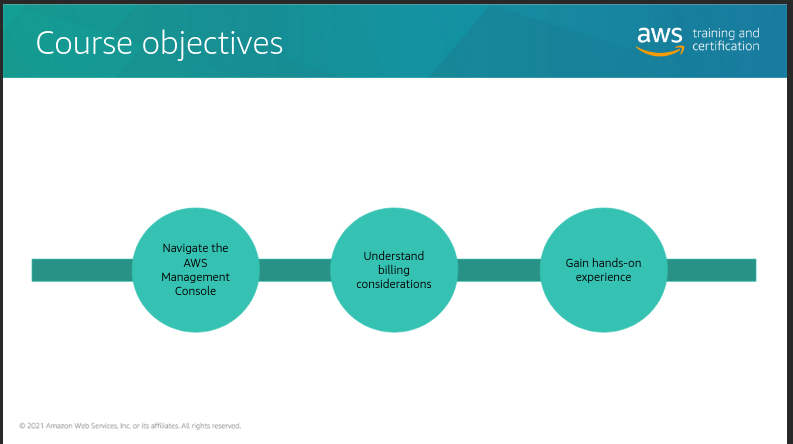
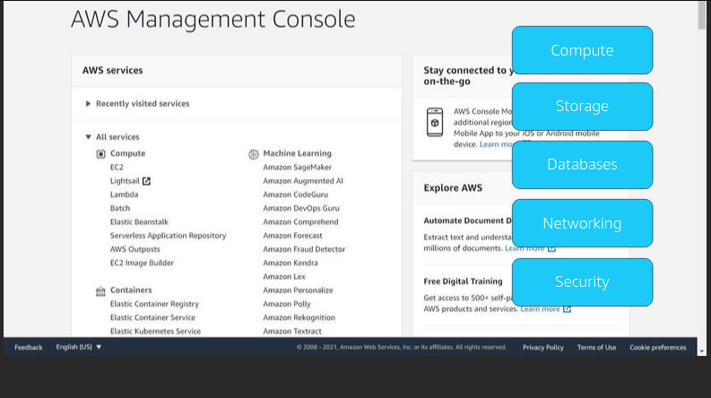

#   Introduction to the AWS Management  Console

### This is the foundation for Cloud Practitioner Journey
We build our foundation journey from AWS educate course. Click [Introduction to the AWS Management Console](https://awseducate.instructure.com/courses/744) to start learning.

This course intends to make the learner familiar with <b>AWS Management Console Interface</b>.

The main objective of this course is to make learners comfortable with <b><i>Navigation of AWS Management Console, Understanding billing considerations and gain hands-on experience</i></b>.

The aws console provides the list of all the services which are grouped by category.

Some commonly used categories are:

#####  [1.  Compute](#compute)
#####  [2.  Storage](#Storage)
#####  [3.  Database](#database)
#####  [4.  Networking & Content Delivery](#networking--content-delivery)
#####  [5.  Security, Identity & Compliance](#security-identity--compliance)

#### Compute
In the Compute section, Amazon Elastic Compute Cloud (or Amazon EC2) and AWS Lambda are computing services that we might need to access frquently.

+   #####    Amazon EC2
    <b><i>Amazon Elastic Compute Cloud (Amazon EC2)</i></b>, is a web service that provides secure, resizable compute capacity in the cloud.

+   #####    AWS Lambda
    <b><i>Amazon Web Service Lambda (AWS Lambda)</i></b>, is a serverless compute service  that lets you code without provisoning or managing servers, creating workload-aware cluster scaling logic, maintaining event integrations, or managing runtimes.

#### Storage
In the Storage category, we learn about Amazon S3.

+   #####    Amazon S3
    <b><i>Amazon Simple Storage Service (Amazon S3)</i></b>, an object storage service that offer industry-leading  scalability, data availability, security, and performance. It is used in most architectures.

#### Database
In the Database category, we learn about RDS and DynamoDB.

+   #####    Amazon RDS
    <b><i>Amazon Relational Database Service (RDS)</i></b>, is a service that allows you to set up, operate, and scale a relational database in the cloud with just a few clicks.

+   #####    Amazon DynamoDB
    <b><i>Amazon DynamoDB</i></b>, is a key-valued and document database that delivers single-digit millisecond performance at any scale. It is used when the architecture of database is non-releational type.

#### Networking & Content Delivery
In the Networking & Content Delivery section, we can set up additional VPCs,Amazon CloudFront and Amazon Route 53 are other common Networking & Content Delivery Services.

+   #####    VPC
    <b><i>Virtual Private Cloud (VPC)</i></b>, is an isolation section of te cloud  that you can use to provison shared AWS resources.

+   #####    Amazon CloudFront
    <b><i>Amazon CloudFront</i></b>, is fast Content Delivery Network (CDN) that securely delivers data, videos, applications and APIs to customers globally within low latency high transfer speeds, all within a developer friendly environment.

+   #####    Amazon Route 53
    <b><i>Amazon Route 53</i></b>, is a highly available and scalable cloud Domain Name System (DNS) web service. It gives you a reliable and costt effective way to route and users to Internet applications by translating names like `www.example.com` into the numeric IP addresses like `192.0.2.1` that computer use to connect to each other.

#### Security, Identity & Compliance
In the Security, Identity & Compliance, Amazon gives you various services that you can use  to protect your cloud environment. The most important of these services is <b><i>AWS Identity and Access Management, or IAM</i></b>.

+   #####    AWS IAM
    <b><i>AWS Identity and Access Management (AWS IAM)</i></b>, enables you to manage access to AWS services and resources securely. With IAM, you can create users on AWS account, configure password policies, grant users access to services, and much more.

<b><i><u>Note: We learn more about these services as we dive deeper into learning AWS.</u></i></b>