#   Introduction to the AWS Management  Console

### This is the foundation for Cloud Practitioner Journey
We build our foundation journey from AWS educate course. Click [Introduction to the AWS Management Console](https://awseducate.instructure.com/courses/744) to start learning.

##  AWS Management Console Interface

This course intends to make the learner familiar with <b>AWS Management Console Interface</b>.
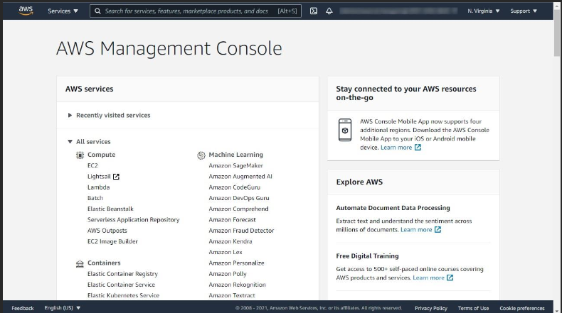

The main objective of this course is to make learners comfortable with <b><i>Navigation of AWS Management Console, Understanding billing considerations and gain hands-on experience</i></b>.
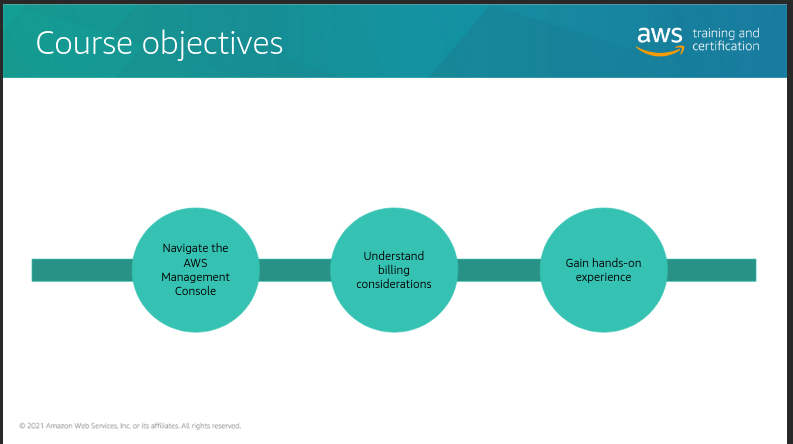

The aws console provides the list of all the services which are grouped by category.
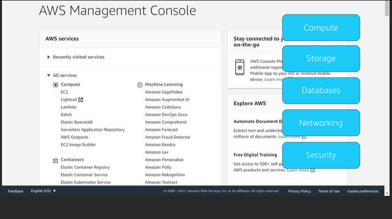

Some commonly used categories are:

####  [1.  Compute](#compute)
####  [2.  Storage](#Storage)
####  [3.  Database](#database)
####  [4.  Networking & Content Delivery](#networking--content-delivery)
####  [5.  Security, Identity & Compliance](#security-identity--compliance)

### Compute
In the Compute section, Amazon Elastic Compute Cloud (or Amazon EC2) and AWS Lambda are computing services that we might need to access frquently.

+   ####    Amazon EC2
    <b><i>Amazon Elastic Compute Cloud (Amazon EC2)</i></b>, is a web service that provides secure, resizable compute capacity in the cloud.

+   ####    AWS Lambda
    <b><i>Amazon Web Service Lambda (AWS Lambda)</i></b>, is a serverless compute service  that lets you code without provisoning or managing servers, creating workload-aware cluster scaling logic, maintaining event integrations, or managing runtimes.

### Storage
In the Storage category, we learn about Amazon S3.

+   ####    Amazon S3
    <b><i>Amazon Simple Storage Service (Amazon S3)</i></b>, an object storage service that offer industry-leading  scalability, data availability, security, and performance. It is used in most architectures.

### Database
In the Database category, we learn about RDS and DynamoDB.

+   ####    Amazon RDS
    <b><i>Amazon Relational Database Service (RDS)</i></b>, is a service that allows you to set up, operate, and scale a relational database in the cloud with just a few clicks.

+   ####    Amazon DynamoDB
    <b><i>Amazon DynamoDB</i></b>, is a key-valued and document database that delivers single-digit millisecond performance at any scale. It is used when the architecture of database is non-releational type.

### Networking & Content Delivery
In the Networking & Content Delivery section, we can set up additional VPCs,Amazon CloudFront and Amazon Route 53 are other common Networking & Content Delivery Services.

+   ####    VPC
    <b><i>Virtual Private Cloud (VPC)</i></b>, is an isolation section of te cloud  that you can use to provison shared AWS resources.

+   ####    Amazon CloudFront
    <b><i>Amazon CloudFront</i></b>, is fast Content Delivery Network (CDN) that securely delivers data, videos, applications and APIs to customers globally within low latency high transfer speeds, all within a developer friendly environment.

+   ####    Amazon Route 53
    <b><i>Amazon Route 53</i></b>, is a highly available and scalable cloud Domain Name System (DNS) web service. It gives you a reliable and costt effective way to route and users to Internet applications by translating names like `www.example.com` into the numeric IP addresses like `192.0.2.1` that computer use to connect to each other.

### Security, Identity & Compliance
In the Security, Identity & Compliance, Amazon gives you various services that you can use  to protect your cloud environment. The most important of these services is <b><i>AWS Identity and Access Management, or IAM</i></b>.

+   ####    AWS IAM
    <b><i>AWS Identity and Access Management (AWS IAM)</i></b>, enables you to manage access to AWS services and resources securely. With IAM, you can create users on AWS account, configure password policies, grant users access to services, and much more.

<strong>_Note:  We learn more about these services as we dive deeper into learning AWS._</strong>

##  Billing Considerations

AWS has various transparent pricing model that you can use to your advantage. Most flexible is pay-as-you-go model.

### 1.  Pay as you go

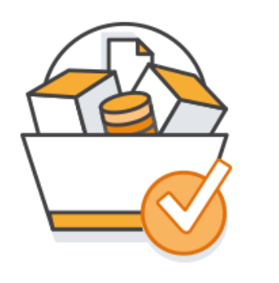

Using this pricing model:
+   Pay only for the time that you use the service
+   No contracts
+   No minimum use

####    A.  Service Cost Factors
When choosing an AWS resource, it is important to understand the factors that affects service pricing. Some of the more common services we will use include <b>_Storage_</b> and <b>_Compute_</b>.

+   #####    Amazon S3

    
    For example, when you create an S3 bucket for storage you are not charged for the bucket. However, you are charged for the following:

    +   Amount of storage that you use
    +   The storage class of the upload files

+   #####    Amazon EC2

    
    When you provison an EC2 instance for computing charges are based on the following:

    +   Computing options that you select
    +   Volume (hard drive) size that you choose

####    B.  Price Varriance Per Region

    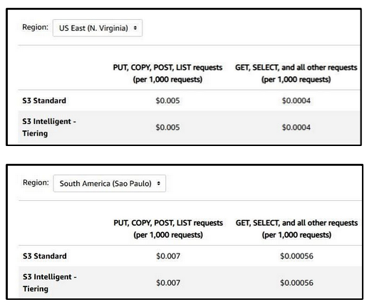 

In this exapmle, the costs for <b>_Amazon S3_</b> are slightly more expensive in South America Region than they are in Northern Virginia Region.

### 2.  Minimize Costs

Best practices to minimize costs when using the below services.

<table>
<tr>
    <th> Amazon S3 </th>
    <th> Amazon EC2 </th>
</tr>
<tr>
<td>
     

+   Delete files from your bucket
>   _Note: Empty buckets don't cost anything and don't need to be deleted_
</td>
<td>
    

+   Terminate the instance
>   _Note: A <b>Stopped</b> instance will charge you for the provisioned EBS volume_
</td>
</tr>
</table>

### 3.  Additional Resources

[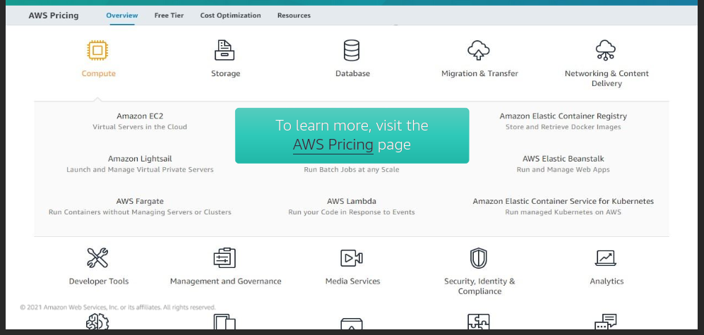<small>**_AWS Resource Pricing_**</small>](https://aws.amazon.com/pricing/?aws-products-pricing.sort-by=item.additionalFields.productNameLowercase&aws-products-pricing.sort-order=asc&awsf.Free%20Tier%20Type=*all&awsf.tech-category=*all)

AWS provides detail on pricing for every by category.

##  Hands on Practice
### Objectives
[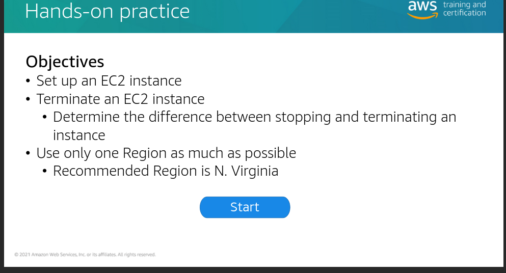<small>**_Objectives of Hand on Practice_**</small>](https://aws.amazon.com/pricing/?aws-products-pricing.sort-by=item.additionalFields.productNameLowercase&aws-products-pricing.sort-order=asc&awsf.Free%20Tier%20Type=*all&awsf.tech-category=*all)

#### A. Setting up an EC2 instance

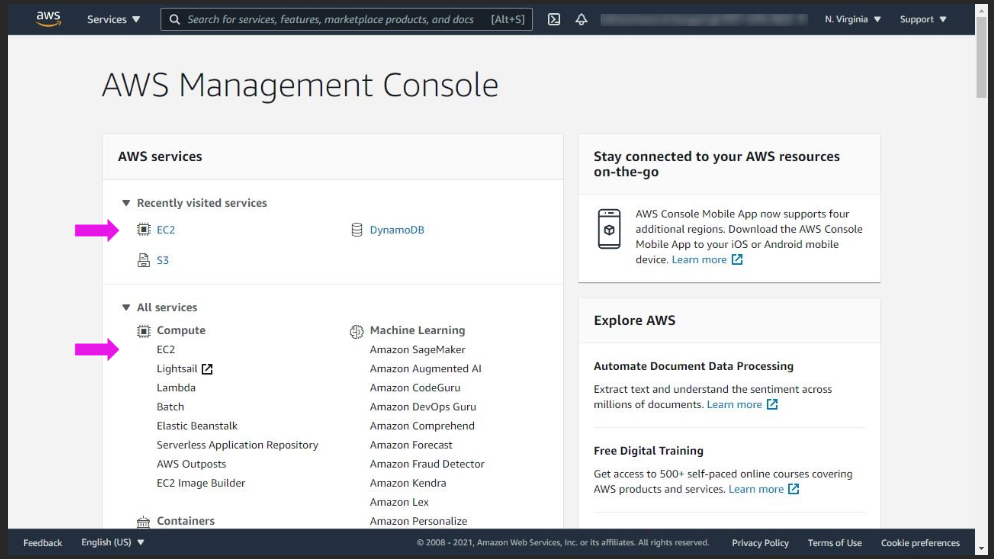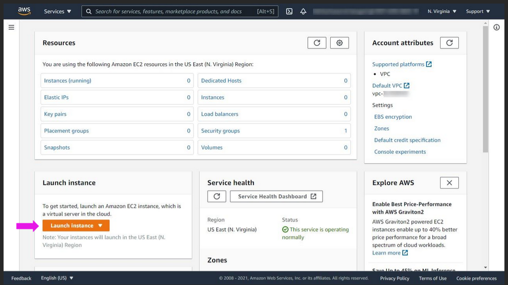
<small><b>*_Visit and Launch EC2 Instance_*</b></small>

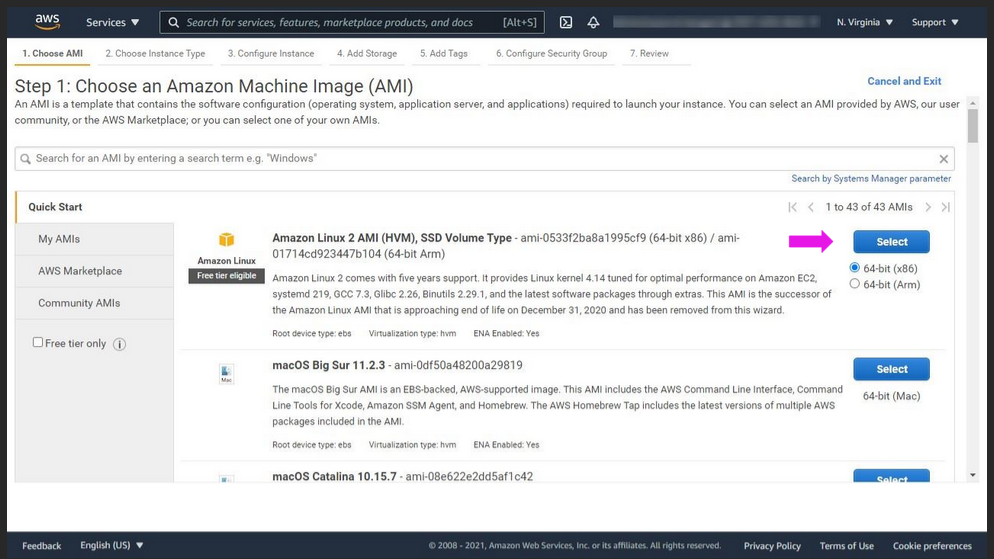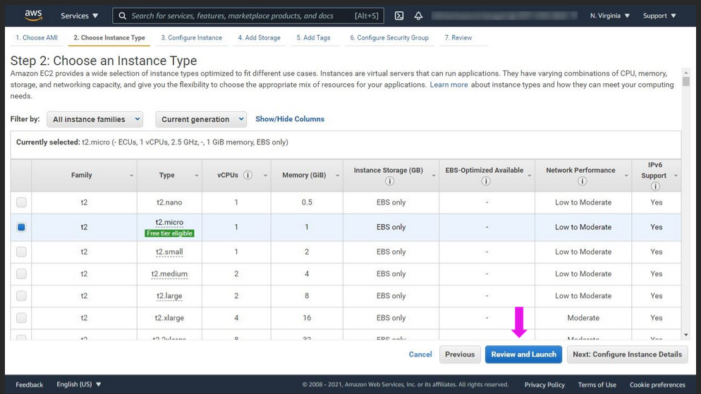
<small><b>*_Choose Instance Machine Image and Instance type of EC2_*</b></small>

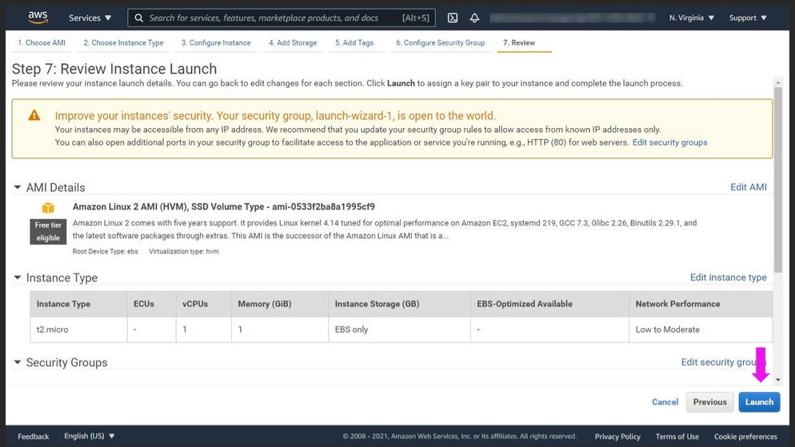

<small><b>*_Review Instance Launch_*</b></small>

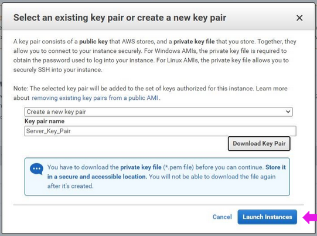

<small><b><i>Select and Create key pair and Launch EC2 instance</i></b></small>

  <b>_Keypair_</b>, is a set of password that you can use to connect securely to your instance.

#### B. Stopping an EC2 instance

    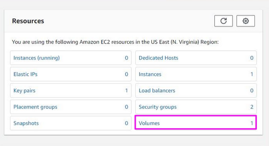

+   Stopping does not cost charge for instance but however it will still charge for volume.

#### C. Terminate an EC2 instance

    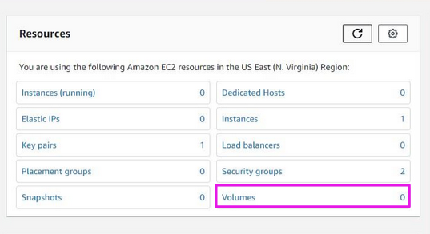

+   Terminate does not cost charge for instance as it will delete volume.

#### D. Working in one Region

    

+   The best practice is to choose instances running in one region.

Here we come to the end of **_Introduction to the AWS Management Console_**. Here we sucessfully gain the knowledge of following things.

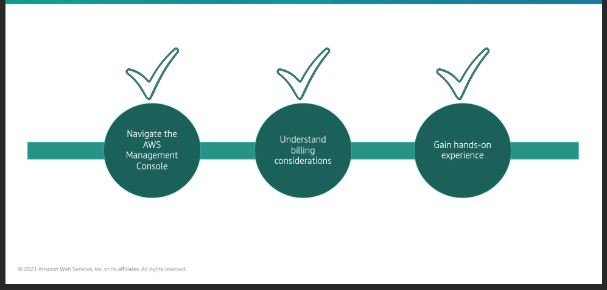

##  End of Course