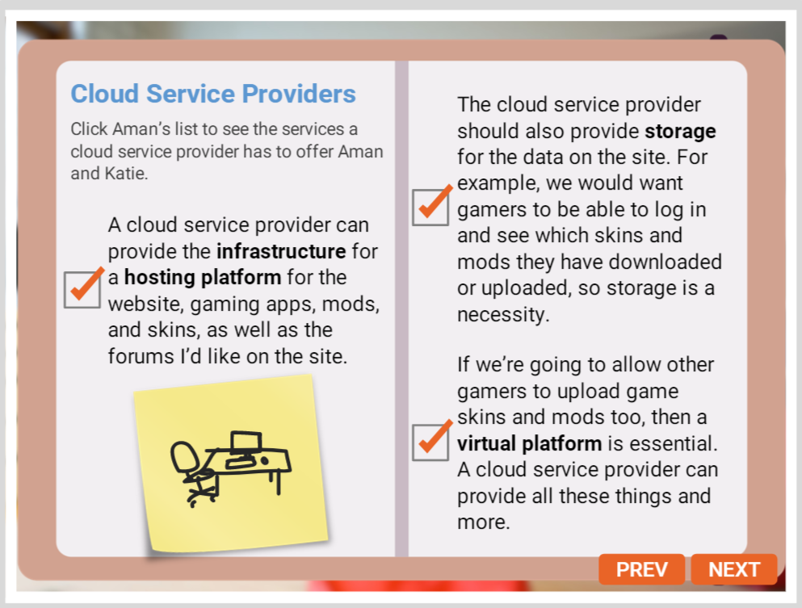

##  Using The Cloud

### Cloud Services

1.    Model of Cloud Computing
### IaaS
+      Meaning:
    IaaS stands for infrastructure as a service.

+      Definition
    IaaS is a model in which virtual machines and servers are used for customers to host a wide range of applications, and IT services are provided.

+      Uses in Gaming
    The game's developer uses the cloud to host the game, so gamers can download the game and play it on their phones. When you download a game to either a console or a PC, you are likely using IaaS. Plus, IaaS makes it possible for you to buy all of those skins for your characters.        

+      Benefits
    IaaS is affordable, the savings allow gamers to download the fame to their phones for free. Both console and PC game developers use IaaS. It is scalable, manages backups of applications and software, and allows for minimal downtime and frequent monitoring.   

### PaaS
+      Meaning
    Paas stands for platform as a service.

+      Definition
    It provides a virtual platform for customers to create custom software.

+      Uses in gaming
    A fame developer can use PaaS to create a virtual platform where players can create custom skins or game mods and upload them to their own site or to the gaming site          

+      Benefits
    PaaS integrates many of a game's web services and databases, which are storing all of those gaming mods, so you can download and browse thousands of gaming mods fairly quickly on your phone. PaaS allows for many users to access the platform at the same time.         

### SaaS
+      Meaning:
    SaaS stands for software as a service.

+      Definition
   It provides applications via the Internet that are managed by a third party.

+      Uses in Gaming
    It is a great model for collaborative faming projects and applications. For example, it allows for guilds to communicate and share info about gaming stategies.    

+      Benefits
    It allows you to automatically install gaming applications, add-ons, and patches. Game developers who use it can save money because a third party is managing their gaming applications, installations, and downloads.

2.  ### Benefits of a Cloud Service Providers
+      Customization
    If we need additional space for this service, or if we get a bump in gamers due to adding this services, the cloud service provider will allow us to customize a package that works for us.

+      Affordability
    The cloud is much more affordable than traditional storage options. We would have to purchase our own servers and software if we managed and hosted the site ourselves. Plus, we'd have to find space! I'm not sure my bedroom has room for an entire server setup!

+      Scalability
    The cloud provider can accommodate our site if we decide to add additional options, such as live-streaming people using our game mods and skins.

+      Flexibility
    A cloud service providers managing and hosting and activities running the site. And if we're at school and the site has problems or need updates, the cloud service provider can take care of them and ensure that gamers who use the site can still access it while maintenance is ongoing.

####    Cloud service providers

